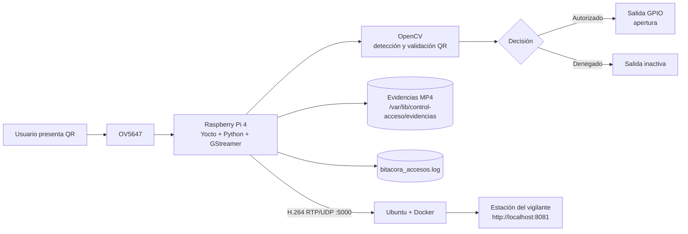

# Sistema de control de acceso con Yocto, GStreamer y Raspberry Pi 4

Proyecto 1 — Taller de Sistemas Embebidos, Instituto Tecnológico de Costa Rica.

Este repositorio integra una imagen Linux personalizada construida con **Yocto Project**, una aplicación en **Python + GStreamer + OpenCV** ejecutada sobre una **Raspberry Pi 4 con cámara OV5647**, y una estación de vigilancia en **Docker** que recibe video H.264 por RTP/UDP y lo presenta en una interfaz web.

## Estado actual

| Subsistema | Estado |
|---|---|
| Imagen Yocto para Raspberry Pi 4 | Validada en hardware |
| Cámara OV5647 + libcamera | Validada |
| Servicio systemd de control de acceso | Validado |
| Streaming H.264/RTP/UDP hacia laptop | Validado |
| Estación del vigilante en Docker | Validada |
| QR autorizado (MC001) | Validado |
| QR denegados (NO001 / TEST123) | Validados |
| Evidencia independiente por evento, 60 s | Validada |
| Evidencias concurrentes | Validada |
| Bitácora con ruta de evidencia | Validada |
| Retención: video 7 días / bitácora 30 días | Implementada; validación final en imagen pendiente |
| Rearme QR sin eventos duplicados | En validación final |
| Salida GPIO / circuito de apertura | Pendiente |
| Encoder H.264 por hardware | Pendiente; actualmente se utiliza x264enc |
| QEMU con versión actual del código | Pendiente de revalidación |

> El estado anterior distingue entre funciones ya comprobadas en Raspberry Pi y elementos todavía pendientes de cierre. No se debe presentar como validado aquello que siga marcado como pendiente.

## Arquitectura general



## Ejecución rápida

### Estación del vigilante

En la laptop:

```bash
cd ~/Project_1_Embebidos

# Si la imagen Docker todavía no existe:
docker compose -f compose.yaml -f compose.web.yaml up --build -d

# Integración final: solo el receptor vigilante
docker compose -f compose.integration.yaml up -d
docker compose -f compose.integration.yaml ps
```

Abrir:

```text
http://localhost:8081
```

### Raspberry Pi

La configuración de red de la aplicación está en:

```text
/etc/default/control-acceso
```

Para el montaje directo usado durante la integración:

```text
CONTROL_ACCESO_MODE=rpi
CONTROL_ACCESO_GUI=0
DEST_HOST=10.42.0.1
DEST_PORT=5000
```

Reiniciar y observar:

```bash
systemctl restart control-acceso
journalctl -fu control-acceso
```

## Documentación

La documentación técnica completa está en [docs/](docs/README.md):

- [Arquitectura del sistema](docs/01_arquitectura.md)
- [Pipeline GStreamer](docs/02_pipeline_gstreamer.md)
- [Construcción e instalación con Yocto](docs/03_yocto_build_install.md)
- [Docker y QEMU](docs/04_docker_qemu.md)
- [Circuito y GPIO](docs/05_circuito_gpio.md)
- [Pruebas y validación](docs/06_validacion.md)
- [Guion de demostración](docs/07_demostracion.md)
- [Bitácora técnica resumida](docs/08_bitacora_trabajo.md)
- [Uso de inteligencia artificial](docs/09_uso_ia.md)

## Estructura principal del repositorio

```text
.
├── prueba_integrada_h1.py
├── meta-control-acceso/
├── yocto-config/
├── docker/
├── scripts/
├── compose.yaml
├── compose.web.yaml
├── compose.integration.yaml
├── Dockerfile
├── Jenkinsfile
└── docs/
```

## Identificador de prueba

En la versión actual del proyecto:

```text
MC001 -> acceso autorizado
cualquier otro identificador decodificado -> acceso denegado
```

## Nota sobre codificación de video

La ruta final actualmente utiliza **x264enc**, por lo que la codificación H.264 se realiza por software. Se investigó `v4l2h264enc`, pero la ruta de hardware todavía no está cerrada. Esta limitación debe mantenerse explícita en la documentación y en la demostración hasta que sea resuelta.

## Rama de integración

El desarrollo integrado se mantiene sobre:

```text
integration/raspberry-docker
```

La documentación se prepara en una rama separada para poder revisarla antes de integrarla al código final.
