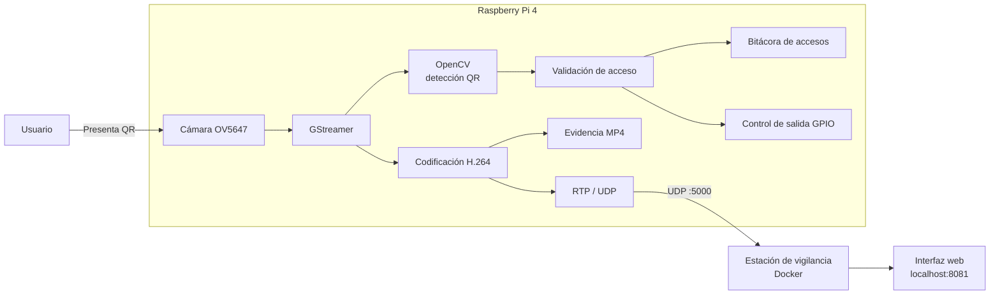

# Sistema de control de acceso con Yocto, GStreamer y Raspberry Pi 4

Proyecto desarrollado para el curso **Taller de Sistemas Embebidos** del Instituto Tecnológico de Costa Rica.

El sistema implementa una solución embebida de control y supervisión de acceso sobre una **Raspberry Pi 4** con cámara **OV5647**. La plataforma utiliza una imagen Linux personalizada construida con **Yocto Project**, una aplicación desarrollada en **Python**, **GStreamer** y **OpenCV**, y una estación de vigilancia ejecutada mediante **Docker**.

La aplicación procesa códigos QR obtenidos directamente desde la cámara, determina si el identificador presentado está autorizado, registra cada evento, genera evidencia de video y transmite simultáneamente el flujo hacia una estación remota de vigilancia.

---

## Arquitectura general

El sistema se divide en dos plataformas principales:

- **Raspberry Pi 4:** captura, procesamiento, decisión de acceso, almacenamiento de evidencia y transmisión.
- **Estación de vigilancia:** recepción del flujo RTP/UDP y visualización mediante una interfaz web ejecutada en Docker.



La captura de cámara se comparte mediante un `tee` de GStreamer, permitiendo procesar el mismo flujo para identificación, grabación y transmisión sin abrir múltiples instancias de la cámara.

---

## Funcionalidades principales

El sistema incorpora:

- captura de video mediante `libcamerasrc`;
- procesamiento de códigos QR con OpenCV;
- validación de identificadores autorizados;
- política de decisión *fail-secure* ante timeout;
- generación independiente de evidencia MP4 por evento;
- transmisión H.264 mediante RTP/UDP;
- estación de vigilancia basada en Docker;
- bitácora persistente de solicitudes de acceso;
- política automática de retención de evidencias y registros;
- ejecución automática mediante `systemd`;
- recuperación del servicio ante fallos;
- soporte para ejecución con fuente sintética en entornos sin cámara;
- pruebas automatizadas mediante Jenkins.

Los identificadores utilizados para las pruebas de autorización son:

```text
MC001
MC002
```

Cualquier otro identificador QR decodificado es clasificado como acceso denegado.

---

## Flujo de operación

Durante la operación normal:

1. La cámara captura continuamente el punto de acceso.
2. GStreamer distribuye el flujo entre las ramas de procesamiento y multimedia.
3. OpenCV analiza los frames en busca de códigos QR.
4. El identificador obtenido es procesado fuera del hilo principal de GStreamer.
5. El sistema determina si la solicitud está autorizada o denegada.
6. El evento se registra en una bitácora persistente.
7. Se inicia una evidencia de video asociada al evento.
8. El flujo de cámara continúa transmitiéndose hacia la estación de vigilancia.

La decisión de acceso utiliza un tiempo máximo configurable. Si la clasificación no finaliza dentro de ese intervalo, la solicitud es denegada siguiendo una política *fail-secure*.

---

## Evidencia y persistencia

Los datos generados por la aplicación se almacenan en:

```text
/var/lib/control-acceso
```

con la siguiente estructura:

```text
/var/lib/control-acceso/
├── bitacora_accesos.log
└── evidencias/
    ├── evidencia_YYYY-MM-DD_HH-MM-SS_microsegundos.mp4
    └── ...
```

Cada evento incluye:

- fecha y hora;
- identificador detectado;
- resultado de autorización;
- referencia al archivo de evidencia correspondiente.

La política de retención configurada es:

```text
Evidencias de video: 7 días
Bitácora de accesos: 30 días
```

Cada evidencia tiene una duración de **60 segundos**.

---

## Plataforma Yocto

La imagen Linux se construye para:

```text
MACHINE = "raspberrypi4-64"
INIT_MANAGER = "systemd"
```

El proyecto utiliza una capa propia denominada:

```text
meta-control-acceso
```

Esta capa contiene:

```text
meta-control-acceso/
├── conf/
│   └── layer.conf
├── recipes-apps/
│   └── control-acceso/
│       ├── control-acceso_1.0.bb
│       └── files/
│           ├── control-acceso.service
│           └── prueba_integrada_h1.py
├── recipes-core/
│   └── images/
│       └── control-acceso-image.bb
└── recipes-multimedia/
    └── libcamera/
        └── libcamera_%.bbappend
```

La imagen integra las dependencias necesarias para cámara, GStreamer, OpenCV, Python, networking y ejecución automática de la aplicación.

Las revisiones utilizadas para Poky, `meta-openembedded` y `meta-raspberrypi` se encuentran registradas en:

```text
yocto-config/versiones.txt
```

---

## Servicio de control de acceso

La aplicación se instala como:

```text
/usr/bin/control-acceso
```

y se administra mediante:

```text
control-acceso.service
```

El servicio utiliza:

```text
/etc/default/control-acceso
```

para configurar parámetros de ejecución como:

```text
CONTROL_ACCESO_MODE
CONTROL_ACCESO_GUI
DEST_HOST
DEST_PORT
```

Comandos principales:

```bash
systemctl status control-acceso
systemctl restart control-acceso
journalctl -fu control-acceso
```

---

## Estación de vigilancia

La estación de vigilancia recibe el flujo H.264 transmitido por la Raspberry Pi mediante **RTP sobre UDP**.

El contrato de transmisión utilizado es:

```text
Codec:       H.264
Transporte:  RTP/UDP
Puerto:      5000
Payload:     96
Clock rate:  90000 Hz
```

Para ejecutar únicamente la estación de vigilancia:

```bash
cd ~/Project_1_Embebidos

docker compose \
    -f compose.yaml \
    -f compose.web.yaml \
    up --build -d vigilante
```

La interfaz se visualiza en:

```text
http://localhost:8081
```

Para detenerla:

```bash
docker compose \
    -f compose.yaml \
    -f compose.web.yaml \
    down
```

---

## Demostración con dos contenedores

El repositorio también permite probar el enlace multimedia sin utilizar la Raspberry Pi.

En este modo:

```text
Contenedor emisor
    ↓
videotestsrc
    ↓
H.264 / RTP / UDP
    ↓
Contenedor vigilante
    ↓
Interfaz web
```

Se ejecuta mediante:

```bash
docker compose \
    -f compose.yaml \
    -f compose.web.yaml \
    up --build -d
```

El emisor utiliza una fuente sintética de video y reproduce el mismo contrato RTP utilizado posteriormente por la Raspberry Pi.

---

## Codificación H.264

La implementación utiliza:

```text
x264enc
```

para realizar la codificación H.264 por software.

Durante el desarrollo también se evaluó `v4l2h264enc` como alternativa de codificación mediante hardware. El dispositivo V4L2 correspondiente al encoder fue detectado en la Raspberry Pi, pero la ruta no consiguió procesar correctamente los frames en la configuración utilizada.

Por este motivo, `x264enc` se adoptó como la ruta funcional de codificación del sistema.

---

## Pruebas y validación

El repositorio incluye pruebas para evaluar aspectos como:

- negociación de *caps*;
- formato de píxel;
- framerate;
- topología del pipeline;
- comportamiento de `tee`, `queue` y `appsink`;
- intervalo de keyframes;
- latencia;
- manejo de errores;
- recuperación del pipeline;
- cierre de archivos MP4;
- comportamiento ante almacenamiento insuficiente;
- reinicio mediante systemd;
- arquitectura de hilos;
- timeout de decisión;
- retención de evidencias;
- disponibilidad de plugins y versiones del entorno.

Las pruebas se encuentran en:

```text
tests/
├── host/
└── rpi/
```

y su ejecución automatizada se define mediante:

```text
Jenkinsfile
```

Los resultados conservados como evidencia se almacenan en:

```text
resultados/
```

---

## Estructura del repositorio

```text
Project_1_Embebidos/
├── prueba_integrada_h1.py
├── Dockerfile
├── Jenkinsfile
├── compose.yaml
├── compose.web.yaml
├── compose.offline.yaml
│
├── docker/
│   ├── emisor.sh
│   ├── vigilante.sh
│   └── vigilante_web.py
│
├── meta-control-acceso/
│   ├── conf/
│   ├── recipes-apps/
│   ├── recipes-core/
│   └── recipes-multimedia/
│
├── yocto-config/
│   ├── project-local.conf
│   └── versiones.txt
│
├── scripts/
├── tests/
├── resultados/
└── docs/
```

---

## Tecnologías utilizadas

- Raspberry Pi 4
- Raspberry Pi Camera Board v1.3 / OV5647
- Yocto Project
- Linux
- Python
- GStreamer
- OpenCV
- libcamera
- H.264
- RTP/UDP
- Docker
- systemd
- Jenkins
- Git / GitHub

---

## Documentación técnica

La documentación detallada del sistema se encuentra en:

```text
docs/
```

e incluye la arquitectura, diseño del pipeline multimedia, construcción de la imagen Yocto, entorno Docker/QEMU, requerimientos, casos de uso, metodología de validación y decisiones técnicas del proyecto.
