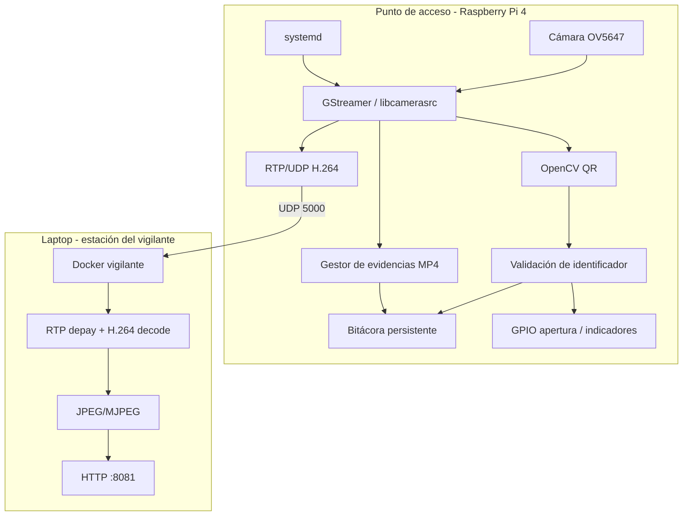
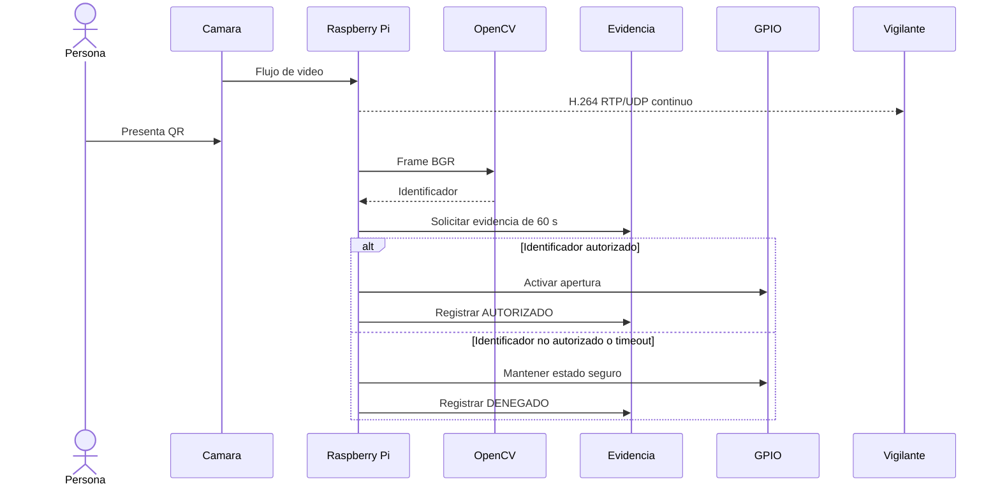

# Arquitectura del sistema

## 1. Propósito

El sistema supervisa un punto de acceso mediante una cámara, identifica una solicitud mediante un código QR, decide si el identificador está autorizado, conserva evidencia de video, transmite video en vivo a una estación de vigilancia y, en la versión final, debe accionar una salida eléctrica de apertura cuando el acceso sea autorizado.

## 2. Componentes

| Componente | Función |
|---|---|
| Raspberry Pi 4 | Plataforma embebida objetivo |
| Raspberry Pi Camera Board v1.3 / OV5647 | Captura de video |
| Yocto Project | Generación de la imagen Linux |
| libcamera / libcamerasrc | Acceso a la cámara |
| GStreamer | Procesamiento multimedia |
| OpenCV | Detección y decodificación de QR |
| Python | Lógica de integración y control |
| systemd | Arranque y recuperación del servicio |
| microSD | Sistema operativo y almacenamiento persistente |
| Ethernet | Enlace Raspberry Pi ↔ laptop |
| Docker | Estación del vigilante |
| Navegador web | Visualización del video recibido |
| GPIO | Salida de apertura e indicadores; pendiente de cierre físico |

## 3. Arquitectura de bloques



## 4. Flujo funcional



## 5. Persistencia

La aplicación trabaja en:

```text
/var/lib/control-acceso
```

Estructura:

```text
/var/lib/control-acceso/
├── bitacora_accesos.log
└── evidencias/
    ├── evidencia_YYYY-MM-DD_HH-MM-SS_microsegundos.mp4
    └── ...
```

Cada evento guarda fecha/hora, identificador, resultado y ruta relativa al video asociado.

Política implementada:

- videos de evidencia: 7 días;
- bitácora textual: 30 días.

## 6. Red de integración

Montaje de laboratorio validado:

```text
Laptop Ethernet: 10.42.0.1
Raspberry Pi:    10.42.0.x (DHCP compartido)
RTP/UDP:         puerto 5000
Web vigilante:   127.0.0.1:8081
```

La dirección de la Raspberry puede cambiar. Debe verificarse con `ip neigh` o mediante DHCP antes de conectarse por SSH.

## 7. Decisiones abiertas

- selección final del GPIO y circuito de apertura;
- validación de encoder H.264 por hardware;
- medición final de FPS, latencia, CPU y throttling;
- validación definitiva del rearme de QR sin duplicados.
