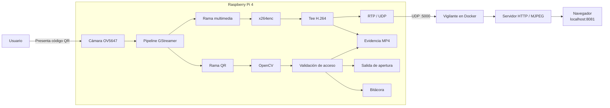
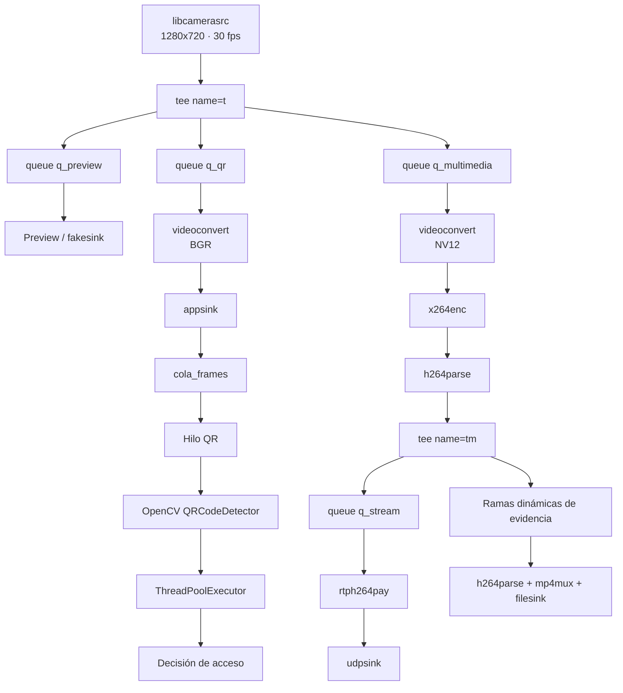
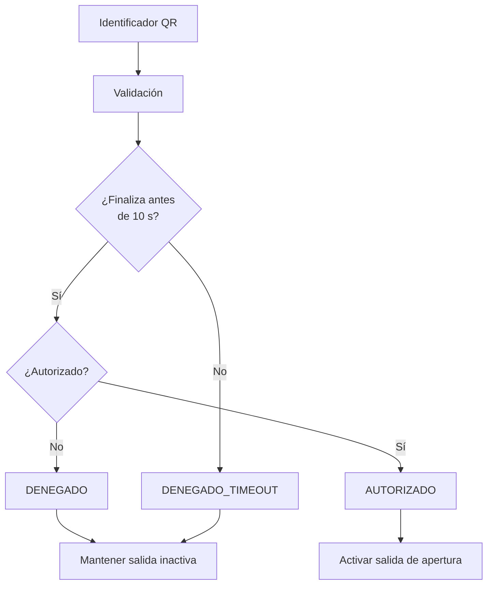
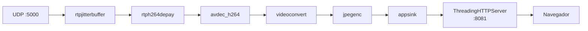
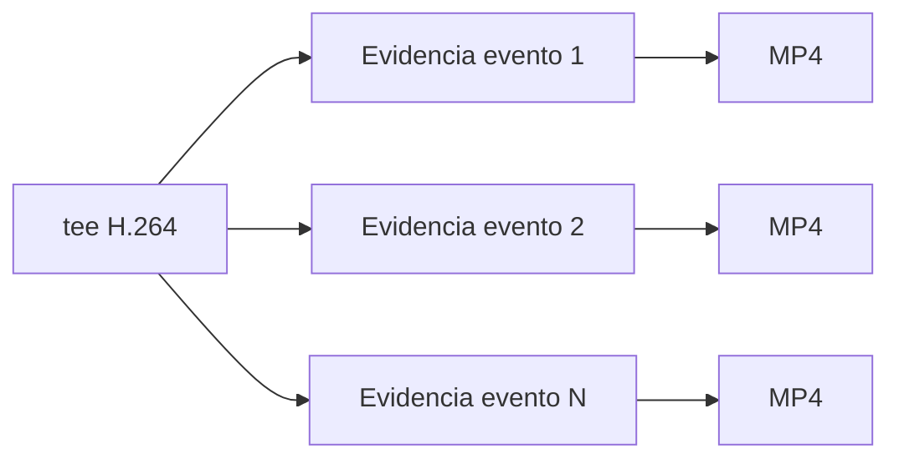
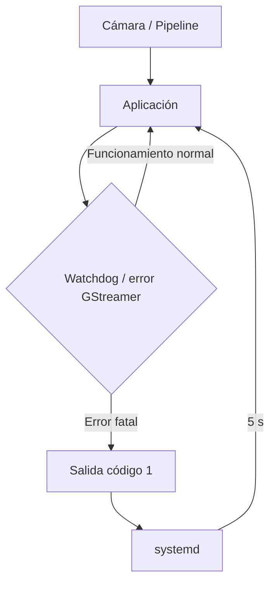
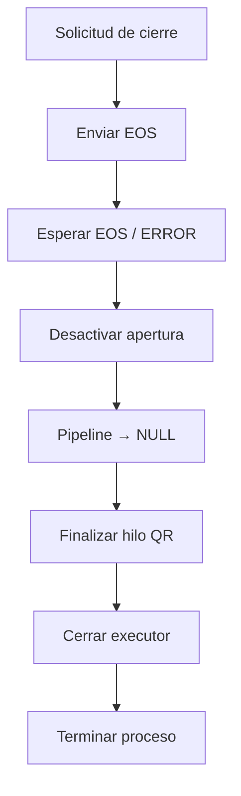
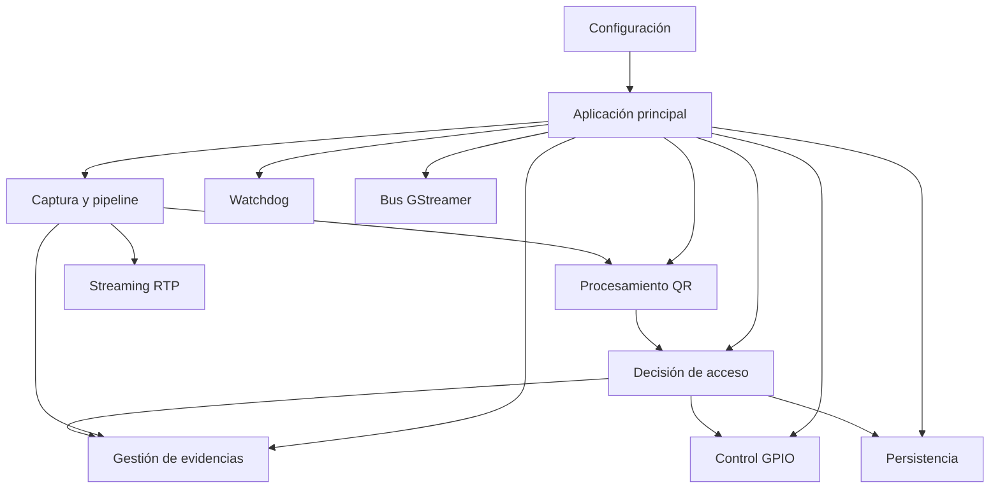
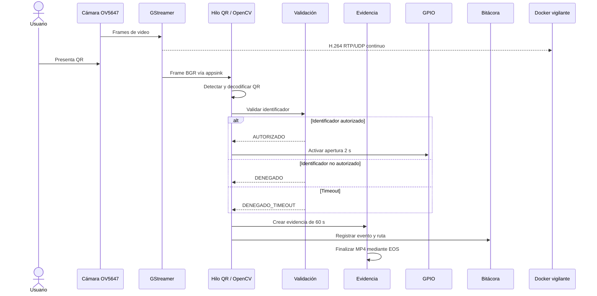

# Arquitectura del sistema

## 1. Propósito

El sistema de control de acceso integra captura de video, identificación mediante códigos QR, decisión de autorización, generación de evidencia, control de una salida de apertura y transmisión de video hacia una estación de vigilancia.

La solución se ejecuta principalmente sobre una **Raspberry Pi 4** con una cámara **OV5647** y una imagen Linux personalizada construida mediante **Yocto Project**. La aplicación principal está desarrollada en **Python**, utiliza **GStreamer** para el procesamiento multimedia y **OpenCV** para la detección y decodificación de códigos QR.

La estación de vigilancia se ejecuta en una computadora con **Docker** y recibe el flujo H.264 enviado por la Raspberry Pi mediante RTP sobre UDP.

---

## 2. Vista general de la arquitectura

La arquitectura se divide en dos nodos principales:

1. **Nodo embebido:** Raspberry Pi 4.
2. **Estación de vigilancia:** computadora con Docker y navegador web.



La Raspberry Pi concentra la lógica crítica del sistema. La estación de vigilancia actúa como receptor y visualizador del video, sin participar en la decisión de autorización.

---

## 3. Componentes principales

| Componente | Función |
|---|---|
| Raspberry Pi 4 | Plataforma embebida que ejecuta la aplicación de control |
| Cámara OV5647 | Fuente de video del punto de acceso |
| Yocto Project | Construcción de la imagen Linux personalizada |
| libcamera / `libcamerasrc` | Acceso a la cámara desde GStreamer |
| GStreamer | Captura, conversión, codificación, grabación y transmisión |
| OpenCV | Detección y decodificación de códigos QR |
| Python | Integración de la lógica del sistema |
| `systemd` | Arranque automático y recuperación del servicio |
| `x264enc` | Codificación H.264 por software |
| microSD | Sistema operativo y almacenamiento persistente |
| Ethernet | Comunicación entre Raspberry Pi y estación de vigilancia |
| Docker | Ejecución aislada de la estación del vigilante |
| Navegador web | Visualización del video recibido |
| GPIO BCM17 | Interfaz lógica de apertura del acceso |
| Jenkins | Automatización de pruebas de integración y validación |

---

## 4. Arquitectura del nodo embebido

La aplicación utiliza una única fuente de video y distribuye el flujo mediante un elemento `tee` de GStreamer.

Esta decisión evita abrir la cámara varias veces y permite que captura, análisis QR y procesamiento multimedia trabajen de forma paralela.



El pipeline tiene tres ramas principales antes de la codificación:

- **preview:** mantiene una salida de visualización o descarte;
- **QR:** entrega frames BGR a OpenCV mediante `appsink`;
- **multimedia:** convierte, codifica y distribuye el video H.264.

Después de la codificación existe un segundo `tee`, denominado `tm`, que permite reutilizar el flujo H.264 tanto para transmisión como para las grabaciones de evidencia.

---

## 5. Captura de video

En Raspberry Pi la fuente utilizada es:

```text
libcamerasrc
! video/x-raw,width=1280,height=720,framerate=30/1
```

La cámara se accede mediante libcamera y el plugin `libcamerasrc`.

La aplicación también contempla otros modos de ejecución:

| Modo | Fuente |
|---|---|
| `rpi` | `libcamerasrc` |
| `host` | `v4l2src` |
| `qemu` | `videotestsrc` |

Esta separación permite utilizar la misma lógica general de aplicación con diferentes fuentes de video.

---

## 6. Procesamiento QR y concurrencia

La detección QR se diseñó para evitar que una operación relativamente costosa bloquee el hilo de streaming de GStreamer.

El callback asociado al `appsink` se limita a recibir el frame y colocarlo en una cola:

```text
GStreamer / appsink
        ↓
   cola_frames
        ↓
   hilo procesar_qr
        ↓
 OpenCV QRCodeDetector
        ↓
ThreadPoolExecutor
        ↓
validar_identificador()
```

La cola de frames tiene tamaño limitado. Si el procesamiento QR no puede seguir el ritmo de la cámara, se priorizan frames recientes en lugar de acumular indefinidamente datos antiguos.

La lógica de decisión se ejecuta en un `ThreadPoolExecutor` independiente del callback de GStreamer.

---

## 7. Decisión de acceso

Los identificadores autorizados configurados en la aplicación son:

```text
MC001
MC002
```

La clasificación básica es:

```text
identificador autorizado     -> AUTORIZADO
otro identificador válido    -> DENEGADO
timeout de decisión          -> DENEGADO_TIMEOUT
```

El tiempo máximo de decisión es:

```text
10 s
```

El uso de timeout implementa una política **fail-secure**: si la decisión no puede completarse dentro del tiempo permitido, el sistema no concede acceso.



---

## 8. Control de apertura

La lógica de salida de apertura está asociada a **BCM17**.

En la implementación Linux utilizada, la aplicación accede al GPIO mediante sysfs:

```text
/sys/class/gpio/gpio529
```

donde:

```text
512 + 17 = 529
```

Durante la inicialización, la dirección se configura con:

```text
low
```

lo que establece la salida como salida digital y la coloca inicialmente en estado bajo.

Para una autorización válida:

```text
salida HIGH
    ↓
2 segundos
    ↓
salida LOW
```

La aplicación utiliza un temporizador independiente para devolver la salida al estado inactivo.

Antes de terminar por error o durante un cierre controlado, la aplicación ejecuta la desactivación de la salida, manteniendo la política de no conceder una apertura de forma accidental.

---

## 9. Codificación y distribución H.264

La rama multimedia utiliza:

```text
videoconvert
→ video/x-raw,format=NV12
→ x264enc
→ h264parse
→ tee
```

La configuración principal del encoder es:

```text
tune=zerolatency
bitrate=2000
speed-preset=veryfast
key-int-max=30
scenecut=0
```

La implementación utiliza `x264enc`, por lo que la codificación H.264 se realiza por software.

El flujo H.264 resultante se reutiliza en dos funciones:

1. transmisión continua hacia la estación de vigilancia;
2. generación dinámica de evidencias MP4.

---

## 10. Transmisión hacia la estación de vigilancia

La rama de transmisión utiliza:

```text
h264parse
→ rtph264pay
→ udpsink
```

con los siguientes parámetros:

```text
Payload RTP:  96
Clock rate:   90000 Hz
Puerto UDP:   5000
```

La dirección del receptor se obtiene de:

```text
DEST_HOST
```

y el puerto de:

```text
DEST_PORT
```

La configuración utilizada por la imagen Yocto define:

```text
DEST_HOST=10.42.0.1
DEST_PORT=5000
```

---

## 11. Estación de vigilancia

La estación de vigilancia se ejecuta dentro de Docker.

Su pipeline receptor es:

```text
udpsrc
→ rtpjitterbuffer
→ rtph264depay
→ avdec_h264
→ videoconvert
→ jpegenc
→ appsink
```

El `appsink` conserva el frame JPEG más reciente y un servidor HTTP entrega estos frames al navegador como una transmisión MJPEG.



La interfaz web se encuentra en:

```text
http://localhost:8081
```

La estación de vigilancia no modifica el proceso de autorización. Su responsabilidad es únicamente recibir y presentar el video del punto de acceso.

---

## 12. Evidencia de video por evento

Cada solicitud de acceso genera una evidencia independiente de:

```text
60 s
```

La grabación no utiliza una tubería separada desde la cámara. En su lugar, se conecta dinámicamente una nueva rama al `tee` H.264 `tm`.

La rama creada para cada evento contiene:

```text
queue
→ h264parse
→ mp4mux
→ filesink
```

El nombre del archivo utiliza una marca temporal con resolución de microsegundos:

```text
evidencia_YYYY-MM-DD_HH-MM-SS_microsegundos.mp4
```

Esto permite que varias evidencias puedan coexistir sin colisiones de nombre.



Al finalizar la duración configurada, la rama recibe EOS para permitir que `mp4mux` cierre correctamente el contenedor MP4 antes de desmontarla del pipeline.

---

## 13. Persistencia y bitácora

El servicio utiliza como directorio de trabajo:

```text
/var/lib/control-acceso
```

La estructura de datos es:

```text
/var/lib/control-acceso/
├── bitacora_accesos.log
└── evidencias/
    └── evidencia_*.mp4
```

Cada evento registra información asociada con:

- fecha y hora;
- identificador QR;
- resultado de autorización;
- archivo de evidencia correspondiente.

La política de retención implementada es:

```text
Evidencias de video: 7 días
Bitácora:            30 días
```

La limpieza se realiza a partir de las marcas temporales almacenadas por el sistema.

---

## 14. Supervisión de la cámara

La aplicación incorpora un watchdog de frames.

Después de que el pipeline alcanza el estado `PLAYING`, se controla el tiempo transcurrido desde el último frame recibido.

El límite configurado es:

```text
3 s sin frames
```

Si se supera ese intervalo:

1. la cámara se considera no operativa;
2. se fuerza la salida de apertura al estado seguro;
3. se marca un error fatal;
4. la aplicación termina con código de salida distinto de cero.

Este comportamiento permite que `systemd` actúe como nivel externo de recuperación.

---

## 15. Gestión del servicio mediante systemd

La aplicación se instala como:

```text
/usr/bin/control-acceso
```

y se ejecuta mediante:

```text
control-acceso.service
```

La unidad utiliza:

```ini
WorkingDirectory=/var/lib/control-acceso
ExecStart=/usr/bin/python3 /usr/bin/control-acceso
Restart=on-failure
RestartSec=5
```

La arquitectura de recuperación queda formada por dos niveles:



La aplicación detecta fallos relacionados con el flujo y termina de forma controlada; `systemd` se encarga de iniciar nuevamente el proceso cuando la terminación corresponde a un fallo.

---

## 16. Manejo del bus de GStreamer

El bus del pipeline procesa los mensajes principales:

- `ERROR`;
- `WARNING`;
- `EOS`.

Ante un error de GStreamer se registra el origen y la información de diagnóstico, se marca la condición de error fatal y se abandona el `GLib.MainLoop`.

Durante una terminación solicitada, la aplicación envía EOS al pipeline y espera la finalización antes de liberar los recursos.

---

## 17. Cierre coordinado

La aplicación contempla cierre mediante:

- `SIGTERM`;
- `Ctrl+C`;
- EOS de GStreamer.

El flujo de cierre es:



El objetivo es liberar los elementos multimedia y mantener la salida de apertura en estado inactivo antes de terminar.

---

## 18. Configuración mediante variables de entorno

La aplicación separa parámetros de ejecución del código.

Entre las variables utilizadas se encuentran:

```text
CONTROL_ACCESO_MODE
CONTROL_ACCESO_GUI
CONTROL_ACCESO_GPIO
CONTROL_ACCESO_DATA_DIR
VIDEO_DEVICE
DEST_HOST
DEST_PORT
```

En la imagen Yocto, los parámetros principales se instalan en:

```text
/etc/default/control-acceso
```

El servicio systemd carga este archivo mediante:

```ini
EnvironmentFile=-/etc/default/control-acceso
```

---

## 19. Arquitectura de software

A nivel lógico, la aplicación puede dividirse en los siguientes módulos funcionales:



Esta separación funcional permite que las tareas de captura, decisión, grabación, transmisión y recuperación no dependan de un único flujo de ejecución.

---

## 20. Arquitectura de despliegue

La aplicación se incorpora directamente a la imagen Yocto mediante la receta:

```text
meta-control-acceso/
└── recipes-apps/
    └── control-acceso/
        ├── control-acceso_1.0.bb
        └── files/
            ├── prueba_integrada_h1.py
            └── control-acceso.service
```

La receta:

- instala la aplicación;
- instala y habilita la unidad systemd;
- declara las dependencias de ejecución;
- crea la configuración de entorno;
- prepara el directorio persistente de datos.

La imagen completa se construye mediante:

```text
control-acceso-image.bb
```

---

## 21. Flujo completo del sistema



---

## 22. Resumen arquitectónico

La arquitectura final se fundamenta en cinco decisiones principales:

1. **Una única captura de cámara**, distribuida mediante `tee`.
2. **Procesamiento QR fuera del callback de GStreamer**, evitando bloquear el pipeline multimedia.
3. **Un único flujo H.264 compartido** entre transmisión y evidencias.
4. **Política fail-secure**, aplicada tanto al timeout de decisión como al manejo de fallos.
5. **Recuperación en dos niveles**, mediante watchdog interno y reinicio externo con systemd.

Estas decisiones permiten integrar captura, análisis, almacenamiento, control y vigilancia remota dentro de una sola plataforma embebida, manteniendo separadas las responsabilidades críticas del sistema.
