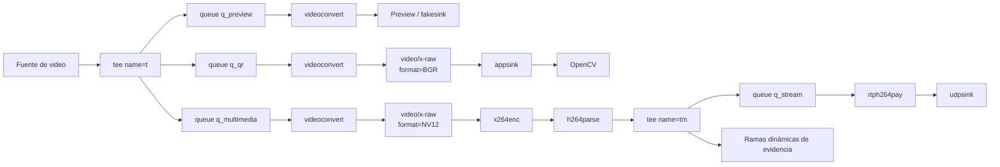
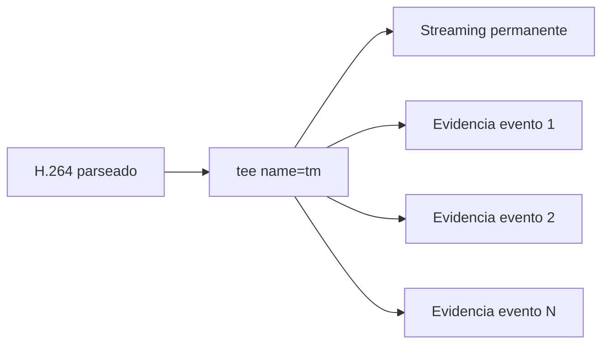
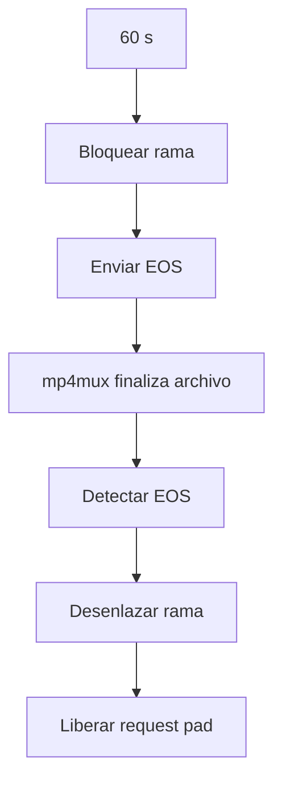
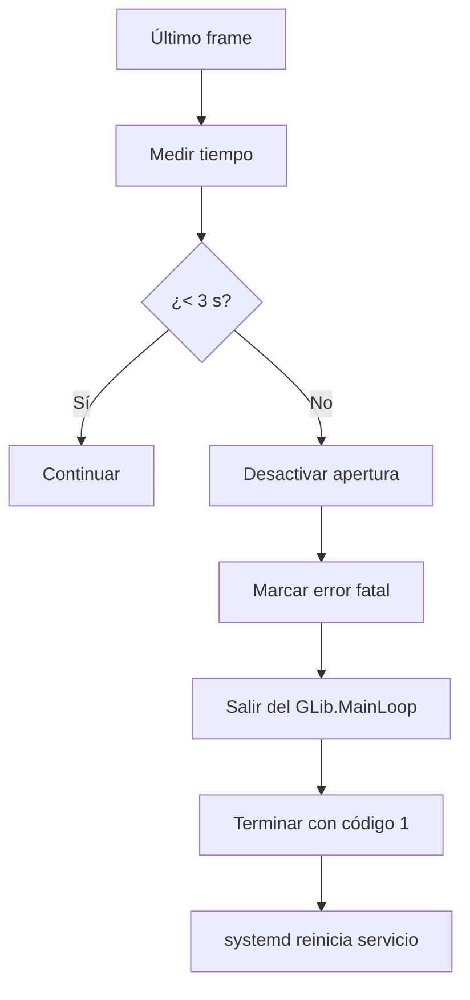
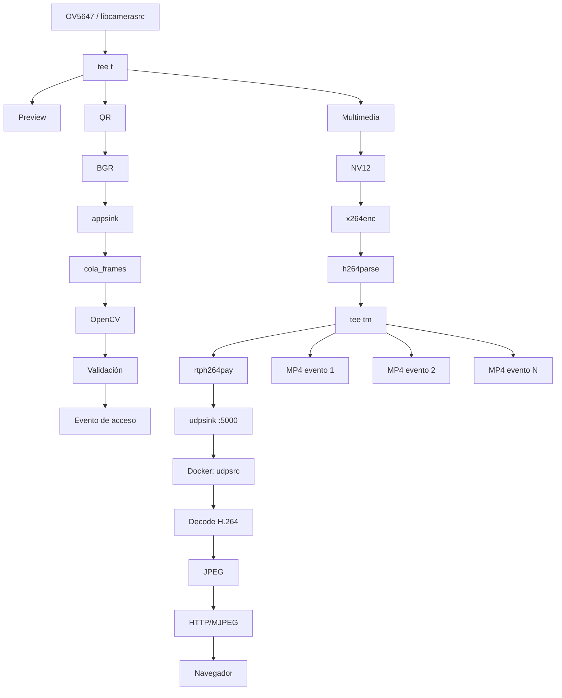

# Pipeline GStreamer

## 1. Propósito

El pipeline multimedia es el núcleo del sistema de control de acceso. Su función es tomar una única fuente de video y distribuirla de forma concurrente hacia tres necesidades principales:

1. visualización local o descarte controlado;
2. procesamiento de códigos QR mediante OpenCV;
3. codificación H.264 para transmisión y generación de evidencias.

La implementación utiliza **GStreamer 1.22.12** y se construye desde Python mediante `Gst.parse_launch()`.

---

## 2. Fuente de video

La aplicación selecciona la fuente de video según el modo de ejecución.

### Raspberry Pi

En la Raspberry Pi se utiliza:

```text
libcamerasrc
! video/x-raw,width=1280,height=720,framerate=30/1
```

`libcamerasrc` obtiene los frames desde la cámara OV5647 a través de libcamera.

### Host Linux

Para pruebas con una cámara compatible con Video4Linux2:

```text
v4l2src device=/dev/video0
! image/jpeg,width=1280,height=720,framerate=30/1
! jpegdec
```

El dispositivo puede modificarse mediante la variable:

```text
VIDEO_DEVICE
```

### QEMU

Cuando la aplicación se ejecuta en modo `qemu`, la fuente física se sustituye por:

```text
videotestsrc is-live=true pattern=smpte
! video/x-raw,width=1280,height=720,framerate=30/1
```

Esto permite probar el comportamiento general del pipeline sin depender de una cámara física.

---

## 3. Pipeline general

La aplicación utiliza un primer `tee`, denominado `t`, para dividir la captura de video en tres ramas.



Este diseño permite reutilizar una sola captura de cámara y mantener separadas las tareas de análisis, visualización y multimedia.

---

## 4. Rama de visualización

La rama de visualización se construye como:

```text
t.
→ queue
→ videoconvert
→ autovideosink / fakesink
```

La selección del sink depende de:

```text
CONTROL_ACCESO_GUI
```

Cuando la interfaz gráfica está habilitada:

```text
autovideosink sync=false
```

Cuando está deshabilitada:

```text
fakesink sync=false
```

La cola utilizada en esta rama tiene política `leaky=downstream` y un tamaño máximo de dos buffers:

```text
max-size-buffers=2
max-size-bytes=0
max-size-time=0
leaky=downstream
```

Esta configuración evita que una visualización lenta provoque crecimiento indefinido de la cola o bloquee el resto del pipeline.

---

## 5. Rama de procesamiento QR

La rama QR entrega frames en formato BGR hacia OpenCV:

```text
t.
→ queue q_qr
→ videoconvert
→ video/x-raw,format=BGR
→ appsink
```

El `appsink` se configura con:

```text
emit-signals=true
max-buffers=2
drop=true
sync=false
```

El callback asociado a `new-sample` no ejecuta directamente la detección ni la decisión de acceso.

Su responsabilidad es:

1. obtener el frame;
2. convertirlo a una estructura utilizable por OpenCV;
3. colocar el frame en `cola_frames`.

La cola de procesamiento está limitada a:

```text
maxsize=2
```

De esta forma, si el procesamiento QR tarda más que la llegada de frames, se evita acumular una gran cantidad de información atrasada.

---

## 6. Separación entre GStreamer y la decisión de acceso

La arquitectura de procesamiento es:

```text
appsink
   ↓
callback de GStreamer
   ↓
cola_frames
   ↓
hilo procesar_qr
   ↓
OpenCV QRCodeDetector
   ↓
ThreadPoolExecutor
   ↓
validar_identificador()
```

La decisión de acceso se ejecuta fuera del hilo del `appsink`.

Esto evita que operaciones de OpenCV o validación interfieran con la continuidad del flujo multimedia.

El sistema utiliza:

```python
ThreadPoolExecutor(max_workers=1)
```

para ejecutar la clasificación del identificador.

---

## 7. Detección y decodificación QR

La aplicación utiliza:

```python
cv2.QRCodeDetector()
```

para localizar y decodificar códigos QR.

Los identificadores autorizados configurados son:

```text
MC001
MC002
```

El resultado de la clasificación puede ser:

```text
AUTORIZADO
DENEGADO
DENEGADO_TIMEOUT
```

La decisión utiliza un límite de:

```text
10 s
```

Si el clasificador supera ese tiempo, la solicitud es denegada.

---

## 8. Control de eventos QR repetidos

La aplicación incorpora dos mecanismos temporales para evitar eventos duplicados.

### Rearme visual

```text
TIEMPO_REARME_QR = 3.0 s
```

Cuando el código deja de observarse durante ese intervalo, el sistema puede volver a reconocer un código mostrado nuevamente.

### Bloqueo del mismo identificador

```text
TIEMPO_BLOQUEO_MISMO_QR = 60.0 s
```

Después de procesar un identificador, el mismo código no genera un nuevo evento durante el intervalo de bloqueo configurado.

Esto evita que un QR mantenido frente a la cámara produzca múltiples solicitudes de acceso consecutivas.

---

## 9. Rama multimedia

La tercera rama del primer `tee` prepara los frames para codificación:

```text
t.
→ queue q_multimedia
→ videoconvert
→ video/x-raw,format=NV12
→ x264enc
→ h264parse
→ tee name=tm
```

La cola multimedia utiliza:

```text
max-size-buffers=8
max-size-bytes=0
max-size-time=0
leaky=no
```

A diferencia de las ramas de análisis y visualización, esta rama no descarta buffers de forma intencional porque alimenta la transmisión y las evidencias.

---

## 10. Codificación H.264

La implementación utiliza el encoder:

```text
x264enc
```

con la configuración:

```text
tune=zerolatency
bitrate=2000
speed-preset=veryfast
key-int-max=30
option-string=scenecut=0
```

El objetivo de esta configuración es reducir la latencia y mantener un intervalo controlado entre keyframes.

Después del encoder se utiliza:

```text
h264parse config-interval=-1
```

antes de distribuir el flujo mediante el segundo `tee`, denominado `tm`.

La codificación H.264 se realiza por software.

Durante el desarrollo también se evaluó `v4l2h264enc`. El dispositivo correspondiente al encoder V4L2 fue detectado, pero no logró procesar los frames correctamente en la plataforma utilizada. Por esta razón se conservó `x264enc` como ruta funcional del sistema.

---

## 11. Segundo tee: distribución del flujo H.264

Una vez codificado el video, el elemento:

```text
tee name=tm
```

distribuye el flujo H.264 hacia dos destinos:



La rama de streaming existe durante toda la ejecución.

Las ramas de evidencia se crean y eliminan dinámicamente según los eventos QR detectados.

---

## 12. Streaming RTP/UDP

La rama permanente de streaming es:

```text
tm.
→ queue q_stream
→ rtph264pay
→ udpsink
```

La configuración utilizada es:

```text
rtph264pay pt=96 config-interval=1
```

y el destino se obtiene mediante:

```text
DEST_HOST
DEST_PORT
```

La configuración instalada en la imagen Yocto utiliza:

```text
DEST_HOST=10.42.0.1
DEST_PORT=5000
```

El contrato de transmisión es:

```text
Codec:        H.264
Transporte:   RTP sobre UDP
Payload:      96
Clock rate:   90000 Hz
Puerto:       5000
```

El `udpsink` se ejecuta con:

```text
sync=false
```

para evitar que el sink introduzca sincronización adicional que aumente la latencia.

---

## 13. Receptor de la estación de vigilancia

La estación de vigilancia utiliza otro pipeline GStreamer dentro de Docker.

El receptor es:

```text
udpsrc port=5000
→ rtpjitterbuffer latency=100
→ rtph264depay
→ avdec_h264
→ videoconvert
→ video/x-raw,format=I420
→ jpegenc quality=75
→ appsink
```

El contrato RTP se declara explícitamente como:

```text
application/x-rtp
media=video
encoding-name=H264
payload=96
clock-rate=90000
```

El `appsink` del receptor utiliza:

```text
max-buffers=1
drop=true
sync=false
```

De esta manera, la aplicación web conserva únicamente el frame JPEG más reciente.

El servidor HTTP entrega esos frames al navegador como una secuencia MJPEG en:

```text
http://localhost:8081
```

---

## 14. Generación dinámica de evidencias

Cada evento QR crea una nueva rama conectada al segundo `tee`.

La rama de evidencia tiene la forma:

```text
queue
→ h264parse
→ mp4mux
→ filesink
```

Cada rama recibe un identificador interno distinto:

```text
q_evento_<n>
mux_evento_<n>
archivo_evento_<n>
```

y se conecta mediante un request pad:

```text
tm.request_pad_simple("src_%u")
```

Esto permite que múltiples evidencias permanezcan activas simultáneamente sin crear una segunda captura de cámara ni un segundo encoder H.264.

---

## 15. Duración y nombre de las evidencias

Cada evidencia se mantiene durante:

```text
60 s
```

El archivo se genera con el formato:

```text
evidencia_YYYY-MM-DD_HH-MM-SS_microsegundos.mp4
```

Ejemplo conceptual:

```text
evidencia_2026-10-08_18-25-41_123456.mp4
```

La resolución temporal del nombre evita colisiones cuando se generan eventos cercanos entre sí.

---

## 16. Finalización de una evidencia

Cuando se cumplen los 60 segundos:

1. se instala un `PadProbe` de bloqueo sobre la rama;
2. se envía un evento EOS únicamente a esa grabación;
3. `mp4mux` finaliza correctamente el contenedor;
4. se detecta el EOS;
5. se retira la rama dinámica del pipeline;
6. se libera el request pad del `tee`.



Este procedimiento permite obtener archivos MP4 correctamente cerrados sin detener el pipeline principal.

---

## 17. Persistencia

Los archivos generados por el pipeline se almacenan en:

```text
/var/lib/control-acceso/evidencias/
```

La bitácora se almacena en:

```text
/var/lib/control-acceso/bitacora_accesos.log
```

Cada solicitud de acceso queda asociada con la ruta de su evidencia correspondiente.

La retención configurada es:

```text
Videos:    7 días
Bitácora: 30 días
```

---

## 18. Watchdog de frames

La aplicación controla la continuidad de la fuente de video.

Después de que el pipeline alcanza `PLAYING`, se almacena el instante del último frame recibido.

La condición de error se define como:

```text
3 s sin recibir frames
```

Si el límite se supera:



La recuperación se realiza externamente mediante la política:

```ini
Restart=on-failure
RestartSec=5
```

del servicio systemd.

---

## 19. Bus de GStreamer

El pipeline instala un `signal watch` sobre el bus:

```python
bus.add_signal_watch()
```

y procesa tres tipos principales de mensajes.

### ERROR

Ante un error:

- se imprime el elemento que originó el fallo;
- se registra el mensaje de error;
- se imprime información de depuración cuando está disponible;
- se marca `error_fatal`;
- se termina el `GLib.MainLoop`.

### WARNING

Las advertencias se registran junto con su origen y datos de depuración, pero no provocan automáticamente la terminación del proceso.

### EOS

La recepción de EOS finaliza el loop principal de manera controlada.

---

## 20. Cierre coordinado del pipeline

La aplicación maneja tanto `SIGTERM` como `Ctrl+C`.

En un cierre solicitado:

```text
solicitud de terminación
        ↓
enviar EOS al pipeline
        ↓
esperar EOS o ERROR
        ↓
desactivar salida de apertura
        ↓
pipeline → NULL
        ↓
finalizar hilo QR
        ↓
cerrar ThreadPoolExecutor
```

El pipeline espera hasta cinco segundos por la recepción de EOS antes de continuar con la liberación de recursos.

---

## 21. Política de colas

Las colas del sistema tienen configuraciones diferentes según la función que cumplen.

| Cola | Política | Objetivo |
|---|---|---|
| `q_preview` | `leaky=downstream`, 2 buffers | Evitar bloqueo por visualización |
| `q_qr` | `leaky=downstream`, 2 buffers | Priorizar frames recientes |
| `q_multimedia` | `leaky=no`, 8 buffers | Mantener continuidad de codificación |
| `q_stream` | `leaky=no`, 2 buffers | Alimentar la transmisión RTP |
| `q_evento_n` | `leaky=no`, 8 buffers | Mantener integridad de cada evidencia |

La política no es idéntica en todas las ramas porque cada una tiene requerimientos distintos.

Las ramas de análisis toleran descarte de frames antiguos, mientras que las ramas multimedia priorizan la continuidad del flujo codificado.

---

## 22. Formatos utilizados

Los formatos principales del pipeline son:

```text
Captura:             video/x-raw
Resolución:          1280 × 720
Framerate objetivo:  30/1
QR/OpenCV:           BGR
Entrada encoder:     NV12
Video comprimido:    H.264
Transporte:          RTP/UDP
Evidencia:           MP4
Web vigilante:       JPEG/MJPEG
```

Las conversiones se realizan explícitamente mediante `videoconvert` y capsfilters para establecer interfaces claras entre las etapas.

---

## 23. Flujo completo del pipeline



---

## 24. Decisiones de diseño

El pipeline se basa en varias decisiones técnicas principales:

1. **Una única captura de cámara.**  
   La fuente se abre una sola vez y se distribuye con `tee`.

2. **Separación entre multimedia y decisión.**  
   La detección QR y la clasificación se ejecutan fuera del callback de GStreamer.

3. **Conversión explícita de formatos.**  
   BGR se reserva para OpenCV y NV12 para la entrada del encoder.

4. **Un solo encoder H.264.**  
   El flujo comprimido se reutiliza para streaming y evidencias.

5. **Ramas dinámicas para evidencia.**  
   Cada evento crea su propia rama MP4 sin detener el flujo principal.

6. **EOS para cierre de archivos.**  
   Las evidencias se finalizan mediante EOS para permitir que `mp4mux` cierre correctamente el contenedor.

7. **Recuperación ante pérdida de frames.**  
   El watchdog detecta interrupciones de cámara y delega la recuperación del proceso a systemd.

8. **RTP/UDP para vigilancia.**  
   Se prioriza una transmisión de baja sobrecarga adecuada para video en vivo dentro de la red de integración.

---

## 25. Resultado

El pipeline integra en una sola arquitectura:

- captura desde cámara real o fuente sintética;
- visualización;
- procesamiento QR;
- codificación H.264;
- generación simultánea de evidencias;
- transmisión RTP/UDP;
- recepción y visualización web;
- manejo de errores;
- cierre coordinado;
- supervisión de pérdida de frames.

La reutilización de una única fuente de video y un único flujo H.264 permite mantener sincronizadas las funciones principales del sistema y reduce la duplicación de procesamiento dentro de la Raspberry Pi.
