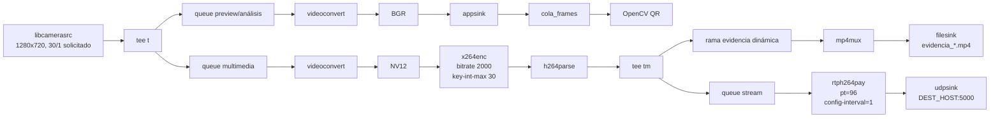

# Pipeline GStreamer

## 1. Objetivo

El pipeline debe compartir una única captura de cámara entre tres necesidades:

1. visualización/procesamiento QR;
2. codificación y evidencia;
3. transmisión en vivo hacia la estación del vigilante.

## 2. Fuente de video

### Raspberry Pi

```text
libcamerasrc
! video/x-raw,width=1280,height=720,framerate=30/1
```

La cámara se detecta mediante libcamera y el overlay OV5647.

### QEMU

En modo `qemu` se sustituye la cámara por:

```text
videotestsrc is-live=true
! video/x-raw,width=1280,height=720,framerate=30/1
```

## 3. Pipeline conceptual



## 4. Procesamiento QR

El callback del `appsink` no realiza la decisión de acceso. Su función principal es extraer el frame y encolarlo. La detección/decodificación QR ocurre en un hilo separado, evitando bloquear el hilo de GStreamer.

Regla actual de acceso:

```text
MC001 -> AUTORIZADO
otro identificador decodificado -> DENEGADO
timeout de decisión -> DENEGADO_TIMEOUT
```

Tiempo máximo configurado:

```text
10 s
```

## 5. Evidencia por evento

Cada lectura QR solicita una rama de grabación independiente. El archivo se crea con un nombre único basado en fecha y hora.

Duración:

```text
60 s
```

Las ramas pueden coexistir: una segunda solicitud puede generar una nueva evidencia mientras una anterior sigue grabándose.

## 6. Streaming

Contrato RTP utilizado tanto por emisor como receptor:

```text
Codec:       H.264
Transporte:  RTP sobre UDP
Puerto:      5000
Payload:     96
Clock rate:  90000
config-interval=1
```

El receptor Docker usa:

```text
udpsrc
-> rtpjitterbuffer
-> rtph264depay
-> avdec_h264
-> videoconvert
-> jpegenc
-> appsink
-> servidor HTTP/MJPEG
```

## 7. Cierre y errores

La aplicación tiene manejo del bus de GStreamer para:

- ERROR;
- WARNING;
- EOS.

El cierre coordinado debe finalizar las ramas y dejar archivos MP4 reproducibles.

## 8. Limitación actual

La codificación usa `x264enc`, es decir, **software**. La integración con `v4l2h264enc` se investigó, pero el encoder hardware no quedó operativo en la configuración actual. No se debe describir `x264enc` como aceleración por hardware.

## 9. Validaciones pendientes del pipeline final

- medir FPS reales y no inferirlos a partir del capsfilter;
- medir latencia extremo a extremo con hardware final;
- medir CPU/RSS;
- revisar throttling;
- decidir si se acepta x264enc o se continúa investigando la ruta hardware;
- generar el grafo final del pipeline en Raspberry/Yocto.
