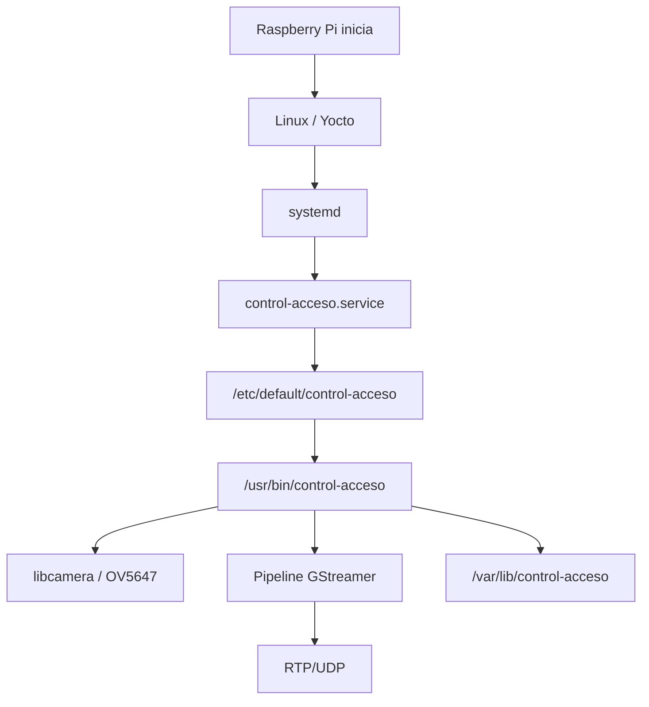
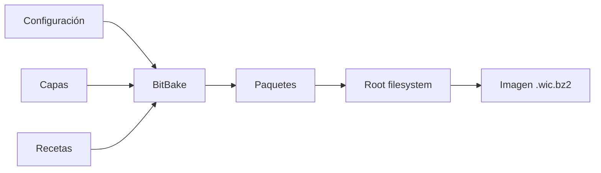
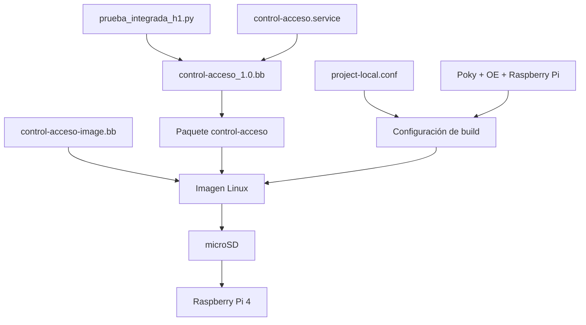
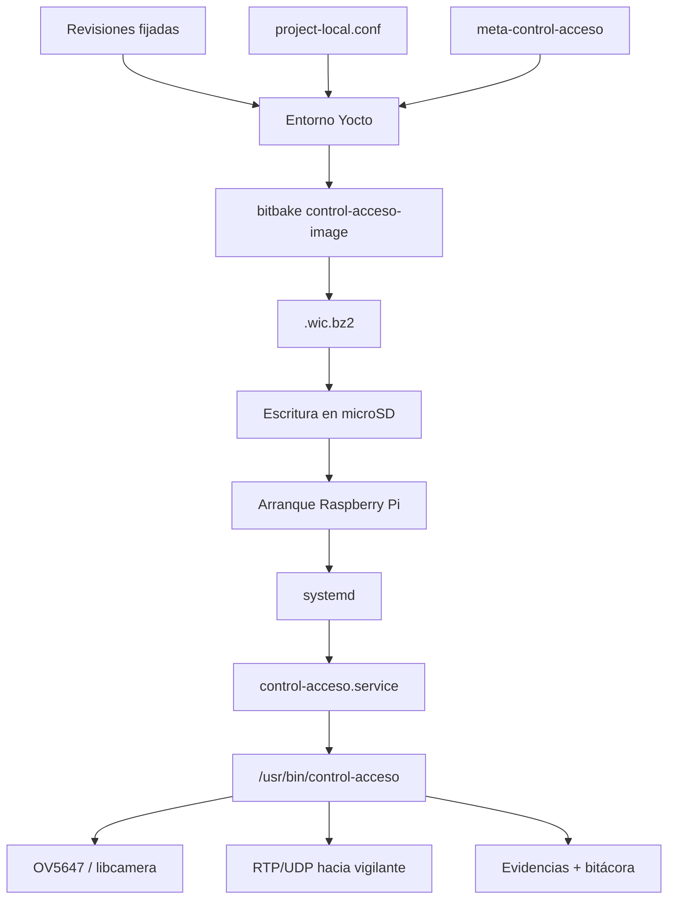

# Yocto: construcción e instalación

## 1. Propósito

Este documento describe la construcción, composición e instalación de la imagen Linux utilizada por el sistema de control de acceso sobre **Raspberry Pi 4**.

La distribución se genera mediante **Yocto Project** a partir de Poky, `meta-openembedded`, `meta-raspberrypi` y una capa propia denominada:

```text
meta-control-acceso
```

La imagen resultante incorpora directamente las dependencias de cámara, GStreamer, OpenCV, Python, networking, almacenamiento y administración del servicio requeridas por la aplicación.

El objetivo de este diseño es que la Raspberry Pi pueda arrancar desde la microSD y ejecutar automáticamente el sistema de control de acceso sin depender de instalaciones manuales posteriores.

---

## 2. Plataforma objetivo

La plataforma de hardware se define mediante:

```bitbake
MACHINE = "raspberrypi4-64"
```

El administrador de servicios utilizado es:

```bitbake
INIT_MANAGER = "systemd"
```

La combinación corresponde a una imagen Linux de 64 bits para Raspberry Pi 4 con arranque y supervisión del servicio mediante systemd.

---

## 3. Versiones del entorno

El proyecto utiliza la serie **Scarthgap** de Yocto Project y conserva las revisiones exactas de las capas principales en:

```text
yocto-config/versiones.txt
```

Las revisiones utilizadas son:

| Componente | Revisión |
|---|---|
| Poky | `cbd62bb2a9f2ab3466a0f72f4289bc86ca20a019` |
| meta-openembedded | `b5874ea07d69919d9b40d59f2c2f0bbd24bc3259` |
| meta-raspberrypi | `6ca1f75017cc5d5acdb8bb05634c4bc01fa049fd` |

El uso de revisiones fijadas permite reconstruir el entorno con las mismas versiones de las capas utilizadas durante el desarrollo y la validación.

---

## 4. Organización de capas

La estructura conceptual del entorno Yocto es:

```text
proyecto-yocto-rpi/
├── poky/
├── meta-openembedded/
├── meta-raspberrypi/
├── meta-control-acceso/
└── build-rpi/
```

Las responsabilidades se distribuyen de la siguiente manera:

| Capa | Responsabilidad |
|---|---|
| Poky | Distribución de referencia, BitBake y componentes base |
| meta-openembedded | Paquetes adicionales de sistema, multimedia y Python |
| meta-raspberrypi | BSP y soporte específico para Raspberry Pi |
| meta-control-acceso | Imagen, aplicación y configuración propias del proyecto |

La capa del proyecto declara compatibilidad con:

```text
scarthgap
```

mediante:

```bitbake
LAYERSERIES_COMPAT_meta-control-acceso = "scarthgap"
```

---

## 5. Capa `meta-control-acceso`

La capa propia contiene la configuración necesaria para integrar la aplicación en la imagen.

```text
meta-control-acceso/
├── COPYING.MIT
├── README
├── conf/
│   └── layer.conf
├── recipes-apps/
│   └── control-acceso/
│       ├── control-acceso_1.0.bb
│       └── files/
│           ├── control-acceso.service
│           └── prueba_integrada_h1.py
├── recipes-core/
│   └── images/
│       └── control-acceso-image.bb
└── recipes-multimedia/
    └── libcamera/
        └── libcamera_%.bbappend
```

La capa se añade al entorno de construcción mediante:

```bash
bitbake-layers add-layer ../meta-control-acceso
```

La ruta concreta puede variar según la ubicación del workspace; lo importante es que `meta-control-acceso` quede registrada en `bblayers.conf`.

---

## 6. Configuración reproducible del proyecto

Los parámetros específicos del proyecto se conservan en:

```text
yocto-config/project-local.conf
```

La configuración utilizada es:

```bitbake
MACHINE = "raspberrypi4-64"
INIT_MANAGER = "systemd"

LICENSE_FLAGS_ACCEPTED += "synaptics-killswitch"
LICENSE_FLAGS_ACCEPTED += "commercial"

VIDEO_CAMERA = "0"

RPI_KERNEL_DEVICETREE_OVERLAYS:append = " overlays/ov5647.dtbo"
RPI_EXTRA_CONFIG:append = "\ncamera_auto_detect=0\ndtoverlay=ov5647"

PACKAGECONFIG:append:pn-gstreamer1.0-plugins-ugly = " x264"
PACKAGECONFIG:append:pn-gstreamer1.0 = " tracer-hooks coretracers"
```

Esta configuración concentra las decisiones de plataforma, cámara, licencias y características adicionales de GStreamer.

---

## 7. Integración de la cámara OV5647

La Raspberry Pi Camera Board utilizada en el proyecto incorpora el sensor **OV5647**.

El overlay se añade explícitamente mediante:

```bitbake
RPI_KERNEL_DEVICETREE_OVERLAYS:append = " overlays/ov5647.dtbo"
```

y la configuración de arranque incluye:

```bitbake
RPI_EXTRA_CONFIG:append = "\ncamera_auto_detect=0\ndtoverlay=ov5647"
```

Con esta configuración se evita depender de detección automática y se solicita directamente el overlay correspondiente al sensor.

La aplicación accede posteriormente a la cámara mediante:

```text
libcamera
    ↓
libcamera-gst
    ↓
libcamerasrc
    ↓
GStreamer
```

---

## 8. Integración de `libcamerasrc`

La capa contiene:

```text
recipes-multimedia/libcamera/libcamera_%.bbappend
```

con:

```bitbake
PACKAGECONFIG:append = " gst"
```

Este `bbappend` habilita la integración de GStreamer dentro de la construcción de libcamera.

De esta forma, la imagen incluye el elemento:

```text
libcamerasrc
```

utilizado por el pipeline de la aplicación en modo Raspberry Pi.

---

## 9. Soporte de GStreamer

La imagen integra los componentes requeridos para captura, conversión, codificación, empaquetado y transmisión.

La receta de imagen incluye:

```text
gstreamer1.0
gstreamer1.0-plugins-base
gstreamer1.0-plugins-good
gstreamer1.0-plugins-bad
gstreamer1.0-python
gstreamer1.0-plugins-ugly-x264
```

Además, la configuración habilita:

```bitbake
PACKAGECONFIG:append:pn-gstreamer1.0 = " tracer-hooks coretracers"
```

Los tracers permiten realizar mediciones y análisis internos del pipeline, incluyendo las pruebas de latencia realizadas durante la validación.

---

## 10. Codificación H.264

La implementación funcional utiliza:

```text
x264enc
```

por lo que se habilita:

```bitbake
PACKAGECONFIG:append:pn-gstreamer1.0-plugins-ugly = " x264"
```

Debido a las condiciones de licencia asociadas con determinados componentes multimedia, el proyecto acepta:

```bitbake
LICENSE_FLAGS_ACCEPTED += "commercial"
```

La imagen incorpora así el plugin requerido para realizar la codificación H.264 por software.

---

## 11. Receta de imagen

La imagen principal se define en:

```text
meta-control-acceso/recipes-core/images/control-acceso-image.bb
```

La receta hereda de:

```bitbake
inherit core-image
```

y añade los paquetes necesarios mediante:

```bitbake
IMAGE_INSTALL += " \
    packagegroup-core-boot \
    openssh \
    gstreamer1.0 \
    gstreamer1.0-plugins-base \
    gstreamer1.0-plugins-good \
    gstreamer1.0-plugins-bad \
    gstreamer1.0-python \
    libcamera \
    libcamera-gst \
    gstreamer1.0-plugins-ugly-x264 \
    python3 \
    python3-pygobject \
    python3-numpy \
    python3-opencv \
    v4l-utils \
    control-acceso \
"
```

La imagen también habilita:

```bitbake
IMAGE_FEATURES += "ssh-server-openssh"
```

para permitir acceso remoto durante operación, diagnóstico y validación.

---

## 12. Dependencias del sistema

Las dependencias principales pueden agruparse de la siguiente forma:

| Función | Paquetes |
|---|---|
| Arranque base | `packagegroup-core-boot` |
| Acceso remoto | `openssh` |
| Framework multimedia | `gstreamer1.0` |
| Plugins multimedia | base, good, bad y ugly |
| Cámara | `libcamera`, `libcamera-gst` |
| Python | `python3` |
| Bindings GStreamer | `python3-pygobject`, `gstreamer1.0-python` |
| Procesamiento QR | `python3-opencv` |
| Operaciones numéricas | `python3-numpy` |
| Codificación H.264 | `gstreamer1.0-plugins-ugly-x264` |
| Diagnóstico V4L2 | `v4l-utils` |
| Aplicación | `control-acceso` |

La imagen también reserva espacio adicional en el sistema de archivos:

```bitbake
IMAGE_ROOTFS_EXTRA_SPACE = "2097152"
```

---

## 13. Receta de la aplicación

La aplicación se empaqueta mediante:

```text
recipes-apps/control-acceso/control-acceso_1.0.bb
```

La receta incorpora:

```text
prueba_integrada_h1.py
control-acceso.service
```

y hereda soporte de systemd:

```bitbake
inherit systemd
```

Las dependencias de ejecución declaradas incluyen Python, PyGObject, NumPy, OpenCV, GStreamer, libcamera y los plugins multimedia utilizados por el pipeline.

---

## 14. Instalación de la aplicación

Durante `do_install()`, el script Python se instala como:

```text
/usr/bin/control-acceso
```

con permisos de ejecución.

Conceptualmente:

```text
prueba_integrada_h1.py
        ↓
receta Yocto
        ↓
/usr/bin/control-acceso
```

La unidad systemd se instala en:

```text
/usr/lib/systemd/system/control-acceso.service
```

y el archivo de variables de entorno se crea en:

```text
/etc/default/control-acceso
```

---

## 15. Configuración de ejecución instalada

La receta genera:

```text
/etc/default/control-acceso
```

con:

```text
CONTROL_ACCESO_MODE=rpi
CONTROL_ACCESO_GUI=0
DEST_HOST=10.42.0.1
DEST_PORT=5000
```

Estos valores permiten separar del código los parámetros asociados con el entorno de ejecución.

La aplicación puede leerlos mediante variables de entorno y modificar su comportamiento sin alterar el script.

---

## 16. Directorio persistente

La receta crea:

```text
/var/lib/control-acceso
```

como área persistente de trabajo.

El servicio systemd también declara:

```ini
StateDirectory=control-acceso
```

por lo que el sistema dispone del directorio:

```text
/var/lib/control-acceso/
```

para almacenar:

```text
bitacora_accesos.log
evidencias/
```

Esto mantiene los datos generados separados del ejecutable instalado en `/usr/bin`.

---

## 17. Servicio systemd

La unidad instalada es:

```ini
[Unit]
Description=Sistema de control de acceso
After=network.target

[Service]
Type=simple
EnvironmentFile=-/etc/default/control-acceso
Environment=PYTHONUNBUFFERED=1
WorkingDirectory=/var/lib/control-acceso
StateDirectory=control-acceso
ExecStart=/usr/bin/python3 /usr/bin/control-acceso
Restart=on-failure
RestartSec=5

[Install]
WantedBy=multi-user.target
```

La receta configura:

```bitbake
SYSTEMD_SERVICE:${PN} = "control-acceso.service"
SYSTEMD_AUTO_ENABLE:${PN} = "enable"
```

por lo que el servicio queda habilitado como parte de la propia imagen.

---

## 18. Secuencia de arranque

El despliegue final sigue esta secuencia:



No es necesario ejecutar manualmente el script después del arranque.

---

## 19. Preparación del entorno de construcción

El entorno utilizado durante el desarrollo se inicializa desde Poky.

```bash
cd ~/proyecto-yocto-rpi/poky
source buildtools/environment-setup-x86_64-pokysdk-linux
source oe-init-build-env ../build-rpi
```

Después de ejecutar `oe-init-build-env`, el directorio activo corresponde al build de Raspberry Pi:

```text
~/proyecto-yocto-rpi/build-rpi
```

---

## 20. Aplicación de la configuración del proyecto

Los valores conservados en:

```text
yocto-config/project-local.conf
```

deben estar reflejados en la configuración del build.

La configuración principal comprende:

```text
MACHINE
INIT_MANAGER
LICENSE_FLAGS_ACCEPTED
VIDEO_CAMERA
RPI_KERNEL_DEVICETREE_OVERLAYS
RPI_EXTRA_CONFIG
PACKAGECONFIG de GStreamer
```

Esto permite mantener documentadas las opciones que distinguen la imagen del proyecto de una imagen base genérica.

---

## 21. Construcción de la imagen

La imagen se genera con:

```bash
bitbake control-acceso-image
```

BitBake:

1. resuelve recetas y dependencias;
2. obtiene y prepara las fuentes;
3. configura y compila los paquetes;
4. construye el root filesystem;
5. genera los artefactos de despliegue.

El flujo puede representarse como:



---

## 22. Artefactos de despliegue

Los artefactos se generan en:

```text
tmp/deploy/images/raspberrypi4-64/
```

La imagen utilizada para la microSD corresponde al patrón:

```text
control-acceso-image-raspberrypi4-64.rootfs-<timestamp>.wic.bz2
```

y normalmente existe también un enlace:

```text
control-acceso-image-raspberrypi4-64.rootfs.wic.bz2
```

El archivo `.wic.bz2` contiene la imagen de disco comprimida lista para ser escrita en la microSD.

---

## 23. Identificación de la microSD

Antes de escribir la imagen se debe identificar con precisión el dispositivo:

```bash
lsblk
```

La salida debe revisarse por tamaño, particiones y punto de montaje.

El nombre del dispositivo depende del host y no debe asumirse.

Ejemplos posibles:

```text
/dev/sda
/dev/sdb
/dev/mmcblk0
```

> `dd` escribe directamente sobre el dispositivo seleccionado. Elegir el disco incorrecto puede destruir datos del host.

---

## 24. Desmontaje de la microSD

Si las particiones fueron montadas automáticamente, deben desmontarse antes de escribir la imagen.

Ejemplo:

```bash
sudo umount /dev/sda1
sudo umount /dev/sda2 2>/dev/null || true
```

El dispositivo debe ajustarse al valor identificado mediante `lsblk`.

---

## 25. Escritura de la imagen

La imagen comprimida puede escribirse directamente mediante:

```bash
bzcat \
tmp/deploy/images/raspberrypi4-64/control-acceso-image-raspberrypi4-64.rootfs.wic.bz2 \
| sudo dd of=/dev/sda bs=4M status=progress conv=fsync
```

Después se sincronizan las escrituras:

```bash
sync
```

y se expulsa el dispositivo:

```bash
sudo eject /dev/sda
```

Nuevamente, `/dev/sda` es solamente un ejemplo y debe sustituirse por el dispositivo identificado en el host.

---

## 26. Preparación física de la Raspberry Pi

Para el arranque se conectan:

- microSD con la imagen Yocto;
- cámara OV5647;
- interfaz Ethernet;
- sistema de ventilación utilizado en el montaje;
- alimentación de la Raspberry Pi.

La cámara debe conectarse con la Raspberry Pi apagada.

---

## 27. Acceso por red

En el montaje de integración, la computadora actúa como extremo de red con la dirección:

```text
10.42.0.1
```

La Raspberry Pi obtiene una dirección dentro de esa red.

Para localizarla pueden utilizarse herramientas como:

```bash
ip neigh
```

y comprobar conectividad con:

```bash
ping -c 3 10.42.0.X
```

El acceso remoto se realiza mediante:

```bash
ssh root@10.42.0.X
```

---

## 28. Cambio de host key después de reflashear

Al escribir una imagen nueva en la microSD, la identidad SSH del sistema puede cambiar.

Si SSH informa que la host key ya no coincide, debe eliminarse únicamente la entrada correspondiente a esa dirección:

```bash
ssh-keygen -f ~/.ssh/known_hosts -R 10.42.0.X
```

Después puede establecerse nuevamente la conexión SSH.

---

## 29. Verificación del servicio

Una vez iniciado el sistema:

```bash
systemctl status control-acceso --no-pager
```

El servicio también puede reiniciarse mediante:

```bash
systemctl restart control-acceso
```

y sus mensajes pueden observarse con:

```bash
journalctl -fu control-acceso
```

La política `Restart=on-failure` permite que systemd reinicie la aplicación cuando esta finaliza por una condición de error.

---

## 30. Verificación de la cámara

La detección del sensor puede comprobarse mediante herramientas de libcamera.

Ejemplo:

```bash
cam -l
```

El plugin utilizado por GStreamer se verifica con:

```bash
gst-inspect-1.0 libcamerasrc
```

La presencia de `libcamerasrc` confirma que la integración GStreamer de libcamera está disponible en la imagen.

---

## 31. Verificación del encoder

La disponibilidad del encoder utilizado por la aplicación se consulta mediante:

```bash
gst-inspect-1.0 x264enc
```

La aplicación final utiliza este elemento para producir el flujo H.264 compartido por transmisión y evidencia.

---

## 32. Verificación de plugins

Entre los elementos principales del pipeline se encuentran:

```text
libcamerasrc
videoconvert
appsink
x264enc
h264parse
rtph264pay
udpsink
mp4mux
```

Su disponibilidad puede comprobarse con:

```bash
gst-inspect-1.0 <elemento>
```

Ejemplo:

```bash
gst-inspect-1.0 rtph264pay
```

---

## 33. Verificación de datos persistentes

La evidencia almacenada puede consultarse con:

```bash
ls -lh /var/lib/control-acceso/evidencias
```

y los eventos registrados mediante:

```bash
tail -n 10 /var/lib/control-acceso/bitacora_accesos.log
```

Los archivos permanecen fuera de `/tmp`, por lo que se conservan como datos persistentes del sistema.

---

## 34. Configuración del destino de vigilancia

Los parámetros de red de la aplicación se encuentran en:

```text
/etc/default/control-acceso
```

La configuración integrada en la receta es:

```text
CONTROL_ACCESO_MODE=rpi
CONTROL_ACCESO_GUI=0
DEST_HOST=10.42.0.1
DEST_PORT=5000
```

Si cambia la estación receptora, puede modificarse `DEST_HOST` sin editar el programa Python.

Después de modificar la configuración:

```bash
systemctl restart control-acceso
```

---

## 35. Relación entre repositorio e imagen instalada

La relación de los artefactos principales es:



Este flujo permite rastrear cómo el código fuente termina incorporado en el sistema operativo que ejecuta la Raspberry Pi.

---

## 36. Reproducibilidad

La reproducibilidad del entorno se apoya en tres elementos principales:

- revisiones exactas en `yocto-config/versiones.txt`;
- configuración específica en `yocto-config/project-local.conf`;
- recetas propias en `meta-control-acceso`.

La combinación de estos archivos documenta:

```text
versiones de capas
+ configuración de plataforma
+ dependencias
+ aplicación
+ servicio
+ receta de imagen
```

y constituye la base necesaria para reconstruir la imagen utilizada por el proyecto.

---

## 37. Nota sobre el host de construcción

Durante el desarrollo en Ubuntu se observó una restricción de AppArmor relacionada con user namespaces que podía impedir algunas operaciones de BitBake.

Cuando el entorno de construcción presentaba errores asociados con:

```text
/proc/self/uid_map
```

se utilizó temporalmente:

```bash
sudo sysctl -w kernel.apparmor_restrict_unprivileged_userns=0
```

Este ajuste corresponde al host de construcción y no forma parte de la imagen instalada en la Raspberry Pi.

---

## 38. Flujo completo de construcción e instalación



---

## 39. Resumen

La imagen Yocto integra en un único artefacto:

- soporte para Raspberry Pi 4;
- cámara OV5647 mediante libcamera;
- GStreamer y sus plugins;
- codificación H.264 mediante `x264enc`;
- OpenCV y NumPy;
- aplicación Python;
- servicio systemd;
- acceso SSH;
- almacenamiento persistente;
- herramientas de diagnóstico;
- configuración del destino RTP.

El resultado es un sistema Linux personalizado que arranca directamente en la Raspberry Pi 4 y pone en ejecución el servicio de control de acceso como parte del proceso normal de inicio.
