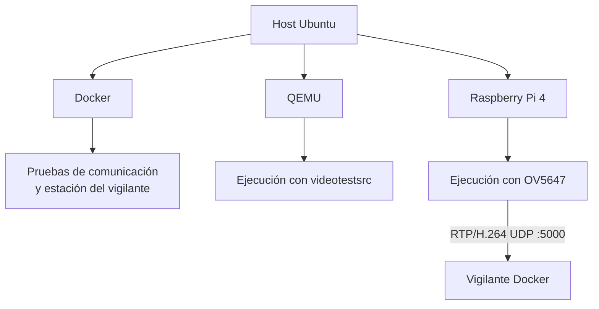
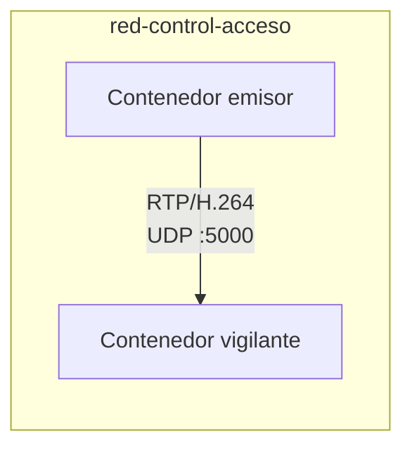
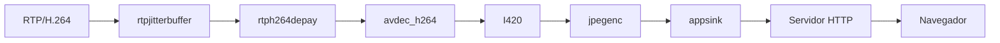
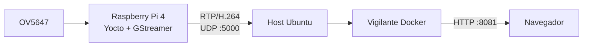
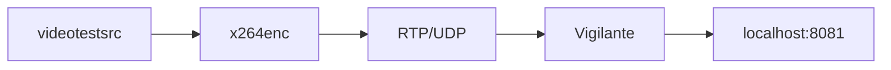
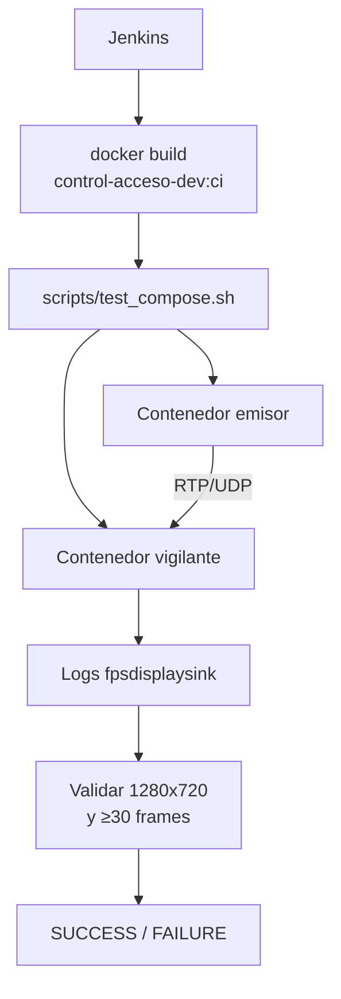
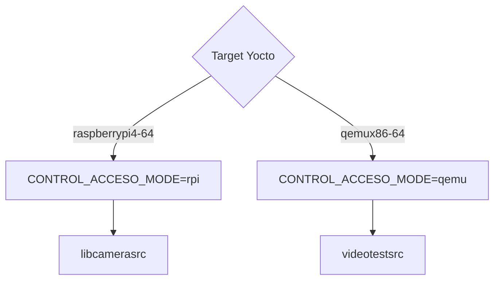
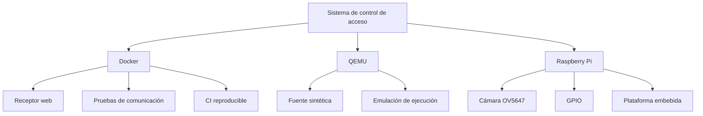

# Docker y QEMU

## 1. Propósito

Docker y QEMU cumplen funciones distintas dentro del proyecto.

**Docker** se utiliza para:

- encapsular las dependencias de GStreamer y Python;
- ejecutar la estación de vigilancia;
- reproducir el contrato RTP/H.264 sin utilizar la Raspberry Pi;
- automatizar pruebas de comunicación entre un emisor y un receptor;
- proporcionar un entorno reproducible para Jenkins.

**QEMU** se utiliza como entorno de emulación para ejecutar la aplicación con una fuente de video sintética cuando no se dispone de la cámara física.

La Raspberry Pi 4 continúa siendo la plataforma embebida de despliegue del sistema.

---

## 2. Relación entre los entornos

La solución puede visualizarse mediante tres niveles:



Cada entorno tiene un propósito específico:

| Entorno | Fuente de video | Uso principal |
|---|---|---|
| Docker emisor | `videotestsrc` | Validación del enlace multimedia |
| QEMU | `videotestsrc` | Ejecución sin hardware de cámara |
| Raspberry Pi | `libcamerasrc` + OV5647 | Plataforma embebida |
| Docker vigilante | RTP/H.264 recibido | Supervisión del punto de acceso |

---

## 3. Imagen Docker

El repositorio incluye:

```text
Dockerfile
```

basado en:

```dockerfile
FROM ubuntu:24.04
```

La imagen instala las herramientas requeridas para ejecutar los componentes multimedia y las pruebas:

```text
python3
python3-opencv
python3-numpy
python3-gi
python3-gst-1.0
gir1.2-gstreamer-1.0
gir1.2-gst-plugins-base-1.0
gstreamer1.0-tools
gstreamer1.0-plugins-base
gstreamer1.0-plugins-good
gstreamer1.0-plugins-bad
gstreamer1.0-plugins-ugly
gstreamer1.0-libav
ffmpeg
```

El directorio de trabajo del contenedor es:

```text
/proyecto
```

La imagen incorpora además:

```text
prueba_integrada_h1.py
docker/
```

Esto proporciona un entorno con las dependencias necesarias para ejecutar los scripts de emisor, receptor y validación.

---

## 4. Arquitectura Docker

El archivo principal de Compose es:

```text
compose.yaml
```

y define dos servicios:

```text
emisor
vigilante
```

ambos conectados mediante:

```text
red-control-acceso
```

de tipo:

```text
bridge
```

La arquitectura es:



El servicio `emisor` recibe:

```text
DEST_HOST=vigilante
DEST_PORT=5000
```

por lo que Docker resuelve el nombre `vigilante` dentro de la red del proyecto.

---

## 5. Emisor Docker

El script:

```text
docker/emisor.sh
```

implementa un transmisor RTP/H.264 basado en una fuente sintética.

El pipeline es:

```text
videotestsrc is-live=true pattern=ball
→ video/x-raw,format=I420,width=1280,height=720,framerate=30/1
→ x264enc
→ h264parse
→ rtph264pay
→ udpsink
```

La configuración del encoder es:

```text
tune=zerolatency
bitrate=2000
speed-preset=veryfast
key-int-max=30
```

La carga RTP utiliza:

```text
pt=96
config-interval=1
```

El destino se controla mediante:

```text
DEST_HOST
DEST_PORT
```

Por defecto:

```text
DEST_HOST=vigilante
DEST_PORT=5000
```

---

## 6. Propósito del emisor sintético

El emisor Docker permite comprobar independientemente de la Raspberry Pi:

- resolución del flujo;
- framerate configurado;
- codificación H.264;
- empaquetado RTP;
- comunicación UDP;
- recepción y decodificación;
- compatibilidad entre emisor y vigilante.

Esto permite aislar fallos de red o multimedia antes de involucrar cámara, Yocto y hardware físico.

---

## 7. Vigilante de consola

El script:

```text
docker/vigilante.sh
```

implementa un receptor de validación.

Su pipeline es:

```text
udpsrc port=5000
→ rtpjitterbuffer latency=100
→ rtph264depay
→ avdec_h264
→ fpsdisplaysink
→ fakesink
```

Los caps RTP se fijan como:

```text
application/x-rtp
media=video
encoding-name=H264
payload=96
clock-rate=90000
```

Esta variante no presenta el video en una interfaz gráfica. Su función es comprobar que el receptor:

- negocia correctamente el flujo;
- decodifica H.264;
- recibe frames;
- puede reportar métricas mediante `fpsdisplaysink`.

---

## 8. Estación de vigilancia web

La interfaz utilizada para supervisión se implementa en:

```text
docker/vigilante_web.py
```

El pipeline receptor es:

```text
udpsrc port=5000
→ rtpjitterbuffer latency=100
→ rtph264depay
→ avdec_h264
→ videoconvert
→ video/x-raw,format=I420
→ jpegenc quality=75
→ appsink
```

El `appsink` utiliza:

```text
emit-signals=true
max-buffers=1
drop=true
sync=false
```

De esta forma se conserva únicamente el frame JPEG más reciente.

---

## 9. Conversión de RTP/H.264 a MJPEG

La estación de vigilancia realiza dos transformaciones:

```text
RTP/H.264
    ↓
decodificación
    ↓
frame crudo
    ↓
JPEG
    ↓
HTTP/MJPEG
```

La conversión permite presentar el video directamente en un navegador sin requerir un reproductor GStreamer en el cliente.



---

## 10. Servidor web

`vigilante_web.py` utiliza:

```python
ThreadingHTTPServer
```

y atiende en:

```text
0.0.0.0:8081
```

La página principal se entrega en:

```text
/
```

y el flujo de video en:

```text
/video.mjpg
```

La interfaz se visualiza desde el host mediante:

```text
http://localhost:8081
```

La respuesta de video utiliza:

```text
multipart/x-mixed-replace
```

con frames JPEG consecutivos.

---

## 11. `compose.web.yaml`

La variante:

```text
compose.web.yaml
```

modifica el servicio `vigilante` para utilizar:

```text
python3 -u /proyecto/docker/vigilante_web.py
```

y publica:

```text
127.0.0.1:8081:8081/tcp
5000:5000/udp
```

Esto permite que:

- el navegador del host acceda a la interfaz web;
- la Raspberry Pi envíe RTP/UDP directamente al puerto 5000 del host.

El puerto HTTP se enlaza únicamente a:

```text
127.0.0.1
```

por lo que la interfaz web queda expuesta localmente en la computadora de vigilancia.

---

## 12. Ejecución de la estación de vigilancia

Desde la raíz del repositorio:

```bash
docker compose \
    -f compose.yaml \
    -f compose.web.yaml \
    up --build -d vigilante
```

El comando levanta solamente el receptor web.

Para comprobar el servicio:

```bash
docker compose \
    -f compose.yaml \
    -f compose.web.yaml \
    ps
```

La interfaz se abre en:

```text
http://localhost:8081
```

Para detenerla:

```bash
docker compose \
    -f compose.yaml \
    -f compose.web.yaml \
    down
```

---

## 13. Integración Raspberry Pi → Docker

Durante la operación con hardware, la Raspberry Pi sustituye al emisor sintético.



La aplicación embebida utiliza:

```text
DEST_HOST=10.42.0.1
DEST_PORT=5000
```

en el montaje de red utilizado para la integración.

El contenedor vigilante publica el puerto UDP 5000 del host, de manera que el flujo enviado por la Raspberry Pi entra directamente al receptor GStreamer del contenedor.

---

## 14. Demostración con dos contenedores

Para comprobar el sistema multimedia sin Raspberry Pi pueden ejecutarse simultáneamente:

```text
emisor
vigilante
```

mediante:

```bash
docker compose \
    -f compose.yaml \
    -f compose.web.yaml \
    up --build -d
```

El flujo resultante es:



Esta configuración reproduce el mismo contrato de transporte utilizado por la Raspberry Pi:

```text
H.264
RTP
UDP
payload 96
clock-rate 90000
puerto 5000
```

---

## 15. Entorno Docker para CI

Jenkins construye una imagen adicional con la etiqueta:

```text
control-acceso-dev:ci
```

mediante:

```bash
docker build -t control-acceso-dev:ci .
```

Esta imagen se utiliza para ejecutar pruebas de host de forma aislada y reproducible.

Entre las pruebas ejecutadas dentro de Docker se encuentran:

- consistencia del repositorio;
- arquitectura de hilos;
- timeout fail-secure;
- retención;
- manejo de errores;
- smoke tests.

---

## 16. `compose.offline.yaml`

Para la prueba automatizada de comunicación se utiliza:

```text
compose.offline.yaml
```

Esta variante no reconstruye imágenes ni necesita descargar dependencias durante la ejecución de la prueba.

Los servicios utilizan:

```text
image: control-acceso-dev:ci
```

y montan:

```text
./docker:/proyecto/docker:ro
```

El objetivo es probar la comunicación con una imagen ya construida por Jenkins.

---

## 17. Prueba automática de comunicación

El script:

```text
scripts/test_compose.sh
```

crea un proyecto Compose aislado con un nombre propio:

```text
control-acceso-ci-<BUILD_NUMBER>
```

y ejecuta:

```text
emisor
vigilante
```

La prueba comprueba que:

1. la imagen de CI existe;
2. la configuración Compose es válida;
3. ambos servicios están en ejecución;
4. el vigilante recibe video;
5. la resolución recibida es 1280×720;
6. se han decodificado al menos 30 frames.

La prueba dispone de hasta 60 segundos para observar recepción válida.

---

## 18. Flujo de prueba Docker en Jenkins



Esto permite validar automáticamente el contrato multimedia sin utilizar la Raspberry Pi durante esa etapa específica.

---

## 19. Papel de QEMU

La aplicación incorpora un modo de ejecución:

```text
qemu
```

En este modo la fuente de video cambia automáticamente a:

```text
videotestsrc is-live=true pattern=smpte
```

en lugar de utilizar:

```text
libcamerasrc
```

El resto de la arquitectura mantiene el mismo enfoque de procesamiento:

```text
fuente
→ tee
→ QR / multimedia
→ H.264
→ RTP/UDP
```

QEMU permite trabajar con una fuente sintética cuando el hardware de cámara no está disponible.

---

## 20. Selección automática del modo QEMU en Yocto

La receta de la aplicación define:

```bitbake
CONTROL_ACCESO_MODE = "rpi"
CONTROL_ACCESO_MODE:qemux86-64 = "qemu"
```

Esto significa que:

- para la plataforma Raspberry Pi se instala `CONTROL_ACCESO_MODE=rpi`;
- para un target `qemux86-64` se instala `CONTROL_ACCESO_MODE=qemu`.

La aplicación no necesita modificarse manualmente para seleccionar una fuente distinta.



---

## 21. Diferencias entre Raspberry Pi y QEMU

| Característica | Raspberry Pi | QEMU |
|---|---|---|
| Fuente de video | OV5647 | `videotestsrc` |
| Acceso a cámara | libcamera | No requerido |
| Hardware físico | Sí | Emulado |
| Pipeline QR | Sí | Misma lógica de aplicación |
| H.264 | `x264enc` | `x264enc` |
| RTP/UDP | Sí | Sí |
| Evidencias | Soportadas por la aplicación | Soportadas por la aplicación |
| systemd | Integrado en imagen Yocto | Compatible con imagen emulada |
| Propósito | Operación sobre hardware | Emulación y validación |

QEMU no sustituye las pruebas que dependen de propiedades físicas de la Raspberry Pi, como cámara real, temperatura, periféricos GPIO o comportamiento específico del hardware.

---

## 22. QEMU en Jenkins

El `Jenkinsfile` conserva etapas específicas para pruebas A1–A6 en modo QEMU.

La ejecución se controla mediante:

```text
RUN_QEMU
```

Las etapas contempladas incluyen:

```text
A1 - Caps negociados
A2 - Formato de píxel
A3 - Framerate
A4 - Capsfilters
A5 - Conversiones
A6 - Grafo del pipeline
```

Estas etapas reutilizan los mismos scripts empleados para analizar aspectos equivalentes del pipeline.

La variable permite activar o desactivar la ejecución QEMU sin eliminar las pruebas del flujo de CI.

---

## 23. Separación de responsabilidades

Docker, QEMU y Raspberry Pi no representan tres implementaciones diferentes del proyecto.

Comparten la misma arquitectura conceptual, pero cada plataforma resuelve una función distinta:



---

## 24. Contrato común de video

La interoperabilidad entre los diferentes entornos se mantiene mediante un contrato multimedia común.

```text
Codec:        H.264
Transporte:   RTP sobre UDP
Payload:      96
Clock rate:   90000 Hz
Puerto:       5000
Resolución:   1280 × 720
Framerate:    30/1 configurado
```

Mientras emisor y receptor respeten este contrato, el vigilante puede recibir video generado por:

- el contenedor emisor;
- la aplicación ejecutada en QEMU;
- la Raspberry Pi.

---

## 25. Puertos utilizados

| Puerto | Protocolo | Función |
|---:|---|---|
| 5000 | UDP | Recepción de RTP/H.264 |
| 8081 | TCP | Interfaz HTTP/MJPEG |

En `compose.web.yaml`, el puerto web se publica como:

```text
127.0.0.1:8081
```

mientras que el puerto RTP se publica como:

```text
5000:5000/udp
```

---

## 26. Comandos principales

### Construir la imagen Docker

```bash
docker build -t control-acceso-vigilante:dev .
```

### Levantar emisor y vigilante

```bash
docker compose \
    -f compose.yaml \
    -f compose.web.yaml \
    up --build -d
```

### Levantar únicamente el vigilante

```bash
docker compose \
    -f compose.yaml \
    -f compose.web.yaml \
    up --build -d vigilante
```

### Ver servicios

```bash
docker compose \
    -f compose.yaml \
    -f compose.web.yaml \
    ps
```

### Ver logs

```bash
docker compose \
    -f compose.yaml \
    -f compose.web.yaml \
    logs -f vigilante
```

### Detener el entorno

```bash
docker compose \
    -f compose.yaml \
    -f compose.web.yaml \
    down
```

---

## 27. Resumen

Docker proporciona un entorno reproducible para recepción, visualización y pruebas automatizadas del flujo multimedia. QEMU permite ejecutar la aplicación con una fuente sintética cuando el hardware real no forma parte de la prueba. La Raspberry Pi 4 representa el nodo embebido que integra la cámara OV5647, la lógica de acceso y la transmisión.

Los tres entornos se articulan mediante el mismo contrato RTP/H.264, lo que permite separar el desarrollo y la validación de la red multimedia de las particularidades del hardware físico.
