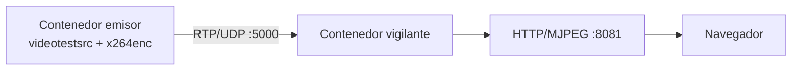
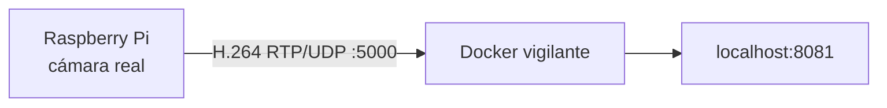

# Docker y QEMU

## 1. Objetivo

Se utilizan tres niveles de validación:

1. dos contenedores Docker para validar emisor y vigilante;
2. QEMU para demostrar que la imagen/aplicación puede ejecutarse en un target emulado;
3. Raspberry Pi como hardware final.

## 2. Demostración con dos contenedores

Arquitectura:



Comando:

```bash
docker compose -f compose.yaml -f compose.web.yaml up --build -d
docker compose -f compose.yaml -f compose.web.yaml ps
```

El emisor genera un patrón sintético a 1280x720 con framerate objetivo de 30 fps y lo envía por RTP/UDP.

Abrir:

```text
http://localhost:8081
```

Esta demostración fue validada en la laptop de desarrollo.

## 3. Integración final Raspberry + Docker

La Raspberry sustituye al contenedor emisor.



Levantar únicamente el vigilante:

```bash
docker compose -f compose.integration.yaml up -d
docker compose -f compose.integration.yaml ps
```

## 4. QEMU

La aplicación tiene modo específico para `qemux86-64`:

```bitbake
CONTROL_ACCESO_MODE:qemux86-64 = "qemu"
```

En ese modo la cámara real se sustituye por `videotestsrc`.

Validaciones realizadas previamente en QEMU:

- arranque de imagen;
- inicio automático del servicio;
- Python/OpenCV/GStreamer;
- x264enc;
- generación de MP4;
- RTP/UDP;
- cambio de variables `DEST_HOST` / `DEST_PORT`;
- cierre mediante EOS.

### Estado

La infraestructura QEMU existe y fue probada con una versión anterior de la aplicación. Después de cerrar el código final del proyecto debe reconstruirse `build-qemu` y repetirse una prueba corta para que la demostración corresponda exactamente a la versión entregada.
