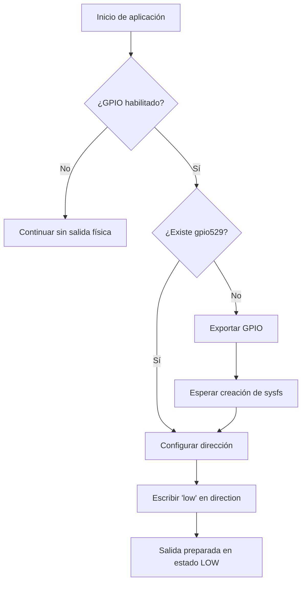
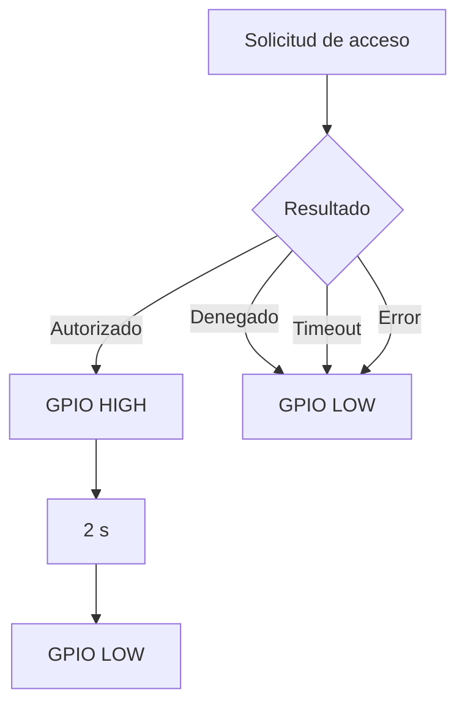
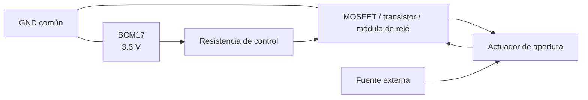
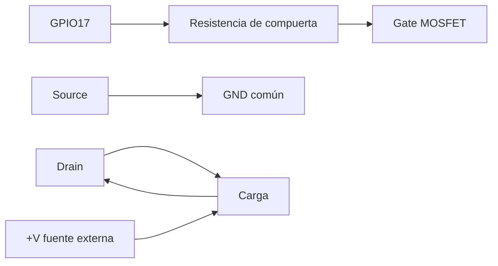
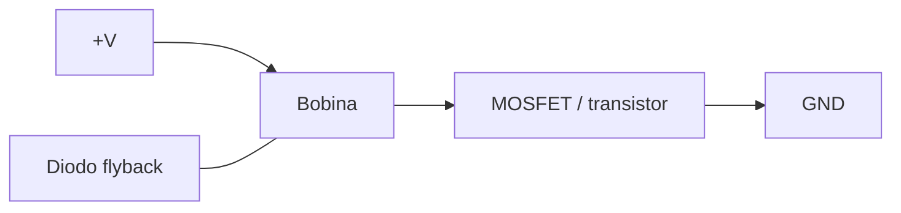
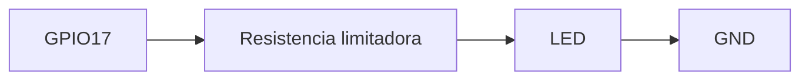
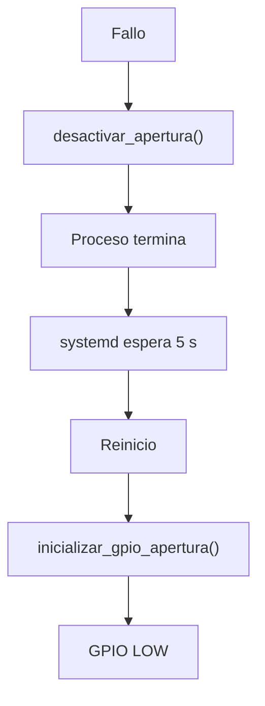
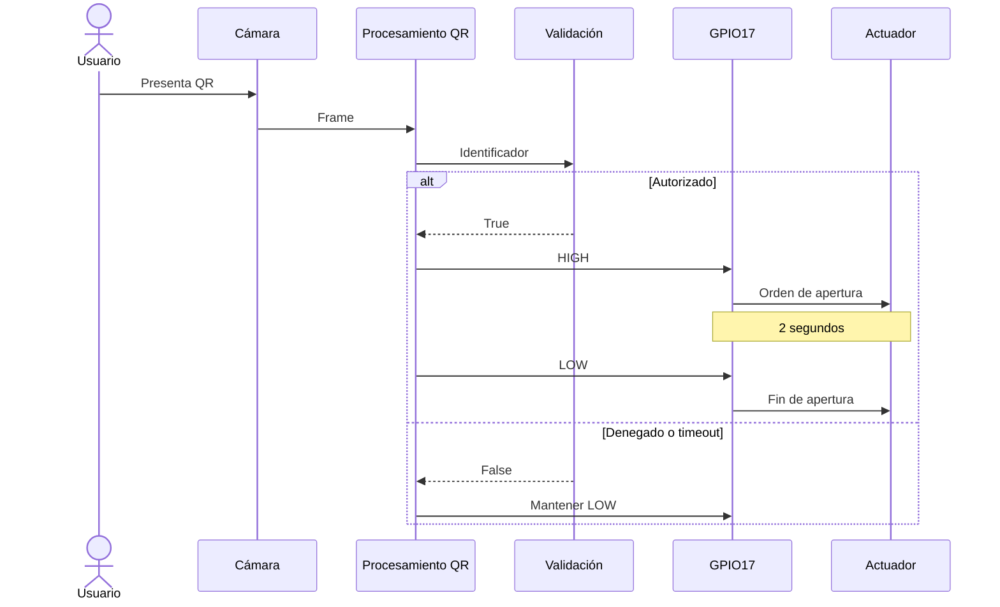

# Circuito y GPIO

## 1. Propósito

La interfaz GPIO representa el vínculo entre la decisión lógica de acceso y el mecanismo físico de apertura.

La aplicación implementa una salida digital asociada con **BCM17**. Cuando un identificador autorizado es procesado correctamente, la salida se activa durante un intervalo limitado y posteriormente regresa al estado inactivo.

La lógica fue diseñada bajo una política **fail-secure**: una condición de error, timeout, cierre de la aplicación o acceso denegado no debe producir una apertura accidental.

---

## 2. Interfaz lógica de apertura

La salida utilizada por la aplicación es:

```text
GPIO BCM17
```

En la implementación Linux utilizada por el proyecto, el código accede a este GPIO mediante:

```text
/sys/class/gpio/gpio529
```

La relación utilizada es:

```text
base GPIO = 512
BCM17     = 17

512 + 17 = 529
```

Por lo tanto:

```text
BCM17 → gpio529
```

Este número pertenece a la representación sysfs empleada por la imagen utilizada y no debe interpretarse como el número físico del pin.

---

## 3. Pin físico

Para BCM17, el pin físico correspondiente en el conector de 40 pines de la Raspberry Pi es:

```text
GPIO BCM17 → pin físico 11
```

Una referencia mínima del conector es:

| Señal | Identificación | Pin físico |
|---|---|---:|
| Salida de apertura | GPIO17 / BCM17 | 11 |
| Tierra | GND | 14 o equivalente |
| Alimentación lógica | 3.3 V | según necesidad del circuito |

La salida GPIO trabaja con lógica de **3.3 V**.

---

## 4. Inicialización de la salida

La aplicación ejecuta una rutina de inicialización al arrancar.

El flujo implementado es:



La escritura:

```text
low
```

sobre el archivo:

```text
direction
```

configura el GPIO como salida y lo coloca inmediatamente en estado bajo.

Esta decisión evita que la inicialización deje la salida activa por defecto.

---

## 5. Activación de apertura

Cuando el sistema clasifica una solicitud como autorizada, ejecuta:

```text
activar_apertura()
```

La secuencia lógica es:

```text
LOW
 ↓
HIGH
 ↓
2 s
 ↓
LOW
```

El tiempo configurado es:

```text
TIEMPO_APERTURA = 2.0 s
```

La aplicación utiliza un `threading.Timer` para desactivar automáticamente la salida una vez transcurrido el intervalo.

---

## 6. Estados de la salida

La política de control puede resumirse así:

| Condición | Estado de la salida |
|---|---|
| Inicio de aplicación | LOW |
| QR autorizado | HIGH durante 2 s |
| QR denegado | LOW |
| Timeout de decisión | LOW |
| Error de cámara | LOW |
| Error fatal de aplicación | LOW |
| Cierre coordinado | LOW |
| Servicio detenido | La aplicación intenta dejar LOW antes de terminar |

La intención funcional es que únicamente una autorización válida provoque una activación temporal.

---

## 7. Política fail-secure

El criterio adoptado por el sistema es:

```text
Ante incertidumbre o fallo → no abrir
```

La lógica de decisión implementa este principio en varios niveles.



Además, el watchdog de cámara llama a:

```text
desactivar_apertura()
```

antes de terminar la aplicación por pérdida de frames.

El mismo procedimiento se ejecuta durante la liberación final de recursos.

---

## 8. Exclusión mutua

El acceso a la salida se protege mediante:

```python
threading.Lock()
```

Esto evita que dos operaciones concurrentes intenten modificar simultáneamente el estado del GPIO o el temporizador de apertura.

La lógica mantiene una única referencia:

```text
temporizador_apertura
```

Si se solicita una nueva apertura mientras existe un temporizador previo, este se cancela antes de crear uno nuevo.

---

## 9. Control mediante variable de entorno

La interfaz puede habilitarse o deshabilitarse mediante:

```text
CONTROL_ACCESO_GPIO
```

La salida se considera habilitada solamente cuando:

```text
CONTROL_ACCESO_MODE=rpi
```

y:

```text
CONTROL_ACCESO_GPIO=1
```

La condición implementada es equivalente a:

```text
modo Raspberry
AND
GPIO habilitado
```

Esto permite ejecutar la misma aplicación en host o QEMU sin intentar acceder al GPIO físico.

---

## 10. Arquitectura eléctrica

El GPIO de una Raspberry Pi no debe utilizarse para alimentar directamente cargas como:

- cerraduras eléctricas;
- solenoides;
- motores;
- relés electromecánicos convencionales.

La salida debe utilizarse únicamente como señal de control hacia una etapa de potencia.

Una arquitectura apropiada es:



La fuente de energía del actuador debe dimensionarse de manera independiente del GPIO.

---

## 11. Interfaz con MOSFET

Para una carga DC, una implementación típica utiliza un MOSFET de nivel lógico como elemento de conmutación.



La selección concreta del MOSFET depende de:

- tensión del actuador;
- corriente nominal;
- corriente de arranque;
- resistencia `RDS(on)` a tensión de compuerta compatible con 3.3 V.

---

## 12. Protección para cargas inductivas

Cuando la carga es inductiva, como un relé o solenoide, debe utilizarse protección contra la sobretensión generada al interrumpir la corriente.

La solución habitual es un diodo flyback conectado en paralelo con la carga.



El diodo no forma parte de la lógica del software, pero es necesario para proteger la etapa de conmutación y evitar que los transitorios alcancen la Raspberry Pi.

---

## 13. Uso de un módulo de relé

También puede utilizarse un módulo de relé compatible con lógica de 3.3 V.

El esquema funcional sería:

```text
GPIO17
  ↓
entrada de control del módulo
  ↓
relé
  ↓
contactos aislados
  ↓
actuador
```

El módulo debe garantizar que:

- la entrada sea compatible con 3.3 V;
- la corriente exigida al GPIO sea reducida;
- el circuito de potencia del actuador permanezca separado de la Raspberry Pi;
- el estado inactivo del módulo corresponda al estado seguro del sistema.

---

## 14. Indicador LED para demostración

Para una demostración sin actuador de potencia puede utilizarse un LED como indicador de la señal lógica.

Circuito conceptual:



El comportamiento observado sería:

```text
AUTORIZADO  → LED encendido durante 2 s
DENEGADO    → LED apagado
TIMEOUT     → LED apagado
```

Este montaje representa solamente la señal lógica de apertura.

---

## 15. Relación entre software y hardware

La cadena completa de control es:


El software nunca controla directamente la carga de potencia; controla únicamente el nivel lógico de BCM17.

---

## 16. Interacción con systemd

La aplicación se ejecuta mediante:

```text
control-acceso.service
```

con:

```ini
Restart=on-failure
RestartSec=5
```

Si el proceso termina por un error fatal:

1. la aplicación intenta llevar la salida a LOW;
2. el proceso finaliza con código de error;
3. systemd espera cinco segundos;
4. systemd reinicia la aplicación;
5. la rutina de inicialización vuelve a configurar la salida en LOW.



---

## 17. Interacción con el watchdog de cámara

El watchdog supervisa que continúen llegando frames.

Cuando transcurren:

```text
3 s
```

sin frames, se ejecuta:

```text
desactivar_apertura()
```

antes de marcar el error fatal.

Esto evita que una interrupción de la fuente de video deje la salida activada mientras el sistema abandona la operación normal.

---

## 18. Cierre coordinado

Durante una terminación solicitada por:

- `SIGTERM`;
- `Ctrl+C`;

la aplicación realiza un cierre coordinado del pipeline y posteriormente ejecuta:

```text
desactivar_apertura()
```

antes de llevar el pipeline a estado `NULL`.

El orden relevante es:

```text
Solicitud de cierre
        ↓
EOS del pipeline
        ↓
Desactivar GPIO
        ↓
Pipeline NULL
        ↓
Liberar hilos y executor
```

---

## 19. Consideraciones de arranque

La política de seguridad requiere que el mecanismo de apertura no dependa únicamente del software para permanecer cerrado durante el boot.

Por diseño eléctrico, la etapa de potencia debe escoger una polaridad que mantenga el actuador desenergizado cuando:

```text
GPIO = LOW
```

y también cuando la Raspberry Pi todavía no ha configurado el pin.

Esto puede conseguirse mediante una resistencia de polarización apropiada en la etapa de control.

---

## 20. Estado seguro a nivel eléctrico

El software define:

```text
LOW = apertura inactiva
HIGH = apertura activa
```

Por lo tanto, la electrónica externa debe respetar la misma convención.

La relación debe ser:

```text
GPIO LOW
→ transistor o relé inactivo
→ actuador sin orden de apertura
```

y:

```text
GPIO HIGH
→ etapa de potencia activa
→ actuador recibe orden temporal de apertura
```

Esta correspondencia evita invertir accidentalmente el comportamiento fail-secure definido por la aplicación.

---

## 21. Alimentación

La fuente destinada al actuador debe seleccionarse según las características de la carga.

La Raspberry Pi y el circuito de potencia pueden compartir referencia de tierra cuando la topología utilizada lo requiera, pero el consumo principal del actuador no debe circular a través del GPIO.

Para cargas de mayor potencia es recomendable separar claramente:

```text
alimentación lógica
alimentación de potencia
```

y utilizar aislamiento cuando el diseño lo justifique.

---

## 22. Tabla de verdad funcional

La interfaz lógica puede representarse mediante:

| Evento | Autorización | GPIO |
|---|---|---|
| MC001 | Sí | HIGH por 2 s |
| MC002 | Sí | HIGH por 2 s |
| Otro QR válido | No | LOW |
| Timeout | No | LOW |
| QR no decodificado | Sin decisión | LOW |
| Pérdida de frames | Error | LOW |
| Cierre de aplicación | — | LOW |

---

## 23. Flujo de autorización



---

## 24. Alcance de la implementación

El repositorio contiene la lógica de software necesaria para:

- inicializar BCM17;
- establecer el estado seguro;
- activar la salida durante dos segundos;
- cancelar y reemplazar temporizadores de apertura;
- desactivar la salida ante errores;
- desactivar la salida durante el cierre;
- habilitar o deshabilitar el GPIO mediante configuración.

La conexión de un actuador real requiere una etapa de interfaz eléctrica adecuada entre BCM17 y la carga.

Por esta razón, la documentación separa claramente:

```text
lógica GPIO implementada en software
```

de:

```text
etapa de potencia externa del actuador
```

---

## 25. Recomendaciones de integración física

Al conectar un mecanismo de apertura se deben respetar como mínimo los siguientes criterios:

- no alimentar la carga directamente desde el GPIO;
- utilizar una etapa de conmutación compatible con 3.3 V;
- utilizar fuente externa para el actuador;
- compartir tierra solamente cuando la topología lo requiera;
- añadir protección flyback para cargas inductivas;
- asegurar que LOW represente el estado inactivo;
- evitar estados flotantes durante el arranque;
- verificar el circuito sin la carga final antes de energizar el actuador.

---

## 26. Resumen

La interfaz de apertura del sistema está implementada alrededor de **BCM17** y utiliza una política de estado seguro basada en nivel bajo.

La aplicación:

```text
inicializa en LOW
activa HIGH únicamente ante autorización
mantiene HIGH durante 2 s
regresa automáticamente a LOW
fuerza LOW durante fallos y cierre
```

La capa de software proporciona la señal de control; cualquier cerradura, relé o actuador debe conectarse mediante una etapa de potencia independiente y eléctricamente apropiada.
