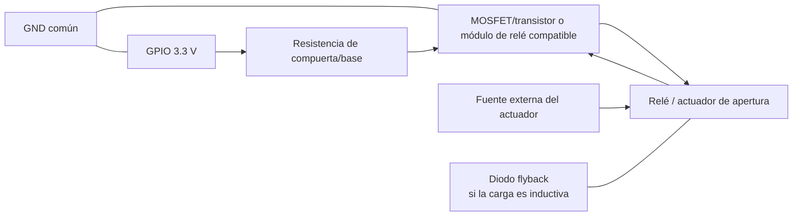

# Circuito y GPIO

## Estado

**Pendiente de implementación física final.**

El sistema debe proporcionar una salida eléctrica de apertura cuando el acceso sea autorizado y mantener un estado seguro cuando el acceso sea denegado, durante el arranque y ante una falla.

## 1. Propuesta mínima para demostración

Para demostrar la lógica sin conectar una cerradura real:


Esta opción permite verificar visualmente:

```text
AUTORIZADO -> salida activa durante un intervalo definido
DENEGADO   -> salida permanece inactiva
TIMEOUT    -> salida permanece inactiva
```

## 2. Propuesta con actuador o relé

**No conectar una cerradura, relé no diseñado para GPIO, motor o solenoide directamente al pin de la Raspberry Pi.**

Arquitectura recomendada:



## 3. GPIO propuestos

Estos pines son una **propuesta de diseño**, todavía no una implementación confirmada:

| Función | GPIO BCM propuesto | Pin físico |
|---|---:|---:|
| Apertura | GPIO17 | 11 |
| Indicador autorizado | GPIO27 | 13 |
| Indicador denegado | GPIO22 | 15 |
| GND | — | 14 o equivalente |

El ventilador utilizado durante las pruebas se alimenta desde 5 V y GND; no forma parte de la lógica GPIO de acceso.

## 4. Estado seguro

La implementación final debe garantizar:

```text
arranque                 -> apertura OFF
servicio detenido        -> apertura OFF
proceso muerto           -> apertura OFF
Raspberry apagada        -> apertura OFF
QR denegado              -> apertura OFF
timeout de decisión      -> apertura OFF
QR autorizado            -> pulso temporal de apertura
```

Para un actuador real, el diseño eléctrico debe ser **fail-secure** o **fail-safe** según el mecanismo elegido y el requisito acordado. En este proyecto se ha definido funcionalmente que una falla no debe producir una apertura accidental.

## 5. Pruebas obligatorias antes de cerrar

- comprobar nivel del GPIO durante boot;
- autorizar MC001 y medir/observar activación;
- presentar QR denegado y comprobar que nunca activa;
- matar el proceso durante una autorización;
- detener el servicio;
- apagar la Raspberry;
- reiniciar la Raspberry;
- comprobar que la salida vuelve siempre al estado seguro.

## 6. Botón de salida

El checklist del proyecto contempla evaluar un botón de salida que pueda liberar el mecanismo por hardware sin depender del software. Antes de implementarlo se debe confirmar con el profesor si aplica al alcance del prototipo final.
