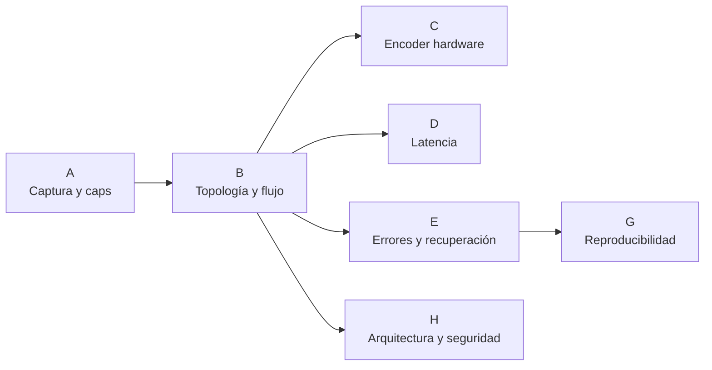
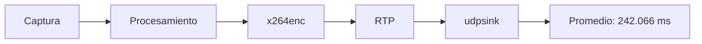

# Pruebas y validación

## 1. Propósito

La validación del sistema se realizó sobre la implementación integrada del proyecto con el objetivo de comprobar el comportamiento real de la captura de video, la arquitectura del pipeline, la transmisión RTP/UDP, la generación de evidencias, la recuperación ante fallos y la reproducibilidad del entorno Yocto.

Las pruebas se ejecutaron principalmente en tres entornos:

- **Raspberry Pi 4 con imagen Yocto**, para las verificaciones dependientes del hardware y del sistema operativo final;
- **Docker sobre Ubuntu**, para pruebas de host, integración y comunicación entre contenedores;
- **Jenkins**, para automatizar la ejecución y conservar un registro reproducible de los resultados.

La documentación de validación distingue entre:

```text
PASS
```

cuando el criterio de aceptación fue comprobado, y:

```text
FAIL / no validado
```

cuando la prueba no alcanzó el criterio necesario para afirmar cumplimiento.

Un resultado negativo se conserva como resultado experimental del proyecto y no se reemplaza por una afirmación teórica.

---

## 2. Estrategia de validación

La campaña se organizó en bloques funcionales.



Los bloques evalúan diferentes niveles del sistema:

| Bloque | Área evaluada |
|---|---|
| A | Captura, formatos, framerate y estructura del pipeline |
| B | `tee`, `queue`, `appsink` y comportamiento del flujo |
| C | Codificación H.264 mediante hardware |
| D | Latencia y keyframes |
| E | Manejo de errores y recuperación |
| F | Recursos y almacenamiento |
| G | Plugins y reproducibilidad del entorno |
| H | Arquitectura de software y comportamiento fail-secure |

---

## 3. Entorno de prueba

La validación sobre hardware utilizó:

```text
Plataforma: Raspberry Pi 4
Sistema: imagen Linux generada con Yocto
Cámara: OV5647
GStreamer: 1.22.12
Resolución: 1280 × 720
Framerate objetivo: 30 fps
Encoder funcional: x264enc
Transporte: RTP/UDP
Puerto: 5000
```

Las revisiones principales del entorno Yocto fueron:

```text
Poky:
cbd62bb2a9f2ab3466a0f72f4289bc86ca20a019

meta-openembedded:
b5874ea07d69919d9b40d59f2c2f0bbd24bc3259

meta-raspberrypi:
6ca1f75017cc5d5acdb8bb05634c4bc01fa049fd
```

---

## 4. Resultado consolidado

La campaña de validación produjo **30 verificaciones con resultado PASS** dentro del checklist utilizado durante la integración.

Los bloques de captura, topología, latencia y manejo de errores presentaron resultados satisfactorios con la ruta funcional basada en `x264enc`.

La principal limitación experimental se encontró en el bloque de codificación H.264 mediante hardware: aunque el plugin `v4l2h264enc` y el dispositivo de codificación fueron detectados, la ruta no logró procesar correctamente los frames.

Por esta razón, la implementación final utiliza:

```text
x264enc
```

como codificador H.264 por software.

---

# 5. Bloque A — Captura, formatos y pipeline

El bloque A verifica que la cámara, los formatos negociados y la estructura básica del pipeline sean compatibles con la operación definida.

## A1 — Caps negociados

**Resultado: PASS**

Se comprobó la negociación del flujo de cámara a:

```text
1280 × 720
30/1 fps
```

sobre la Raspberry Pi.

---

## A2 — Formato de píxel

**Resultado: PASS**

La ruta multimedia utiliza una conversión explícita antes del encoder:

```text
video/x-raw,format=NV12
```

mientras que la rama QR utiliza:

```text
video/x-raw,format=BGR
```

La separación evita depender de conversiones implícitas entre OpenCV y el encoder.

---

## A3 — Framerate real

**Resultado: PASS**

La prueba contó frames durante un intervalo conocido en la Raspberry Pi.

En ejecuciones finales se observaron valores alrededor de:

```text
30.0 fps
```

incluyendo mediciones como:

```text
30.004 fps
30.011 fps
30.020 fps
30.000 fps
```

Esto confirma que el flujo real se mantuvo alrededor del objetivo de 30 fps.

---

## A4 — Capsfilters

**Resultado: PASS**

Se verificó que los filtros de capacidades requeridos por las ramas del pipeline estuvieran declarados y fueran coherentes con los formatos utilizados.

---

## A5 — Conversiones

**Resultado: PASS**

Las conversiones entre la salida de cámara, BGR para OpenCV y NV12 para codificación se ejecutaron correctamente.

---

## A6 — Grafo del pipeline

**Resultado: PASS**

Se generó y revisó el grafo de GStreamer correspondiente al pipeline en ejecución.

La topología confirma:

```text
fuente
→ tee principal
   ├── preview
   ├── QR
   └── multimedia
       → H.264
       → tee secundario
          ├── streaming
          └── evidencias
```

---

# 6. Bloque B — Topología y flujo

El bloque B evalúa que las ramas independientes no bloqueen entre sí y que las políticas de colas correspondan con la función de cada rama.

## B1 — `tee` y colas

**Resultado: PASS**

Se comprobó que las ramas principales parten del mismo `tee` y utilizan colas independientes.

---

## B2 — Política de `queue`

**Resultado: PASS**

Las ramas de preview y QR utilizan colas con descarte de buffers antiguos:

```text
leaky=downstream
```

mientras que las ramas multimedia y evidencia mantienen:

```text
leaky=no
```

Esta diferencia es deliberada: el análisis puede descartar frames obsoletos, mientras que grabación y transmisión priorizan continuidad.

---

## B3 — Latencia de colas

**Resultado: PASS**

La configuración de las colas fue evaluada con el framerate real medido en A3 y no presentó acumulación incompatible con la operación definida.

---

## B4 — `appsink`

**Resultado: PASS**

El `appsink` de la rama QR utiliza:

```text
emit-signals=true
max-buffers=2
drop=true
sync=false
```

lo que permite entregar frames al procesamiento sin convertir al consumidor OpenCV en una fuente de bloqueo para GStreamer.

---

## B5 — Callback

**Resultado: PASS**

El callback de GStreamer se mantiene acotado a la recepción y encolado del frame.

La detección QR y la decisión de acceso no se ejecutan directamente dentro de ese callback.

---

## B6 — EOS y servicio

**Resultado: PASS**

Se verificó el comportamiento de cierre mediante EOS y su interacción con el servicio systemd.

---

# 7. Bloque C — Encoder H.264 por hardware

## 7.1 Objetivo

El bloque C intentó comprobar una ruta de codificación mediante:

```text
v4l2h264enc
```

para compararla con:

```text
x264enc
```

La prueba buscaba validar:

- disponibilidad del plugin;
- dispositivo de codificación;
- salida H.264 real;
- utilización de CPU;
- punto de operación;
- posibilidad de utilizar DMABUF.

---

## 7.2 Detección del dispositivo

La Raspberry Pi expuso un dispositivo identificado como:

```text
bcm2835-codec-encode
```

en:

```text
/dev/video11
```

y:

```text
gst-inspect-1.0 v4l2h264enc
```

confirmó la disponibilidad del elemento de GStreamer.

Esto demostró que el plugin y el dispositivo estaban presentes.

---

## 7.3 Resultado operativo

**Resultado del bloque: no validado**

Al intentar procesar video real con `v4l2h264enc`, el pipeline terminó con un error de procesamiento de frame.

El problema observado fue equivalente a:

```text
Failed to process frame
```

Por lo tanto, la presencia del plugin y del dispositivo no fue suficiente para demostrar una ruta H.264 hardware funcional.

Las comparaciones posteriores del bloque C dependen de que C1 produzca H.264 correctamente, de modo que no se utilizaron para afirmar una mejora de CPU, estabilidad o DMABUF.

---

## 7.4 Decisión técnica

La ruta final del sistema utiliza:

```text
x264enc
```

con:

```text
tune=zerolatency
bitrate=2000
speed-preset=veryfast
key-int-max=30
scenecut=0
```

Esta decisión se basa en el resultado experimental del hardware utilizado y no en la ausencia de soporte teórico para V4L2.

---

# 8. Bloque D — Latencia y keyframes

## D1 — Latencia interna con GST Tracer

**Resultado: PASS**

La latencia fue medida mediante los tracers de GStreamer sobre la Raspberry Pi.

Se obtuvieron:

```text
1044 registros válidos
348 muestras por ruta observada
```

Promedios principales:

```text
fakesink:   1.013 ms
appsink:   29.049 ms
udpsink:  242.066 ms
```

La métrica hasta `udpsink` representa la latencia interna de la ruta de streaming dentro del pipeline antes de considerar red, decodificación y presentación en navegador.



---

## D2 — Latencia extremo a extremo

**Resultado: PASS como medición independiente**

La medición extremo a extremo se realizó comparando una referencia visual frente a la cámara con la imagen recibida por la estación del vigilante.

El resultado observado fue del orden de:

```text
≈ 3 s
```

Esta medición incluye componentes que D1 no contempla:

- transmisión UDP;
- jitter buffer;
- decodificación H.264;
- conversión JPEG;
- entrega HTTP/MJPEG;
- actualización del navegador.

Por esta razón, D1 y D2 no representan la misma métrica.

---

## D3 — Intervalo de keyframes

**Resultado: PASS**

El encoder se configuró con:

```text
key-int-max=30
scenecut=0
```

Con un framerate cercano a:

```text
30 fps
```

el intervalo esperado entre keyframes es aproximadamente:

```text
30 frames / 30 fps ≈ 1 s
```

La medición confirmó un intervalo de aproximadamente un segundo, coherente con el GOP declarado.

---

## D4 — Presupuesto de latencia

**Resultado: PASS**

El presupuesto de latencia reconstruido a partir de los elementos de la ruta produjo:

```text
Ruta agrupada:      239.520 ms
D1 hasta udpsink:   242.066 ms
Diferencia:           2.546 ms
Diferencia relativa:   1.05 %
```

La cercanía entre ambos valores demuestra consistencia entre el tracer total y la suma de contribuciones agrupadas del pipeline.

---

# 9. Bloque E — Manejo de errores y recuperación

## E1 — Watch del bus de GStreamer

**Resultado: PASS**

Se comprobó:

```text
[PASS] Obtención del bus
[PASS] Signal watch
[PASS] Conexión del manejador
[PASS] Manejo de ERROR
[PASS] Manejo de WARNING
[PASS] Manejo de EOS
```

El pipeline procesa explícitamente los mensajes relevantes del bus.

---

## E2 — Watchdog de cámara

**Resultado: PASS**

La aplicación considera la fuente de video no operativa cuando transcurren:

```text
3 s
```

sin recibir frames.

Antes de terminar por esta condición se ejecuta la desactivación de la salida de apertura.

---

## E3 — Política de recuperación

**Resultado: PASS**

La terminación por error se diseñó para producir un código de salida distinto de cero y permitir que systemd aplique:

```ini
Restart=on-failure
```

---

## E4 — Cierre limpio de MP4

**Resultado: PASS**

Se verificó que una evidencia interrumpida durante una prueba de cierre quedara como un archivo MP4 reproducible.

Resultado registrado:

```text
Archivo: evidencia_2026-10-08_18-48-43_218614.mp4
Tamaño: 1.1 MB
Duración: 6.132333333 s
Contenedor: Quicktime / MP4
Video: H.264 High Profile
Resolución: 1280 × 720
gst-discoverer exit: 0
gst-launch exit: 0
```

Esto confirma que el uso de EOS permite finalizar correctamente el contenedor MP4.

---

## E5 — Disco lleno

**Resultado: PASS**

La prueba utilizó un filesystem temporal sin espacio disponible:

```text
Available: 0
Use%: 100 %
```

GStreamer reportó:

```text
No space left on the resource
Could not multiplex stream
```

La prueba confirmó que la condición se manifiesta como error explícito y puede ser detectada por la infraestructura de manejo de fallos.

---

## E6 — Reinicio automático mediante systemd

**Resultado: PASS**

Se envió `SIGKILL` al proceso principal del servicio y se comprobó que systemd creó un nuevo proceso.

La configuración validada fue:

```text
Restart=on-failure
RestartSec=5
```

El journal registró la terminación, la programación del reinicio y el nuevo arranque del servicio.

---

# 10. Bloque F — Recursos y almacenamiento

La validación cuantitativa conservada para este bloque corresponde al rendimiento de almacenamiento.

## F5 — Escritura en almacenamiento

**Resultado: PASS**

Se realizó una escritura de:

```text
64 MiB
```

seguida de sincronización.

Resultado:

```text
Tiempo:       2.65 s
Rendimiento: 24.15 MiB/s
```

El flujo H.264 utilizado por la aplicación tiene un bitrate aproximado de:

```text
2 Mbit/s ≈ 0.25 MB/s
```

por lo que el rendimiento de escritura medido presenta un margen amplio respecto a la tasa requerida por una evidencia individual.

Las mediciones térmicas o de estrés que no produjeron evidencia concluyente no se utilizan como afirmaciones de cumplimiento en esta documentación.

---

# 11. Bloque G — Reproducibilidad

## G1 — Disponibilidad de componentes

**Resultado: PASS**

Se comprobó la presencia de los componentes necesarios para la ruta funcional de GStreamer y la aplicación.

---

## G3 — Registro de plugins

**Resultado: PASS**

Se eliminó la caché previa del registro de GStreamer y se regeneró mediante las herramientas del sistema.

El archivo generado fue:

```text
/root/.cache/gstreamer-1.0/registry.aarch64.bin
```

con una ejecución correcta de `gst-inspect`.

---

## G5 — Versiones exactas

**Resultado: PASS**

La prueba confirmó:

```text
GStreamer: 1.22.12
Poky: scarthgap
Poky commit:
cbd62bb2a9f2ab3466a0f72f4289bc86ca20a019

meta-raspberrypi: scarthgap
meta-raspberrypi commit:
6ca1f75017cc5d5acdb8bb05634c4bc01fa049fd
```

Las revisiones completas del proyecto se conservan además en:

```text
yocto-config/versiones.txt
```

---

# 12. Bloque H — Arquitectura y seguridad de software

## H1 — Arquitectura de hilos

**Resultado: PASS**

La prueba verificó:

```text
[PASS] Callback encola frames
[PASS] Callback no ejecuta detección ni decisión
[PASS] Existe hilo QR independiente
[PASS] Hilo QR consume cola de frames
[PASS] Detección QR fuera del callback
[PASS] Decisión solicitada desde hilo QR
[PASS] Existe ThreadPoolExecutor
[PASS] Clasificador delegado al executor
```

La arquitectura validada es:

```text
GStreamer/appsink
→ cola_frames
→ hilo procesar_qr
→ ThreadPoolExecutor
→ clasificador
```

Esto demuestra que la decisión de acceso no se ejecuta dentro del hilo crítico del callback de GStreamer.

---

## H2 — Timeout fail-secure

**Resultado: PASS**

La aplicación utiliza en producción:

```text
TIEMPO_MAX_DECISION = 10.0 s
```

La prueba redujo temporalmente el límite a:

```text
0.20 s
```

y simuló un clasificador con retardo de:

```text
0.60 s
```

El resultado fue:

```text
Tiempo real hasta decisión: 0.201 s
Autorizado: False
Timeout: True
```

El sistema devolvió la decisión antes de que terminara el clasificador lento y negó el acceso.

---

## H7 — Retención

**Resultado: PASS**

La prueba confirmó que la configuración es:

```text
videos:    7 días
bitácora: 30 días
```

Para videos:

```text
edad >= 7 días → eliminar
edad < 7 días  → conservar
```

Para la bitácora:

```text
edad >= 30 días → eliminar
edad < 30 días  → conservar
```

Las líneas con formato desconocido se conservan en lugar de borrarse, evitando pérdida accidental de datos que la rutina no pueda interpretar.

---

# 13. Validación funcional de acceso

Además de las pruebas automatizadas, la operación integrada permitió comprobar el flujo funcional del sistema.

Identificadores autorizados:

```text
MC001
MC002
```

Comportamiento:

```text
QR autorizado
→ AUTORIZADO
→ registro de evento
→ solicitud de evidencia
→ activación lógica de apertura
```

Para cualquier otro identificador QR correctamente decodificado:

```text
QR no autorizado
→ DENEGADO
→ registro de evento
→ solicitud de evidencia
→ apertura inactiva
```

Ante timeout:

```text
timeout
→ DENEGADO_TIMEOUT
→ apertura inactiva
```

---

# 14. Validación de evidencias

Cada evento solicita una grabación independiente de:

```text
60 s
```

con nombre:

```text
evidencia_YYYY-MM-DD_HH-MM-SS_microsegundos.mp4
```

La arquitectura permite mantener más de una rama de evidencia activa simultáneamente.

Cada evento se registra en:

```text
/var/lib/control-acceso/bitacora_accesos.log
```

junto con la ruta del archivo asociado.

---

# 15. Validación de streaming

La ruta utilizada es:

```text
Raspberry Pi
→ H.264
→ RTP
→ UDP :5000
→ Docker
→ H.264 decode
→ JPEG
→ HTTP/MJPEG
→ navegador
```

La recepción fue comprobada mediante:

- receptor GStreamer de consola;
- `fpsdisplaysink`;
- estación web;
- prueba automática con Docker Compose.

El script:

```text
scripts/test_compose.sh
```

exige:

```text
resolución 1280 × 720
al menos 30 frames decodificados
```

antes de declarar:

```text
Prueba de comunicación: SUCCESS
```

---

# 16. Integración continua

El `Jenkinsfile` automatiza:

- construcción de la imagen Docker de CI;
- validación de consistencia del repositorio;
- H1;
- H2;
- retención;
- manejo de error fatal;
- pruebas A sobre Raspberry;
- bloque B;
- D3;
- bloque E/G;
- bloque C;
- smoke tests;
- comunicación Docker.

Los artefactos generados bajo:

```text
resultados/
```

se archivan al finalizar la ejecución.

---

## 16.1 Interpretación del resultado global de Jenkins

El pipeline de Jenkins aplica una política estricta: si una etapa obligatoria termina con error, la ejecución global se marca como:

```text
FAILURE
```

La ejecución final llegó correctamente a múltiples etapas con resultado PASS, pero el bloque C no pudo validar el encoder hardware.

Por lo tanto:

```text
Jenkins FAILURE
```

no significa que todos los subsistemas hayan fallado.

Significa que al menos uno de los criterios obligatorios del pipeline —en este caso la ruta H.264 mediante hardware— no alcanzó el criterio definido.

Este comportamiento es correcto para un sistema de CI, porque evita ocultar una limitación experimental.

---

# 17. Evidencias conservadas en el repositorio

Entre los resultados versionados se encuentran:

```text
resultados/
├── E1_bus_watch_rpi.txt
├── E4_cierre_mp4_rpi.txt
├── E5_disco_lleno_rpi.txt
├── G5_versiones.txt
├── H1_arquitectura_hilos.txt
├── H2_timeout_failsecure.txt
└── latencia_rpi/
    ├── d1_latency_rpi.log
    └── d4_latency_rpi.log
```

Los scripts de prueba se mantienen en:

```text
tests/
├── host/
└── rpi/
```

Esto permite conservar tanto la evidencia como el procedimiento utilizado para producirla.

---

# 18. Principales resultados cuantitativos

| Magnitud | Resultado |
|---|---:|
| Resolución | 1280 × 720 |
| Framerate real | ≈ 30 fps |
| Bitrate H.264 configurado | 2000 kbit/s |
| GOP | 30 frames |
| Intervalo de keyframe | ≈ 1 s |
| Latencia promedio hasta `udpsink` | 242.066 ms |
| Presupuesto agrupado de latencia | 239.520 ms |
| Diferencia D1–D4 | 2.546 ms |
| Diferencia relativa | 1.05 % |
| Latencia E2E observada | ≈ 3 s |
| Duración de evidencia | 60 s |
| Timeout de decisión | 10 s |
| Watchdog sin frames | 3 s |
| Tiempo de apertura lógica | 2 s |
| Retención de video | 7 días |
| Retención de bitácora | 30 días |
| Escritura de almacenamiento | 24.15 MiB/s |

---

# 19. Limitación técnica documentada

La limitación principal observada durante la validación fue la ruta:

```text
libcamerasrc
→ videoconvert
→ v4l2h264enc
```

El sistema detectó tanto el plugin como el dispositivo:

```text
/dev/video11
bcm2835-codec-encode
```

pero no obtuvo una ejecución estable capaz de producir el flujo H.264 requerido.

La implementación adopta por ello:

```text
x264enc
```

como ruta funcional.

Esta diferencia es importante: el sistema **sí codifica y transmite H.264**, pero la codificación utilizada en la versión validada se realiza por software.

---

# 20. Conclusión de la validación

Las pruebas demuestran el funcionamiento integrado de los principales subsistemas del proyecto:

- captura de video con OV5647;
- operación aproximada a 30 fps;
- arquitectura con `tee` y colas independientes;
- procesamiento QR desacoplado del callback de GStreamer;
- codificación H.264 por software;
- transmisión RTP/UDP;
- recepción en Docker;
- generación y cierre de evidencias MP4;
- persistencia y retención;
- manejo del bus de GStreamer;
- watchdog de cámara;
- reinicio mediante systemd;
- política de timeout fail-secure;
- consistencia y reproducibilidad del entorno Yocto.

La validación también permitió identificar de forma experimental una limitación concreta en la codificación H.264 por hardware. En lugar de ocultarla, el diseño final utiliza la ruta de software que sí mostró operación estable durante las pruebas.
