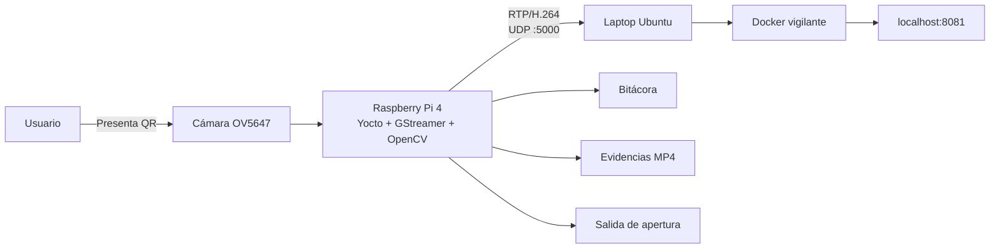
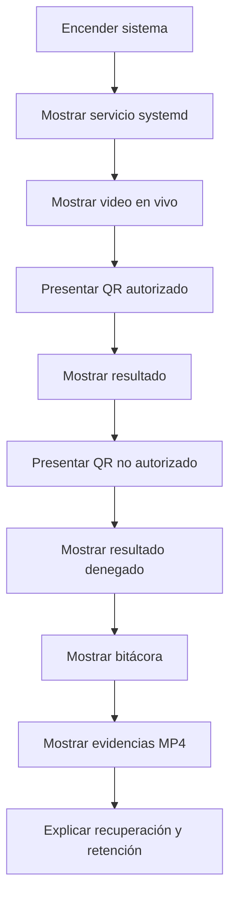
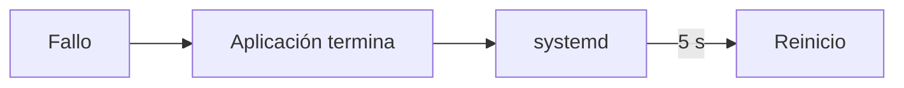
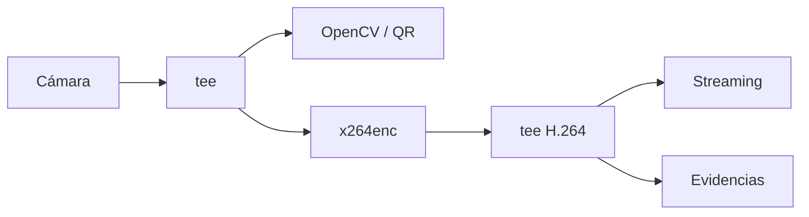
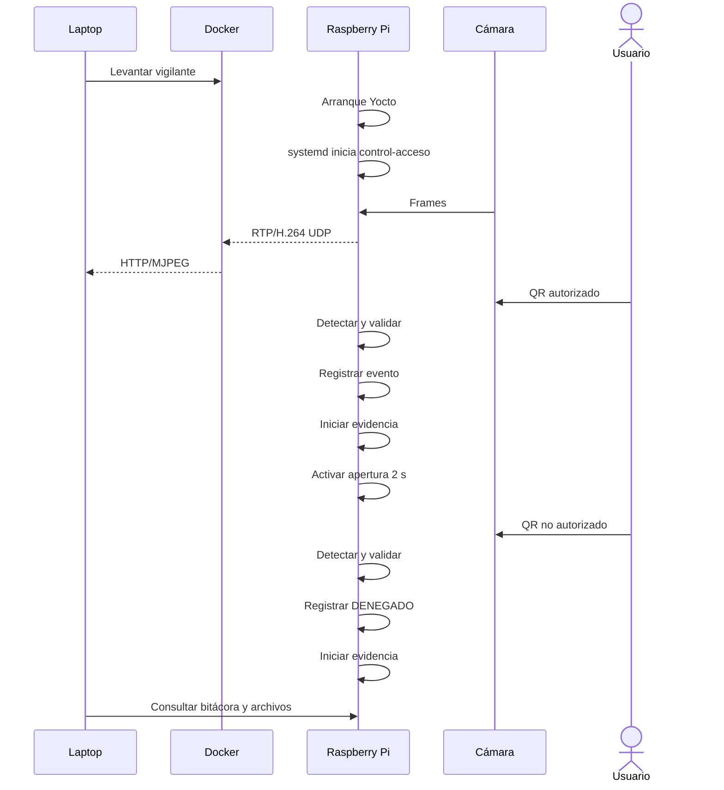

# Operación y demostración del sistema

## 1. Propósito

Este documento describe el procedimiento recomendado para poner en operación y demostrar el sistema de control de acceso de forma ordenada.

La demostración se divide en dos nodos:

- **Raspberry Pi 4**, donde se ejecuta la imagen Yocto y la aplicación de control de acceso;
- **estación de vigilancia**, donde Docker recibe el flujo RTP/H.264 y lo presenta mediante una interfaz web.

El objetivo es mostrar el funcionamiento integrado del sistema sin depender de comandos manuales para iniciar la aplicación en la Raspberry Pi.

---

## 2. Arquitectura de demostración



La Raspberry Pi realiza la captura, detección QR, decisión, registro, generación de evidencias y transmisión.

La laptop actúa como estación de vigilancia.

---

## 3. Preparación del montaje

Antes de encender la Raspberry Pi se conectan:

- microSD con la imagen Yocto;
- cámara OV5647;
- cable Ethernet hacia la laptop;
- sistema de ventilación;
- alimentación.

La cámara debe conectarse con la Raspberry Pi apagada.

En la laptop deben estar disponibles:

```text
Docker
Docker Compose
navegador web
repositorio Project_1_Embebidos
```

---

## 4. Configuración de red

En el montaje utilizado para la integración, la laptop opera con:

```text
10.42.0.1
```

y la Raspberry Pi obtiene una dirección dentro de la misma red.

La aplicación instalada en la Raspberry utiliza:

```text
DEST_HOST=10.42.0.1
DEST_PORT=5000
```

por lo que el flujo H.264 se envía al puerto UDP 5000 de la laptop.

---

## 5. Iniciar la estación de vigilancia

En la laptop:

```bash
cd ~/Project_1_Embebidos
```

Levantar únicamente el vigilante:

```bash
docker compose \
    -f compose.yaml \
    -f compose.web.yaml \
    up --build -d vigilante
```

Comprobar que el contenedor esté activo:

```bash
docker compose \
    -f compose.yaml \
    -f compose.web.yaml \
    ps
```

Para observar sus mensajes:

```bash
docker compose \
    -f compose.yaml \
    -f compose.web.yaml \
    logs -f vigilante
```

---

## 6. Abrir la interfaz web

En el navegador de la laptop:

```text
http://localhost:8081
```

La interfaz corresponde a la estación del vigilante.

Su flujo interno es:

```text
UDP :5000
→ RTP
→ H.264 decode
→ JPEG
→ HTTP/MJPEG
→ navegador
```

---

## 7. Encender la Raspberry Pi

Después de preparar el vigilante, encender la Raspberry Pi.

El servicio:

```text
control-acceso.service
```

se encuentra habilitado mediante systemd y ejecuta automáticamente:

```text
/usr/bin/control-acceso
```

No es necesario iniciar manualmente el programa Python.

---

## 8. Localizar la Raspberry Pi

Desde la laptop puede consultarse la tabla de vecinos:

```bash
ip neigh
```

Una vez identificada la dirección:

```bash
ping -c 3 10.42.0.X
```

y posteriormente:

```bash
ssh root@10.42.0.X
```

---

## 9. Verificar el servicio

Dentro de la Raspberry Pi:

```bash
systemctl status control-acceso --no-pager
```

El servicio debe aparecer en ejecución.

Para observar los mensajes de la aplicación en tiempo real:

```bash
journalctl -fu control-acceso
```

Durante la demostración esta terminal permite observar:

- detección del QR;
- resultado de autorización;
- inicio de evidencia;
- cierre de evidencia;
- errores o mensajes del pipeline.

---

## 10. Secuencia recomendada de demostración



Este orden permite explicar primero la arquitectura y después las funciones de acceso.

---

# 11. Paso 1 — Arranque automático

Mostrar:

```bash
systemctl status control-acceso --no-pager
```

El punto principal es demostrar que la aplicación forma parte de la imagen Yocto y que es iniciada por systemd.

Puede explicarse:

```text
Yocto
→ systemd
→ control-acceso.service
→ /usr/bin/control-acceso
```

---

# 12. Paso 2 — Video en vivo

Abrir:

```text
http://localhost:8081
```

La imagen observada proviene de:

```text
OV5647
→ Raspberry Pi
→ x264enc
→ RTP/UDP
→ Docker
→ navegador
```

El vigilante no participa en la decisión de acceso; únicamente recibe y presenta el video.

---

# 13. Paso 3 — Acceso autorizado

Presentar frente a la cámara uno de los identificadores autorizados:

```text
MC001
```

o:

```text
MC002
```

El flujo esperado es:

```text
QR detectado
→ validación
→ AUTORIZADO
→ registro del evento
→ creación de evidencia
→ activación lógica de apertura
```

En el journal se observa un resultado equivalente a:

```text
Resultado: ACCESO AUTORIZADO
```

La evidencia comienza en el mismo evento.

---

## 13.1 Salida de apertura

La lógica de apertura utiliza:

```text
GPIO BCM17
```

y mantiene la salida activa durante:

```text
2 s
```

Si existe un indicador o etapa de potencia conectada al montaje, la autorización puede mostrarse físicamente.

La aplicación implementa:

```text
LOW
→ HIGH durante 2 s
→ LOW
```

---

# 14. Paso 4 — Acceso denegado

Presentar un QR con un identificador distinto de:

```text
MC001
MC002
```

Por ejemplo:

```text
NO001
```

El flujo esperado es:

```text
QR detectado
→ validación
→ DENEGADO
→ registro del evento
→ evidencia
→ salida de apertura permanece inactiva
```

En el journal se observa:

```text
Resultado: ACCESO DENEGADO
```

---

# 15. Paso 5 — Política fail-secure

La decisión de acceso dispone de un timeout de:

```text
10 s
```

Si la clasificación no termina dentro del tiempo permitido:

```text
DENEGADO_TIMEOUT
```

La salida de apertura permanece inactiva.

La política puede resumirse como:

```text
sin autorización confirmada
→ no abrir
```

---

# 16. Paso 6 — Evidencias

Las evidencias se almacenan en:

```text
/var/lib/control-acceso/evidencias/
```

Para mostrarlas:

```bash
ls -lh /var/lib/control-acceso/evidencias
```

Cada archivo utiliza un nombre como:

```text
evidencia_YYYY-MM-DD_HH-MM-SS_microsegundos.mp4
```

Cada evento genera una evidencia de:

```text
60 s
```

La arquitectura permite mantener varias grabaciones activas simultáneamente.

---

# 17. Paso 7 — Bitácora

Mostrar:

```bash
tail -n 10 /var/lib/control-acceso/bitacora_accesos.log
```

Cada registro asocia:

- fecha y hora;
- identificador;
- resultado;
- ruta de evidencia.

La relación es:

```text
evento de acceso
→ bitácora
→ archivo MP4 correspondiente
```

---

# 18. Paso 8 — Retención

La política configurada es:

```text
Evidencias MP4: 7 días
Bitácora:       30 días
```

La limpieza se realiza automáticamente al iniciar la aplicación.

Los videos cuyo nombre contiene una fecha con antigüedad igual o superior a siete días son eliminados.

En la bitácora se eliminan eventos con antigüedad igual o superior a treinta días.

---

# 19. Paso 9 — Recuperación ante fallos

La arquitectura utiliza dos mecanismos principales:

```text
watchdog interno
+
systemd
```

El watchdog detecta ausencia de frames durante:

```text
3 s
```

y termina la aplicación como error.

Systemd está configurado con:

```ini
Restart=on-failure
RestartSec=5
```

por lo que el proceso es iniciado nuevamente.



---

# 20. Demostración del reinicio de systemd

Si se desea mostrar esta característica de forma controlada, primero obtener el PID:

```bash
systemctl show \
    -p MainPID \
    --value \
    control-acceso
```

Después puede terminarse el proceso:

```bash
kill -9 <PID>
```

Esperar unos segundos y comprobar:

```bash
systemctl status control-acceso --no-pager
```

El nuevo proceso debe tener un PID diferente.

Los eventos pueden observarse mediante:

```bash
journalctl -u control-acceso -n 30 --no-pager
```

Esta prueba debe realizarse únicamente cuando no exista una demostración crítica en curso.

---

# 21. Demostración complementaria con Docker

El sistema multimedia puede mostrarse sin utilizar la Raspberry Pi mediante dos contenedores.

```bash
docker compose \
    -f compose.yaml \
    -f compose.web.yaml \
    up --build -d
```

En este modo:

```text
videotestsrc
→ contenedor emisor
→ H.264/RTP/UDP
→ contenedor vigilante
→ navegador
```

La interfaz continúa disponible en:

```text
http://localhost:8081
```

Esta demostración permite explicar que emisor y receptor comparten el mismo contrato RTP utilizado por la Raspberry Pi.

---

# 22. Comprobación automática de comunicación Docker

El repositorio incluye:

```text
scripts/test_compose.sh
```

que utiliza:

```text
compose.offline.yaml
```

para comprobar de forma automática:

```text
emisor activo
vigilante activo
resolución 1280 × 720
al menos 30 frames decodificados
```

La salida satisfactoria termina con:

```text
Prueba de comunicación: SUCCESS
```

---

# 23. Explicación breve del pipeline durante la demo

Una forma compacta de describir el pipeline es:

```text
La cámara se abre una sola vez.
Un tee divide el video en varias ramas.
Una rama entrega frames BGR a OpenCV.
Otra rama codifica H.264.
El H.264 se reutiliza para streaming y evidencias.
```

Diagrama:



---

# 24. Explicación breve de Yocto

Durante la demostración puede resumirse:

```text
La aplicación no se instaló manualmente
después de arrancar la Raspberry Pi.

La receta de Yocto incorpora:
- Python;
- OpenCV;
- GStreamer;
- libcamera;
- x264;
- la aplicación;
- el servicio systemd.
```

La receta de imagen es:

```text
control-acceso-image.bb
```

y la receta de aplicación:

```text
control-acceso_1.0.bb
```

---

# 25. Explicación breve de la concurrencia

La arquitectura evita realizar la detección QR dentro del callback de GStreamer.

```text
appsink
→ cola_frames
→ hilo QR
→ ThreadPoolExecutor
→ clasificación
```

Esto permite que el pipeline multimedia continúe recibiendo frames mientras se procesa una solicitud de acceso.

---

# 26. Explicación del encoder

La ruta funcional utiliza:

```text
x264enc
```

para codificación H.264 por software.

Durante la validación también se evaluó:

```text
v4l2h264enc
```

El plugin y el dispositivo hardware fueron detectados, pero la ruta no procesó correctamente los frames en la plataforma utilizada.

Por esta razón se mantuvo `x264enc` como encoder del sistema.

---

# 27. Comandos de consulta útiles

## Estado del servicio

```bash
systemctl status control-acceso --no-pager
```

## Logs en tiempo real

```bash
journalctl -fu control-acceso
```

## Cámara detectada

```bash
cam -l
```

## Plugin de cámara

```bash
gst-inspect-1.0 libcamerasrc
```

## Encoder

```bash
gst-inspect-1.0 x264enc
```

## Evidencias

```bash
ls -lh /var/lib/control-acceso/evidencias
```

## Bitácora

```bash
tail -n 10 /var/lib/control-acceso/bitacora_accesos.log
```

---

# 28. Detener la estación de vigilancia

Al finalizar:

```bash
docker compose \
    -f compose.yaml \
    -f compose.web.yaml \
    down
```

Si se desea detener la aplicación en la Raspberry Pi:

```bash
systemctl stop control-acceso
```

Para iniciarla nuevamente:

```bash
systemctl start control-acceso
```

---

# 29. Orden recomendado para una presentación corta

Para una demostración de pocos minutos, el orden más eficiente es:

1. mostrar la arquitectura general;
2. mostrar `systemctl status`;
3. abrir `localhost:8081`;
4. presentar `MC001` o `MC002`;
5. presentar un QR no autorizado;
6. mostrar la bitácora;
7. mostrar los MP4;
8. explicar Yocto, Docker y recuperación;
9. mencionar la decisión técnica de utilizar `x264enc`.

Este orden permite mostrar primero el comportamiento observable y después explicar las decisiones de ingeniería.

---

# 30. Flujo completo de demostración



---

## 31. Resumen

La demostración debe evidenciar que el sistema funciona como una solución integrada y no como un conjunto de pruebas independientes.

Los puntos centrales son:

```text
imagen Yocto
→ arranque automático
→ cámara real
→ pipeline GStreamer
→ OpenCV / QR
→ decisión de acceso
→ evidencia
→ streaming RTP/UDP
→ Docker
→ navegador
```

El énfasis debe mantenerse en la integración entre los subsistemas y en las decisiones de diseño que permiten que captura, procesamiento, almacenamiento y vigilancia operen de manera simultánea.
