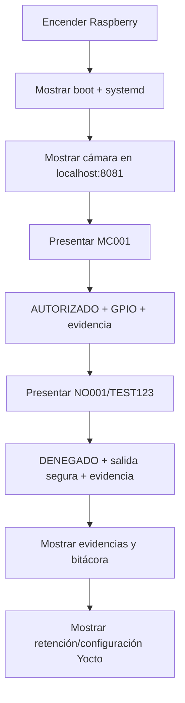

# Guion de demostración presencial

## 1. Objetivo

Demostrar que la imagen Linux construida con Yocto ejecuta automáticamente el sistema de control de acceso sobre Raspberry Pi 4 y que las funciones principales trabajan de forma integrada.

## 2. Preparación

### Laptop

```bash
cd ~/Project_1_Embebidos
docker compose -f compose.integration.yaml up -d
docker compose -f compose.integration.yaml ps
```

Abrir:

```text
http://localhost:8081
```

### Raspberry

Comprobar red:

```bash
ping -c 2 10.42.0.1
```

Comprobar servicio:

```bash
systemctl status control-acceso --no-pager
```

Abrir logs:

```bash
journalctl -fu control-acceso -n 0
```

## 3. Orden recomendado de la demo



### Paso 1 — Arranque

Mostrar que no se ejecutó manualmente el Python: systemd lo inició desde la imagen.

### Paso 2 — Video en vivo

Mostrar la cámara real en la estación del vigilante.

### Paso 3 — Acceso autorizado

Presentar `MC001`.

Esperado:

```text
QR detectado: MC001
Resultado: ACCESO AUTORIZADO
```

En la versión final con circuito, mostrar también la salida de apertura.

### Paso 4 — Acceso denegado

Presentar `NO001` o `TEST123`.

Esperado:

```text
Resultado: ACCESO DENEGADO
```

La salida de apertura debe permanecer inactiva.

### Paso 5 — Evidencia

```bash
ls -lh /var/lib/control-acceso/evidencias
tail -n 10 /var/lib/control-acceso/bitacora_accesos.log
```

Explicar:

- un MP4 por evento;
- 60 segundos;
- nombre único;
- ruta del video asociada en bitácora;
- retención 7/30 días.

## 4. Demostración complementaria de dos contenedores

Si el profesor la solicita:

```bash
docker compose -f compose.yaml -f compose.web.yaml up --build -d
```

Explicar que el contenedor emisor simula la Raspberry mediante `videotestsrc`.

## 5. Demostración QEMU

Realizar después de reconstruir la imagen QEMU con el código final.

Explicar que QEMU sustituye la cámara física por una fuente sintética y permite demostrar el arranque de la imagen y la aplicación fuera del hardware real.

## 6. Preguntas que conviene poder responder

**¿Por qué GStreamer?**  
Permite componer, negociar y depurar pipelines multimedia y separar ramas de análisis, evidencia y red.

**¿Por qué OpenCV?**  
Se utiliza para detectar y decodificar el QR a partir de frames entregados por GStreamer.

**¿Por qué systemd?**  
Para inicio automático, supervisión y política de recuperación ante fallos.

**¿Por qué UDP/RTP?**  
Para transmisión de video en tiempo real con menor sobrecarga y tolerancia a pérdidas.

**¿Dónde persisten los datos?**  
En `/var/lib/control-acceso`.

**¿El encoder es hardware?**  
No en la versión actual: se usa `x264enc`. La ruta hardware continúa documentada como limitación pendiente.
