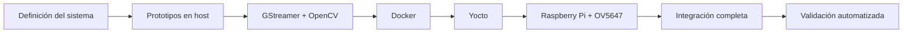

# Bitácora técnica del desarrollo

## 1. Propósito

Este documento resume el proceso técnico seguido para desarrollar e integrar el sistema de control de acceso basado en **Raspberry Pi 4, Yocto Project, GStreamer, OpenCV y Docker**.

La bitácora se enfoca en las decisiones de ingeniería, problemas encontrados, pruebas realizadas y soluciones incorporadas al sistema. No pretende sustituir una bitácora individual de horas de trabajo, sino documentar la evolución técnica del proyecto y las razones detrás de la arquitectura final.

---

## 2. Evolución general del proyecto

El desarrollo siguió una estrategia incremental:



Cada etapa permitió aislar problemas antes de introducir el siguiente nivel de complejidad.

---

# 3. Definición del sistema

La solución se planteó como un sistema de control y supervisión de acceso con las siguientes funciones principales:

- captura continua de video;
- identificación mediante código QR;
- clasificación de solicitudes de acceso;
- generación de evidencia de video;
- registro persistente de eventos;
- transmisión del video hacia una estación de vigilancia;
- ejecución automática en una Raspberry Pi 4.

La identificación se decidió realizar utilizando la misma cámara del sistema, evitando incorporar un lector externo como dependencia del diseño final.

---

## 4. Selección de plataforma

La plataforma objetivo seleccionada fue:

```text
Raspberry Pi 4
```

con:

```text
Raspberry Pi Camera Board v1.3
Sensor OV5647
```

El sistema operativo se construyó mediante Yocto Project con el objetivo de integrar únicamente las dependencias requeridas por la aplicación y controlar de forma reproducible la configuración del sistema.

---

# 5. Prototipos multimedia iniciales

Antes de integrar toda la lógica en Python se realizaron pruebas de GStreamer para comprobar de forma aislada:

- fuentes de video;
- formatos;
- resolución;
- framerate;
- conversión de píxel;
- codificación H.264;
- RTP/UDP;
- recepción del flujo.

El flujo de trabajo aplicado fue:

```text
gst-launch-1.0
        ↓
validación de elementos
        ↓
validación de pipeline
        ↓
integración en Python
```

Esta estrategia permitió distinguir fallos de GStreamer de fallos en la lógica de la aplicación.

---

# 6. Integración Python + GStreamer

La aplicación principal se desarrolló en:

```text
prueba_integrada_h1.py
```

y posteriormente se integró en la receta Yocto como:

```text
/usr/bin/control-acceso
```

La construcción del pipeline se realiza mediante:

```python
Gst.parse_launch()
```

La aplicación fue evolucionando hasta integrar:

- captura;
- distribución mediante `tee`;
- procesamiento QR;
- codificación H.264;
- streaming RTP;
- grabaciones dinámicas;
- watchdog;
- manejo del bus;
- cierre coordinado;
- control GPIO;
- retención.

---

# 7. Arquitectura de una sola captura

Una decisión importante fue evitar abrir la cámara en múltiples procesos o pipelines independientes.

Se adoptó:

```text
una fuente de cámara
        ↓
tee
        ↓
múltiples ramas
```

La arquitectura final separa:

```text
preview
QR
multimedia
```

y, después de codificar H.264:

```text
streaming
evidencias
```

Esto redujo duplicación de captura y permitió mantener sincronizados los diferentes subsistemas.

---

# 8. Procesamiento QR

La primera preocupación de integración fue evitar que OpenCV bloqueara el flujo multimedia.

La solución adoptada separa el procesamiento mediante:

```text
appsink
→ cola_frames
→ hilo QR
→ OpenCV
→ ThreadPoolExecutor
→ clasificación
```

El callback de GStreamer únicamente obtiene y encola frames.

Esta arquitectura fue posteriormente verificada mediante una prueba específica de concurrencia.

---

# 9. Identificadores de acceso

La lógica final utiliza como identificadores autorizados:

```text
MC001
MC002
```

Cualquier otro identificador QR correctamente decodificado se clasifica como:

```text
DENEGADO
```

Además, la aplicación incorpora una política de timeout:

```text
10 s
```

Si la decisión no termina dentro de ese intervalo:

```text
DENEGADO_TIMEOUT
```

---

# 10. Control de eventos QR repetidos

Durante el desarrollo fue necesario evitar que un mismo QR visible continuamente generara eventos repetidos.

Se incorporaron dos mecanismos:

```text
TIEMPO_REARME_QR = 3 s
TIEMPO_BLOQUEO_MISMO_QR = 60 s
```

El primero permite restablecer la detección cuando el QR deja de verse.

El segundo evita que el mismo identificador genere nuevas solicitudes durante un intervalo definido.

---

# 11. Generación de evidencias

La estrategia de evidencia evolucionó hacia una grabación independiente por evento.

La arquitectura final utiliza el flujo H.264 ya generado:

```text
tee H.264
→ rama dinámica
→ h264parse
→ mp4mux
→ filesink
```

Cada evento produce:

```text
evidencia_YYYY-MM-DD_HH-MM-SS_microsegundos.mp4
```

con duración de:

```text
60 s
```

El uso de nombres con microsegundos evita colisiones entre eventos cercanos.

---

# 12. Evidencias concurrentes

Se diseñó el sistema para permitir que varias grabaciones permanezcan activas simultáneamente.

Cada evidencia obtiene:

- su propio `queue`;
- su propio `h264parse`;
- su propio `mp4mux`;
- su propio `filesink`;
- un request pad independiente del `tee`.

Esto permite que un nuevo evento no tenga que esperar a que finalice la evidencia anterior.

---

# 13. Cierre correcto de archivos MP4

Durante el desarrollo se identificó que un archivo MP4 no debe eliminarse simplemente del pipeline sin finalizar correctamente su contenedor.

La solución implementada fue:

```text
bloquear rama
→ enviar EOS
→ dejar que mp4mux finalice
→ detectar EOS
→ retirar rama
```

Las pruebas posteriores confirmaron que los archivos resultantes pueden ser inspeccionados y reproducidos correctamente.

---

# 14. Persistencia

Los datos del sistema se concentran en:

```text
/var/lib/control-acceso
```

con:

```text
/var/lib/control-acceso/
├── bitacora_accesos.log
└── evidencias/
```

La aplicación registra cada solicitud junto con la ruta de su evidencia.

---

# 15. Política de retención

Para evitar crecimiento indefinido del almacenamiento se implementó:

```text
videos:    7 días
bitácora: 30 días
```

La limpieza se ejecuta al iniciar la aplicación.

También se incorporó una protección para evitar borrados cuando la fecha del sistema no sea válida.

---

# 16. Desarrollo de la estación de vigilancia

La estación de vigilancia se construyó inicialmente como un receptor GStreamer de consola.

El pipeline permite comprobar:

```text
RTP
→ H.264
→ decode
→ fpsdisplaysink
```

Posteriormente se desarrolló:

```text
docker/vigilante_web.py
```

para convertir el flujo recibido en JPEG y entregarlo mediante HTTP/MJPEG.

---

# 17. Docker

Docker se utilizó para separar el receptor del entorno del host y facilitar pruebas reproducibles.

Se definieron dos servicios:

```text
emisor
vigilante
```

El emisor utiliza:

```text
videotestsrc
```

y reproduce el mismo contrato multimedia que utiliza la Raspberry Pi.

Esto permitió comprobar la red RTP/H.264 sin depender del hardware.

---

# 18. Interfaz web del vigilante

La estación web recibe:

```text
RTP/H.264
```

y transforma el flujo mediante:

```text
rtph264depay
→ avdec_h264
→ videoconvert
→ jpegenc
→ appsink
```

Los frames JPEG se publican con un:

```text
ThreadingHTTPServer
```

en:

```text
localhost:8081
```

---

# 19. Integración Yocto

La aplicación se integró dentro de una capa propia:

```text
meta-control-acceso
```

La capa contiene:

```text
receta de imagen
receta de aplicación
servicio systemd
configuración de cámara
```

La imagen instala las dependencias necesarias para que la Raspberry Pi arranque directamente con el sistema disponible.

---

# 20. Cámara OV5647

Uno de los problemas principales durante la integración Yocto fue la detección de la cámara.

Inicialmente el sensor no aparecía correctamente en el flujo esperado.

El diagnóstico mostró que el soporte del kernel no era suficiente por sí solo; era necesario incorporar explícitamente el overlay.

La configuración utilizada quedó como:

```bitbake
VIDEO_CAMERA = "0"

RPI_KERNEL_DEVICETREE_OVERLAYS:append = " overlays/ov5647.dtbo"

RPI_EXTRA_CONFIG:append = "\ncamera_auto_detect=0\ndtoverlay=ov5647"
```

Después de esta integración, libcamera pudo detectar el sensor y `libcamerasrc` quedó disponible para GStreamer.

---

# 21. Integración de libcamera con GStreamer

La capa añadió:

```text
libcamera_%.bbappend
```

con:

```bitbake
PACKAGECONFIG:append = " gst"
```

Esto permitió disponer de:

```text
libcamerasrc
```

dentro de la imagen.

---

# 22. Codificación H.264

Se estudiaron dos rutas:

```text
v4l2h264enc
x264enc
```

El dispositivo:

```text
bcm2835-codec-encode
```

y el elemento:

```text
v4l2h264enc
```

fueron detectados en el sistema.

Sin embargo, las pruebas de ejecución produjeron errores durante el procesamiento de frames.

La ruta funcional adoptada fue:

```text
x264enc
```

con:

```text
tune=zerolatency
bitrate=2000
speed-preset=veryfast
key-int-max=30
scenecut=0
```

---

# 23. Integración Raspberry Pi → Docker

La comunicación final utiliza Ethernet.

La configuración empleada en el montaje fue:

```text
Laptop:      10.42.0.1
Destino UDP: 10.42.0.1:5000
```

La Raspberry Pi envía:

```text
H.264
→ RTP
→ UDP
```

hacia la laptop.

Docker publica:

```text
5000/udp
```

y la estación del vigilante presenta el video en:

```text
http://localhost:8081
```

---

# 24. systemd

La aplicación se integró como:

```text
control-acceso.service
```

con:

```ini
Restart=on-failure
RestartSec=5
```

Esto convirtió el proceso Python en un servicio gestionado por el sistema operativo.

La aplicación puede arrancar automáticamente con la Raspberry Pi y ser reiniciada por systemd cuando termina por error.

---

# 25. Watchdog de cámara

Se incorporó un watchdog para detectar pérdida de frames.

El límite utilizado es:

```text
3 s
```

Cuando se alcanza:

```text
desactivar apertura
→ marcar error fatal
→ terminar aplicación
→ systemd reinicia
```

Esta combinación implementa una recuperación en dos niveles:

```text
detección interna
+
recuperación externa
```

---

# 26. Control GPIO

La aplicación incorporó una salida de apertura mediante:

```text
BCM17
```

accedida como:

```text
/sys/class/gpio/gpio529
```

La salida se inicializa en:

```text
LOW
```

y una autorización provoca:

```text
HIGH durante 2 s
```

seguido de:

```text
LOW
```

La desactivación también se ejecuta durante fallos y cierre.

---

# 27. Política fail-secure

La lógica de seguridad quedó basada en:

```text
si no existe autorización confirmada → no abrir
```

Esto aplica a:

- identificador no autorizado;
- timeout;
- pérdida de cámara;
- cierre de la aplicación;
- error fatal.

---

# 28. Manejo del bus de GStreamer

Se añadió un `signal watch` para procesar:

```text
ERROR
WARNING
EOS
```

Los errores provocan terminación con estado de fallo, permitiendo la recuperación mediante systemd.

Las advertencias se registran sin detener necesariamente la aplicación.

EOS se utiliza tanto para cierre global como para finalizar correctamente evidencias.

---

# 29. Cierre coordinado

La aplicación maneja:

```text
SIGTERM
Ctrl+C
```

y realiza:

```text
enviar EOS
→ esperar finalización
→ desactivar GPIO
→ pipeline NULL
→ finalizar hilo QR
→ cerrar executor
```

Este mecanismo evita terminar abruptamente los recursos multimedia durante una detención normal.

---

# 30. Validación de latencia

Se utilizaron tracers de GStreamer para medir la ruta de streaming.

Resultado promedio hasta `udpsink`:

```text
242.066 ms
```

El presupuesto agrupado calculado fue:

```text
239.520 ms
```

con una diferencia aproximada de:

```text
2.546 ms
1.05 %
```

También se realizó una medición visual extremo a extremo del orden de:

```text
3 s
```

que incluye red, jitter buffer, decodificación, conversión a JPEG y presentación en navegador.

---

# 31. Framerate

Las pruebas de conteo de frames mostraron valores cercanos a:

```text
30 fps
```

en la Raspberry Pi.

Ejemplos observados:

```text
30.004
30.011
30.020
30.000
```

Esto confirmó que el flujo alcanzaba el orden de operación esperado alrededor de 30 fps.

---

# 32. Keyframes

El encoder quedó configurado con:

```text
key-int-max=30
scenecut=0
```

Con aproximadamente 30 fps, la prueba confirmó un intervalo cercano a:

```text
1 s
```

entre keyframes.

---

# 33. Pruebas de errores

La validación incorporó pruebas específicas para:

- errores del bus;
- pérdida simulada de frames;
- reinicio mediante systemd;
- cierre de MP4;
- almacenamiento lleno.

En la prueba de almacenamiento lleno, GStreamer reportó:

```text
No space left on the resource
Could not multiplex stream
```

confirmando que el fallo se expresa de forma explícita.

---

# 34. Prueba de recuperación systemd

Se envió `SIGKILL` al proceso del servicio.

El journal registró:

```text
Main process exited
Failed with result 'signal'
Scheduled restart job
Started Sistema de control de acceso
```

y el servicio regresó a estado activo con un PID diferente.

---

# 35. Integración continua con Jenkins

El repositorio incorpora:

```text
Jenkinsfile
```

para automatizar las pruebas.

El flujo incluye:

```text
construcción Docker
→ pruebas de host
→ pruebas Raspberry
→ smoke tests
→ comunicación Docker
→ archivado de resultados
```

Jenkins conserva los archivos generados bajo:

```text
resultados/
```

como artefactos de validación.

---

# 36. Consistencia del repositorio

Se incorporó una prueba específica para verificar:

- sintaxis Python;
- igualdad entre la aplicación principal y la copia usada por Yocto;
- política de retención;
- política de reinicio systemd.

El resultado validado fue:

```text
TEST REPO CONSISTENCY: PASS
```

Esto ayuda a evitar que el código utilizado para construir la imagen se desincronice respecto al archivo principal del repositorio.

---

# 37. Reproducibilidad

Las revisiones de Yocto se fijaron en:

```text
yocto-config/versiones.txt
```

y la configuración específica del proyecto se conserva en:

```text
yocto-config/project-local.conf
```

Las versiones verificadas incluyen:

```text
GStreamer 1.22.12
Poky Scarthgap
meta-raspberrypi Scarthgap
```

---

# 38. Problemas técnicos y soluciones

| Problema encontrado | Solución o decisión adoptada |
|---|---|
| Cámara OV5647 no integrada correctamente | Añadir overlay y configuración explícita |
| `libcamerasrc` no disponible | Habilitar soporte GStreamer en libcamera |
| `x264enc` ausente | Añadir plugins ugly y habilitar x264 |
| Encoder hardware no procesa frames | Utilizar `x264enc` como ruta funcional |
| Procesamiento QR podía bloquear multimedia | Separar callback, cola, hilo y executor |
| Eventos QR repetidos | Rearme y bloqueo temporal por identificador |
| Necesidad de varias evidencias | Ramas dinámicas desde el `tee` H.264 |
| MP4 podía quedar incompleto | Finalización mediante EOS |
| Pérdida de cámara | Watchdog de frames |
| Proceso termina por fallo | Reinicio mediante systemd |
| Crecimiento del almacenamiento | Retención 7/30 días |
| Variación de host key tras reflashear | Eliminar entrada SSH correspondiente |
| Restricción AppArmor en host de build | Ajuste temporal de user namespaces |
| Necesidad de validar red sin Raspberry | Emisor y receptor Docker |

---

# 39. Decisiones de arquitectura consolidadas

La evolución del proyecto condujo a las siguientes decisiones principales:

```text
Una única captura de cámara
Un único encoder H.264
QR fuera del callback de GStreamer
Ramas dinámicas para evidencias
RTP/UDP para vigilancia
Docker como receptor y entorno de pruebas
Yocto para la plataforma embebida
systemd para supervisión
Política fail-secure
```

Estas decisiones conforman la arquitectura documentada en la versión final del repositorio.

---

# 40. Resultado del proceso de desarrollo

El proceso permitió evolucionar desde pruebas aisladas de multimedia hasta un sistema integrado compuesto por:

```text
Raspberry Pi 4
+ cámara OV5647
+ imagen Yocto
+ Python
+ GStreamer
+ OpenCV
+ GPIO
+ evidencias
+ RTP/UDP
+ Docker
+ systemd
+ Jenkins
```

La bitácora técnica muestra que las decisiones finales no fueron seleccionadas únicamente por diseño teórico, sino a partir de pruebas, fallos reproducidos y ajustes realizados durante la integración.
