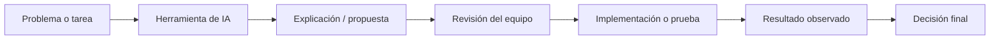
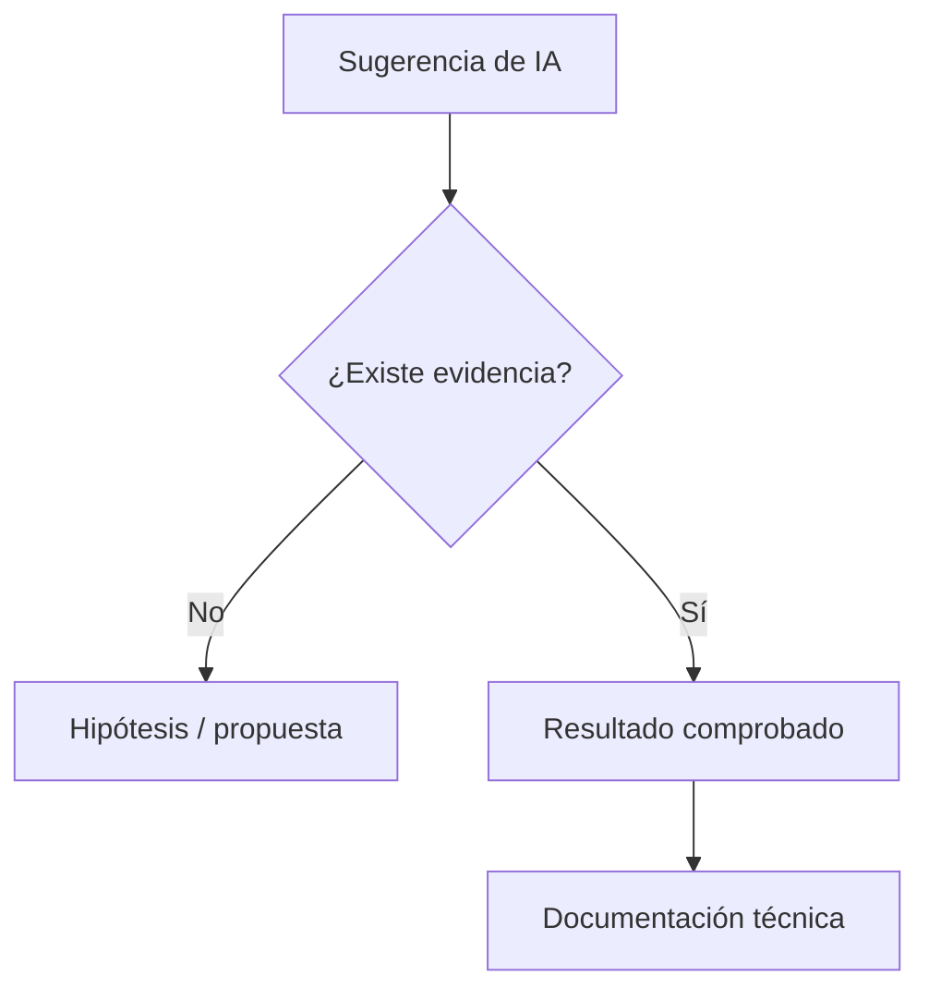

# Uso de inteligencia artificial

## 1. Propósito

Durante el desarrollo del proyecto se utilizaron herramientas de inteligencia artificial como apoyo complementario para actividades de análisis, documentación, programación y revisión técnica.

El uso de estas herramientas no sustituyó las pruebas experimentales ni la validación realizada sobre los entornos de ejecución del proyecto. Las decisiones finales de arquitectura, configuración, integración y selección de resultados fueron tomadas por el equipo a partir del comportamiento observado en Ubuntu, Docker, QEMU y Raspberry Pi.

---

## 2. Alcance de uso

Las herramientas de inteligencia artificial se utilizaron principalmente para:

- explicar conceptos relacionados con Yocto Project, GStreamer, Linux, Docker, QEMU y systemd;
- apoyar la interpretación de mensajes de error y registros de ejecución;
- proponer estrategias de diagnóstico;
- revisar fragmentos de código;
- sugerir casos de prueba;
- organizar información técnica;
- estructurar documentación;
- apoyar la redacción de diagramas y explicaciones;
- revisar consistencia entre código, recetas Yocto, arquitectura y documentación.

El flujo general de uso fue:



La salida de una herramienta de IA se trató como una propuesta que debía ser revisada y comprobada antes de incorporarse al proyecto.

---

## 3. Herramientas utilizadas

Durante diferentes etapas se utilizaron las siguientes herramientas:

| Herramienta | Uso principal |
|---|---|
| OpenAI ChatGPT | Apoyo técnico, análisis de errores, revisión de código y estructuración de documentación |
| Google Gemini | Consulta y apoyo en investigación técnica |
| Google NotebookLM | Organización, consulta y síntesis de documentos y fuentes |
| Anthropic Claude | Consulta complementaria, programación y revisión técnica |

El uso de varias herramientas permitió contrastar explicaciones y obtener distintos enfoques antes de tomar decisiones de implementación.

---

## 4. Uso durante el aprendizaje técnico

La inteligencia artificial se utilizó como apoyo para comprender conceptos necesarios para el proyecto.

Entre los temas consultados se incluyen:

```text
Yocto Project
BitBake
capas y recetas
GStreamer
pipelines multimedia
caps y negociación
tee y queue
appsink
RTP/UDP
H.264
Docker
QEMU
systemd
Linux
OpenCV
concurrencia en Python
```

Las explicaciones obtenidas se utilizaron como material de apoyo para interpretar posteriormente la documentación oficial, los resultados de las herramientas y el comportamiento del sistema.

---

## 5. Apoyo en Yocto Project

Durante la integración con Yocto se utilizó IA para apoyar tareas como:

- interpretar errores de BitBake;
- comprender la relación entre `local.conf`, capas y recetas;
- organizar dependencias de runtime;
- analizar la integración de `libcamera`;
- revisar la estructura de `meta-control-acceso`;
- explicar el funcionamiento de `systemd` dentro de la imagen;
- revisar comandos de construcción y flasheo.

La configuración finalmente utilizada quedó definida explícitamente en archivos del repositorio como:

```text
yocto-config/project-local.conf
yocto-config/versiones.txt
meta-control-acceso/
```

Por lo tanto, la configuración entregada no depende de instrucciones externas generadas durante las conversaciones con herramientas de IA.

---

## 6. Apoyo en GStreamer

La inteligencia artificial se utilizó para analizar y estructurar tuberías relacionadas con:

- captura de cámara;
- conversión de formatos;
- procesamiento con `appsink`;
- codificación H.264;
- RTP;
- UDP;
- grabación MP4;
- cierre mediante EOS;
- recepción del flujo.

Las propuestas fueron verificadas mediante herramientas como:

```text
gst-launch-1.0
gst-inspect-1.0
GST Tracer
```

y posteriormente integradas en la aplicación Python.

El pipeline final se encuentra implementado directamente en:

```text
prueba_integrada_h1.py
```

---

## 7. Apoyo en análisis de errores

Una de las aplicaciones más frecuentes de IA fue el análisis de mensajes de error.

El procedimiento utilizado fue:

```text
obtener error real
→ revisar log completo
→ identificar subsistema
→ consultar posibles causas
→ seleccionar una hipótesis
→ ejecutar una prueba
→ observar resultado
```

No se consideró resuelto un problema únicamente porque una herramienta de IA propusiera una explicación.

La solución debía producir un resultado verificable en el entorno real.

---

## 8. Ejemplos de problemas analizados

Entre los problemas en los que se utilizó apoyo de IA se encuentran:

- cámara OV5647 no detectada correctamente;
- ausencia de `libcamerasrc`;
- integración de plugins GStreamer;
- configuración de `x264enc`;
- evaluación de `v4l2h264enc`;
- manejo de EOS;
- grabaciones MP4;
- arquitectura de hilos;
- watchdog de cámara;
- reinicio mediante systemd;
- comunicación Raspberry Pi → Docker;
- pruebas automatizadas en Jenkins;
- organización de evidencias.

Las soluciones finales se determinaron a partir de pruebas realizadas sobre el sistema.

---

## 9. Apoyo en programación

Las herramientas de IA se utilizaron para apoyar:

- revisión de sintaxis;
- análisis de funciones;
- organización del código;
- propuestas de refactorización;
- manejo de excepciones;
- concurrencia;
- construcción de pruebas;
- generación de scripts auxiliares.

El código incorporado al repositorio fue posteriormente ejecutado y revisado por el equipo.

La versión final se conserva en:

```text
prueba_integrada_h1.py
```

y la consistencia con la copia utilizada por Yocto se verifica mediante pruebas del repositorio.

---

## 10. Apoyo en pruebas

La inteligencia artificial también se utilizó para estructurar pruebas de validación.

Entre los aspectos evaluados se incluyen:

```text
caps
formatos
framerate
topología
queues
appsink
latencia
keyframes
manejo de errores
cierre MP4
disco lleno
reinicio systemd
arquitectura de hilos
timeout
retención
reproducibilidad
```

La herramienta podía ayudar a plantear el procedimiento, pero el resultado PASS o FAIL dependía exclusivamente de la ejecución real.

---

## 11. Apoyo en documentación

La documentación técnica fue organizada con apoyo de IA para mejorar:

- estructura;
- claridad;
- consistencia terminológica;
- diagramas;
- explicación de arquitectura;
- relación entre subsistemas;
- presentación de resultados.

La información técnica incluida en los documentos se contrastó con:

- código del repositorio;
- recetas Yocto;
- scripts de prueba;
- resultados obtenidos;
- configuración utilizada.

La documentación no utiliza una respuesta de IA como evidencia experimental.

---

## 12. Principio de verificación

Se adoptó el siguiente criterio:

```text
Una afirmación generada por IA
no se considera evidencia del sistema.
```

Para afirmar que una función estaba validada se requirió una fuente verificable como:

- ejecución sobre Raspberry Pi;
- salida de una prueba;
- log de Jenkins;
- resultado de GStreamer;
- archivo generado;
- inspección del código;
- configuración del repositorio.



---

## 13. Separación entre asistencia y autoría técnica

Las herramientas de IA apoyaron el proceso, pero no reemplazaron las responsabilidades del equipo.

El equipo realizó directamente:

- conexión y configuración del hardware;
- construcción de imágenes Yocto;
- flasheo de microSD;
- ejecución de comandos;
- pruebas en Raspberry Pi;
- pruebas en Docker;
- ejecución de Jenkins;
- lectura de logs;
- selección de resultados;
- integración del código;
- decisiones finales de diseño.

La IA funcionó como herramienta de consulta y apoyo.

---

## 14. Comandos de riesgo

Los comandos con capacidad de modificar de forma importante el sistema fueron ejecutados manualmente después de revisar su propósito.

Entre ellos:

```text
dd
systemctl
sysctl
configuración de red
operaciones sobre microSD
cambios del sistema de archivos
```

En particular, antes de utilizar:

```bash
dd
```

se verificó manualmente el dispositivo correspondiente a la microSD.

---

## 15. Manejo de resultados contradictorios

Cuando una propuesta no coincidía con el comportamiento real del sistema, se priorizó el resultado experimental.

Un ejemplo importante fue la codificación H.264 mediante hardware.

Aunque la presencia de:

```text
v4l2h264enc
```

y:

```text
bcm2835-codec-encode
```

podía sugerir que la ruta era utilizable, las pruebas reales mostraron fallos de procesamiento.

Por lo tanto, la documentación final conserva como resultado:

```text
x264enc = ruta funcional utilizada
v4l2h264enc = evaluado, pero no validado
```

La evidencia experimental tuvo prioridad sobre cualquier expectativa teórica.

---

## 16. Uso responsable de información generada

Antes de incorporar contenido técnico se aplicaron los siguientes criterios:

1. comprobar que la afirmación correspondiera al sistema real;
2. evitar presentar hipótesis como resultados;
3. diferenciar diseño, implementación y validación;
4. conservar resultados negativos cuando fueran relevantes;
5. no declarar una prueba como exitosa sin evidencia;
6. evitar introducir componentes que no pertenecieran al repositorio final.

---

## 17. Trazabilidad

Los principales elementos mencionados en la documentación pueden rastrearse directamente en el repositorio.

Ejemplos:

```text
Pipeline:
prueba_integrada_h1.py

Yocto:
meta-control-acceso/

Configuración:
yocto-config/

Docker:
docker/
compose.yaml
compose.web.yaml

Pruebas:
tests/

Automatización:
Jenkinsfile

Evidencias:
resultados/
```

Esta trazabilidad permite revisar la información técnica de forma independiente del proceso de asistencia con inteligencia artificial.

---

## 18. Nivel de uso

El uso de IA puede clasificarse como:

```text
asistencia técnica
+
apoyo documental
+
revisión
```

No se utilizó como sustituto de:

```text
experimentación
validación
decisión de ingeniería
```

---

## 19. Resumen

La inteligencia artificial se utilizó como una herramienta de apoyo durante el desarrollo del sistema, principalmente para comprender conceptos, analizar errores, revisar código, plantear pruebas y estructurar documentación.

El criterio seguido durante todo el proyecto fue:

```text
propuesta
→ revisión
→ prueba
→ evidencia
→ decisión
```

De esta manera, las afirmaciones técnicas del proyecto se fundamentan en la implementación y los resultados obtenidos por el equipo, y no únicamente en contenido generado por herramientas de inteligencia artificial.
