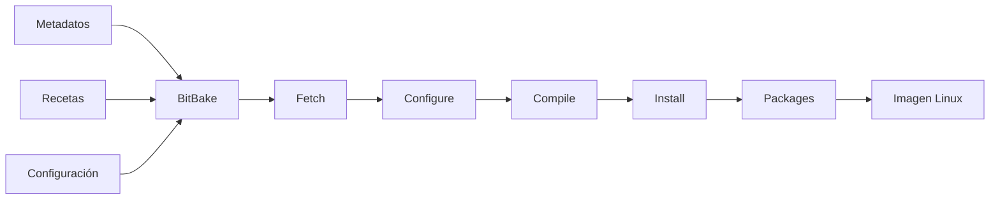
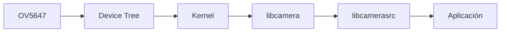
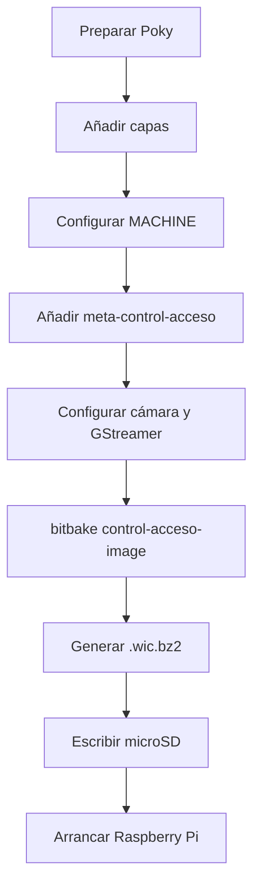
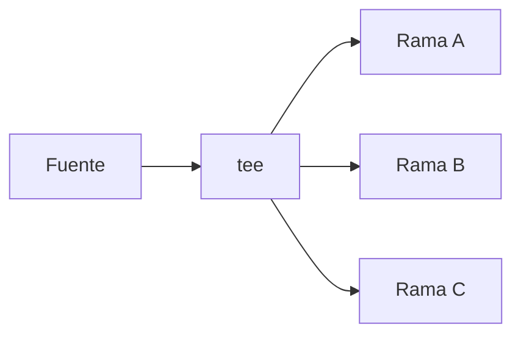
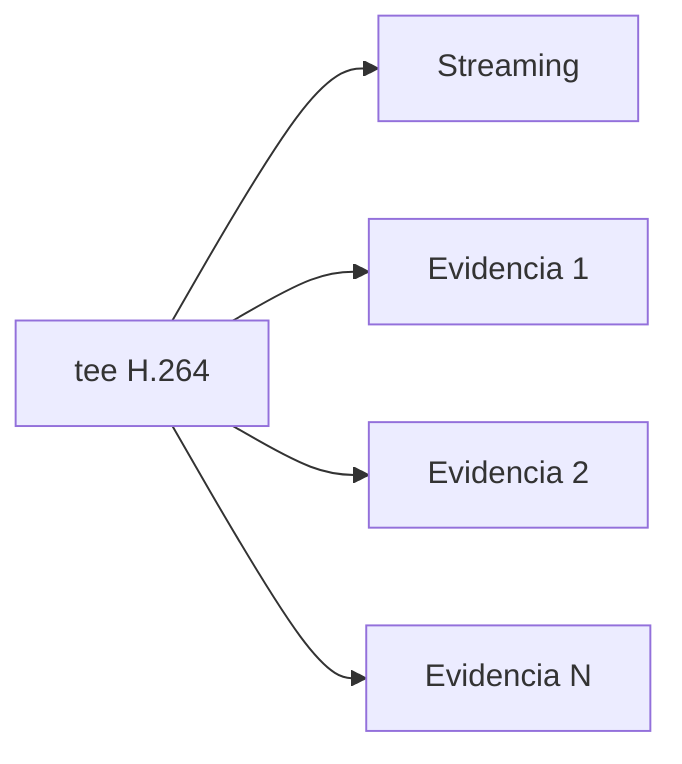
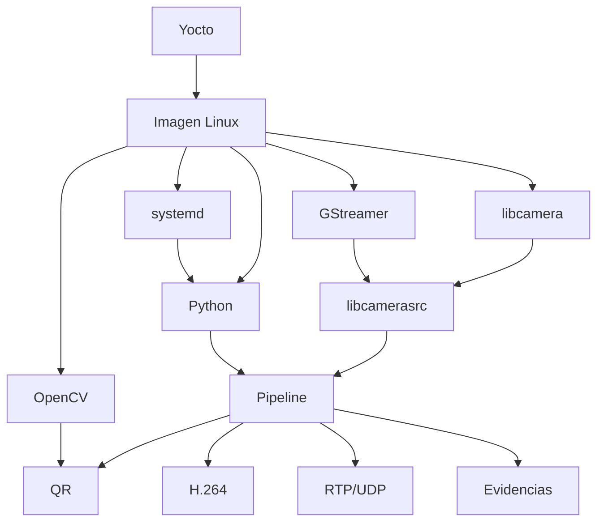

# Fundamentos y flujo de trabajo: Yocto Project y GStreamer

## 1. Propósito

Este documento resume los fundamentos de **Yocto Project** y **GStreamer** utilizados en el proyecto y explica cómo ambos marcos de trabajo se integran dentro del sistema de control de acceso.

El objetivo es documentar no solo qué herramientas se utilizaron, sino también cómo se aplicaron dentro del flujo de desarrollo:

```text
definición de plataforma
→ construcción de Linux con Yocto
→ prototipado de pipelines con GStreamer
→ integración en Python
→ empaquetado de la aplicación
→ despliegue en Raspberry Pi 4
→ validación
```

---

# 2. Yocto Project

## 2.1 ¿Qué es Yocto Project?

Yocto Project es un conjunto de herramientas, metadatos y procesos que permite construir distribuciones Linux personalizadas para sistemas embebidos.

A diferencia de instalar una distribución Linux de propósito general y posteriormente añadir paquetes manualmente, Yocto permite definir de forma declarativa:

- arquitectura objetivo;
- kernel;
- bootloader;
- paquetes;
- servicios;
- configuraciones;
- dependencias;
- archivos instalados;
- imagen final.

El resultado es una imagen reproducible diseñada específicamente para el hardware y la aplicación.

---

## 2.2 BitBake

El motor de construcción utilizado por Yocto es:

```text
BitBake
```

BitBake interpreta recetas y metadatos para resolver dependencias y ejecutar las tareas necesarias para producir paquetes e imágenes.

El flujo conceptual es:



Entre las tareas más comunes se encuentran:

```text
do_fetch
do_unpack
do_patch
do_configure
do_compile
do_install
do_package
do_rootfs
```

No todas las recetas ejecutan exactamente las mismas tareas, pero este modelo permite comprender el proceso general.

---

# 3. Poky

El proyecto utiliza:

```text
Poky
```

como distribución de referencia de Yocto Project.

Poky proporciona, entre otros elementos:

```text
BitBake
OpenEmbedded-Core
meta-poky
configuraciones de referencia
```

No representa la aplicación del proyecto; sirve como base para construir la distribución personalizada.

---

# 4. Modelo de capas

Yocto organiza los metadatos mediante capas.

Esto permite separar responsabilidades y mantener independientes:

```text
soporte de plataforma
paquetes generales
configuración de distribución
aplicación del proyecto
```

La arquitectura utilizada es:

```text
Poky
+
meta-openembedded
+
meta-raspberrypi
+
meta-control-acceso
```

---

## 4.1 Poky / OpenEmbedded-Core

Aporta:

- sistema base;
- recetas fundamentales;
- clases BitBake;
- herramientas del entorno;
- estructura principal del sistema de archivos.

---

## 4.2 `meta-openembedded`

Añade paquetes que no forman parte del conjunto mínimo de OpenEmbedded-Core.

Dentro del proyecto es relevante para componentes relacionados con:

- Python;
- multimedia;
- networking;
- utilidades adicionales.

---

## 4.3 `meta-raspberrypi`

Proporciona el BSP para Raspberry Pi.

Un **Board Support Package** contiene el soporte específico necesario para una familia de placas, incluyendo elementos como:

```text
kernel
device trees
firmware
configuración de boot
soporte de hardware
```

La máquina objetivo del proyecto es:

```bitbake
MACHINE = "raspberrypi4-64"
```

---

## 4.4 `meta-control-acceso`

Esta es la capa propia del proyecto.

Su función es definir los componentes específicos del sistema:

```text
imagen
aplicación
servicio
configuración de cámara
```

Estructura:

```text
meta-control-acceso/
├── conf/
│   └── layer.conf
├── recipes-apps/
│   └── control-acceso/
├── recipes-core/
│   └── images/
└── recipes-multimedia/
    └── libcamera/
```

---

# 5. Recetas BitBake

Las recetas se identifican normalmente mediante:

```text
.bb
```

y describen cómo obtener, configurar, instalar y empaquetar un componente.

En el proyecto existen dos recetas principales.

---

## 5.1 Receta de la aplicación

```text
control-acceso_1.0.bb
```

Esta receta:

- instala el programa Python;
- instala el servicio systemd;
- declara dependencias de ejecución;
- genera el archivo de configuración;
- crea el directorio persistente;
- habilita el servicio.

La aplicación se instala como:

```text
/usr/bin/control-acceso
```

---

## 5.2 Receta de imagen

```text
control-acceso-image.bb
```

La receta de imagen define qué paquetes deben formar parte del sistema final.

Entre ellos:

```text
OpenSSH
GStreamer
plugins GStreamer
libcamera
OpenCV
Python
NumPy
aplicación control-acceso
```

El resultado de BitBake es una imagen Linux completa para la Raspberry Pi.

---

# 6. Archivos `.bbappend`

Un archivo:

```text
.bbappend
```

permite modificar o extender una receta existente sin editar directamente la capa que la contiene.

El proyecto utiliza:

```text
libcamera_%.bbappend
```

para añadir:

```bitbake
PACKAGECONFIG:append = " gst"
```

Esto habilita el soporte GStreamer dentro de libcamera y permite utilizar:

```text
libcamerasrc
```

---

# 7. Configuración del proyecto

Los parámetros principales se conservan en:

```text
yocto-config/project-local.conf
```

La configuración incluye:

```bitbake
MACHINE = "raspberrypi4-64"
INIT_MANAGER = "systemd"

LICENSE_FLAGS_ACCEPTED += "synaptics-killswitch"
LICENSE_FLAGS_ACCEPTED += "commercial"

VIDEO_CAMERA = "0"

RPI_KERNEL_DEVICETREE_OVERLAYS:append = " overlays/ov5647.dtbo"
RPI_EXTRA_CONFIG:append = "\ncamera_auto_detect=0\ndtoverlay=ov5647"

PACKAGECONFIG:append:pn-gstreamer1.0-plugins-ugly = " x264"
PACKAGECONFIG:append:pn-gstreamer1.0 = " tracer-hooks coretracers"
```

Este archivo documenta las decisiones que diferencian la imagen del proyecto de una configuración genérica.

---

# 8. Device Tree y cámara OV5647

Linux utiliza el **Device Tree** para describir hardware que no puede descubrirse automáticamente de la misma forma que un dispositivo PCI o USB.

Para el sensor OV5647 se incorpora:

```text
ov5647.dtbo
```

La configuración:

```bitbake
camera_auto_detect=0
dtoverlay=ov5647
```

solicita explícitamente el overlay correspondiente.

El flujo de software queda:



---

# 9. systemd dentro de la imagen

El proyecto utiliza:

```bitbake
INIT_MANAGER = "systemd"
```

La aplicación se instala como un servicio:

```text
control-acceso.service
```

La unidad configura:

```ini
ExecStart=/usr/bin/python3 /usr/bin/control-acceso
Restart=on-failure
RestartSec=5
```

De esta manera, la aplicación forma parte del ciclo normal de arranque del sistema operativo.

---

# 10. Flujo de construcción Yocto

El procedimiento general es:



El comando principal de construcción es:

```bash
bitbake control-acceso-image
```

Los artefactos aparecen bajo:

```text
tmp/deploy/images/raspberrypi4-64/
```

---

# 11. Reproducibilidad en Yocto

El proyecto conserva las revisiones exactas de las capas en:

```text
yocto-config/versiones.txt
```

Esto reduce el riesgo de reconstruir posteriormente con revisiones incompatibles.

Las versiones registradas son:

```text
Poky:
cbd62bb2a9f2ab3466a0f72f4289bc86ca20a019

meta-openembedded:
b5874ea07d69919d9b40d59f2c2f0bbd24bc3259

meta-raspberrypi:
6ca1f75017cc5d5acdb8bb05634c4bc01fa049fd
```

---

# 12. GStreamer

## 12.1 ¿Qué es GStreamer?

GStreamer es un framework multimedia basado en componentes conectables.

Cada componente realiza una tarea específica:

```text
capturar
convertir
codificar
decodificar
multiplexar
transmitir
almacenar
mostrar
```

Los componentes se denominan:

```text
elements
```

y al conectarlos se forma un:

```text
pipeline
```

---

# 13. Modelo fuente → procesamiento → sink

Una tubería mínima puede expresarse como:

```text
source
→ filter
→ sink
```

Ejemplo:

```text
videotestsrc
→ videoconvert
→ autovideosink
```

En el proyecto, el pipeline es más complejo porque una misma fuente alimenta varias ramas.

---

# 14. Pads

Los elementos de GStreamer se conectan mediante:

```text
pads
```

Un elemento puede tener:

```text
src pad
sink pad
```

Conceptualmente:

```text
elemento A [src]
       ↓
elemento B [sink]
```

La compatibilidad entre pads depende de los tipos multimedia que pueden aceptar.

---

# 15. Caps

Las **capabilities**, o `caps`, describen propiedades del flujo multimedia.

Ejemplo:

```text
video/x-raw,
width=1280,
height=720,
framerate=30/1
```

Los caps pueden incluir:

- tipo de medio;
- resolución;
- framerate;
- formato de píxel;
- codec;
- payload RTP;
- clock rate.

---

# 16. Negociación de caps

Cuando un pipeline entra en funcionamiento, GStreamer negocia formatos compatibles entre elementos.

El proyecto utiliza caps explícitos cuando necesita controlar una interfaz determinada.

Por ejemplo:

```text
video/x-raw,format=BGR
```

antes de OpenCV y:

```text
video/x-raw,format=NV12
```

antes de `x264enc`.

Esto reduce ambigüedades en la negociación.

---

# 17. `videoconvert`

`videoconvert` se utiliza para convertir entre formatos de píxel.

En el sistema aparece antes de:

```text
OpenCV
x264enc
```

porque cada consumidor requiere una representación específica.

Flujo conceptual:

```text
video raw
→ videoconvert
→ formato requerido
→ consumidor
```

---

# 18. `tee`

El elemento:

```text
tee
```

divide un flujo en múltiples ramas.

Ejemplo:



El proyecto utiliza dos `tee`.

### Primer `tee`

```text
tee name=t
```

distribuye la captura hacia:

```text
preview
QR
multimedia
```

### Segundo `tee`

```text
tee name=tm
```

distribuye H.264 hacia:

```text
streaming
evidencias
```

---

# 19. `queue`

Un `tee` debe combinarse normalmente con `queue` para desacoplar las ramas.

Sin colas independientes, un consumidor lento puede bloquear a los demás.

La arquitectura utilizada es:

```text
tee
├── queue → preview
├── queue → QR
└── queue → multimedia
```

Cada `queue` crea una frontera de ejecución que permite mayor independencia entre ramas.

---

# 20. Política `leaky`

Una cola puede configurarse para descartar buffers cuando se llena.

En el proyecto:

```text
q_preview:
leaky=downstream

q_qr:
leaky=downstream
```

Esto es apropiado porque un frame antiguo tiene poco valor para visualización o reconocimiento QR en tiempo real.

En cambio:

```text
q_multimedia
q_stream
q_evento_n
```

utilizan:

```text
leaky=no
```

para preservar continuidad multimedia.

---

# 21. `appsink`

`appsink` permite extraer buffers desde un pipeline hacia una aplicación.

En la rama QR:

```text
GStreamer
→ appsink
→ Python
→ OpenCV
```

El `appsink` utilizado configura:

```text
emit-signals=true
max-buffers=2
drop=true
sync=false
```

Esto permite recibir frames sin mantener una cola creciente dentro del sink.

---

# 22. OpenCV y GStreamer

OpenCV no abre la cámara directamente en la arquitectura final.

GStreamer entrega frames BGR mediante `appsink`.

La secuencia es:

```text
libcamerasrc
→ GStreamer
→ videoconvert
→ BGR
→ appsink
→ NumPy
→ OpenCV QRCodeDetector
```

Esta arquitectura evita tener dos subsistemas diferentes intentando abrir simultáneamente la cámara.

---

# 23. Codificación H.264

La ruta funcional utiliza:

```text
x264enc
```

con:

```text
tune=zerolatency
bitrate=2000
speed-preset=veryfast
key-int-max=30
scenecut=0
```

El encoder convierte video raw en H.264.

```text
NV12
→ x264enc
→ H.264
```

---

# 24. `h264parse`

El elemento:

```text
h264parse
```

normaliza y analiza el bitstream H.264.

Se utiliza antes de:

- RTP;
- grabación MP4.

Esto facilita que los elementos posteriores reciban un flujo H.264 estructurado de forma consistente.

---

# 25. RTP

RTP se utiliza para transportar medios en tiempo real.

El proyecto utiliza:

```text
rtph264pay
```

para encapsular H.264.

Configuración:

```text
pt=96
config-interval=1
```

El flujo se envía mediante UDP.

---

# 26. UDP

El elemento:

```text
udpsink
```

envía los paquetes hacia:

```text
DEST_HOST
DEST_PORT
```

La configuración del proyecto utiliza:

```text
10.42.0.1:5000
```

durante la integración Raspberry Pi → laptop.

UDP reduce la sobrecarga de control respecto a un transporte orientado a conexión y resulta apropiado para un flujo de video en tiempo real dentro de la red utilizada.

---

# 27. Receptor RTP

La estación del vigilante utiliza:

```text
udpsrc
→ rtpjitterbuffer
→ rtph264depay
→ avdec_h264
```

Cada elemento cumple una función:

| Elemento | Función |
|---|---|
| `udpsrc` | Recibir datagramas |
| `rtpjitterbuffer` | Compensar variación temporal de llegada |
| `rtph264depay` | Extraer H.264 del RTP |
| `avdec_h264` | Decodificar H.264 |

---

# 28. Jitter buffer

La red puede introducir variación en el momento de llegada de los paquetes.

El elemento:

```text
rtpjitterbuffer
```

reordena y almacena temporalmente paquetes para entregar un flujo más estable al depayloader.

La estación utiliza:

```text
latency=100
```

La mejora en estabilidad implica un compromiso con la latencia total del sistema.

---

# 29. MP4 y `mp4mux`

Para almacenar evidencias se utiliza:

```text
mp4mux
```

La cadena es:

```text
H.264
→ h264parse
→ mp4mux
→ filesink
```

`mp4mux` construye el contenedor MP4 que contiene el stream H.264.

---

# 30. EOS

EOS significa:

```text
End Of Stream
```

En GStreamer no representa necesariamente un error.

En el proyecto se utiliza para finalizar correctamente una grabación MP4.

La secuencia es:

```text
enviar EOS
→ mp4mux recibe fin de stream
→ finaliza metadatos del contenedor
→ archivo queda reproducible
```

Esto es fundamental para evitar archivos incompletos.

---

# 31. Bus de GStreamer

Cada pipeline dispone de un:

```text
GstBus
```

por el cual se publican mensajes.

El proyecto maneja:

```text
ERROR
WARNING
EOS
```

Esto permite que la aplicación responda a condiciones multimedia sin inspeccionar individualmente cada elemento de forma continua.

---

# 32. Estados del pipeline

Los principales estados de GStreamer son:

```text
NULL
READY
PAUSED
PLAYING
```

El sistema lleva el pipeline a:

```text
PLAYING
```

durante la operación.

Durante el cierre:

```text
pipeline.set_state(Gst.State.NULL)
```

libera los recursos del pipeline.

---

# 33. `gst-launch-1.0`

`gst-launch-1.0` se utilizó como herramienta de prototipado.

Permite construir pipelines desde terminal sin escribir una aplicación.

Ejemplo de prueba de cámara y encoder:

```bash
gst-launch-1.0 -v \
    libcamerasrc ! \
    video/x-raw,width=1280,height=720,framerate=30/1 ! \
    videoconvert ! \
    video/x-raw,format=NV12 ! \
    x264enc tune=zerolatency bitrate=2000 \
        speed-preset=veryfast key-int-max=30 ! \
    h264parse ! \
    fakesink sync=false
```

Esta prueba permite aislar:

```text
cámara
caps
conversión
encoder
```

antes de involucrar la aplicación Python.

---

# 34. `gst-inspect-1.0`

`gst-inspect-1.0` permite consultar plugins y elementos instalados.

Ejemplos:

```bash
gst-inspect-1.0 libcamerasrc
gst-inspect-1.0 x264enc
gst-inspect-1.0 rtph264pay
gst-inspect-1.0 mp4mux
```

Esta herramienta fue utilizada para comprobar que las dependencias incluidas en Yocto realmente estaban disponibles en runtime.

---

# 35. GST Tracer

GStreamer dispone de tracers para observar métricas internas.

La imagen habilita:

```bitbake
PACKAGECONFIG:append:pn-gstreamer1.0 = " tracer-hooks coretracers"
```

Las pruebas de latencia utilizaron:

```text
GST_TRACERS
GST_DEBUG
```

para obtener medidas directas de la ruta hasta `udpsink`.

La latencia promedio registrada fue:

```text
242.066 ms
```

hasta la salida UDP del pipeline.

---

# 36. Del prototipo a Python

La estrategia de desarrollo fue:


Este enfoque facilita localizar fallos.

Si un pipeline falla en `gst-launch-1.0`, el problema puede estudiarse antes de involucrar:

```text
Python
OpenCV
hilos
GPIO
```

---

# 37. Implementación en Python

La aplicación utiliza:

```python
Gst.parse_launch()
```

para construir la tubería.

Después obtiene referencias a elementos específicos:

```text
appsink
tee H.264
bus
```

y conecta callbacks con la lógica Python.

Esto combina:

```text
pipeline declarativo de GStreamer
+
control dinámico desde Python
```

---

# 38. Ramas dinámicas

Una característica que no resulta práctica resolver únicamente con un pipeline estático es la creación de una nueva evidencia por cada evento.

Python permite solicitar dinámicamente:

```text
request pads
```

sobre:

```text
tee name=tm
```

y conectar un nuevo bin de grabación.

Cuando termina la evidencia, la rama se elimina.



---

# 39. Relación entre GStreamer y concurrencia

No toda la lógica debe ejecutarse en los hilos internos de GStreamer.

El proyecto separa:

```text
callback appsink
        ↓
cola de frames
        ↓
hilo QR
        ↓
executor
```

Esto evita que una operación de procesamiento o decisión detenga el flujo multimedia.

---

# 40. GStreamer en Docker

Docker proporciona un entorno donde se pueden ejecutar pipelines sin instalar manualmente todas las dependencias en el host.

El emisor de prueba utiliza:

```text
videotestsrc
→ x264enc
→ rtph264pay
→ udpsink
```

y el receptor:

```text
udpsrc
→ depay
→ decode
→ fpsdisplaysink
```

o:

```text
udpsrc
→ depay
→ decode
→ JPEG
→ servidor web
```

---

# 41. GStreamer en QEMU

La misma aplicación contempla:

```text
CONTROL_ACCESO_MODE=qemu
```

En ese modo:

```text
videotestsrc
```

sustituye a:

```text
libcamerasrc
```

Esto permite estudiar gran parte de la arquitectura sin depender de una cámara real.

No obstante, QEMU no reproduce completamente características físicas como:

- sensor OV5647;
- GPIO real;
- temperatura;
- comportamiento de dispositivos V4L2 propios de la Raspberry Pi.

---

# 42. Dependencias del sistema operativo

La imagen integra explícitamente las dependencias de la aplicación.

| Función | Dependencia |
|---|---|
| Cámara | `libcamera`, `libcamera-gst` |
| GStreamer | `gstreamer1.0` |
| Appsink | plugins base app |
| Conversión | videoconvertscale |
| Fuente sintética | videotestsrc |
| RTP | plugins good RTP |
| UDP | plugins good UDP |
| MP4 | plugins good isomp4 |
| H.264 parser | videoparsersbad |
| x264 | plugins ugly x264 |
| Python/GStreamer | `gstreamer1.0-python`, PyGObject |
| QR | OpenCV |
| Datos numéricos | NumPy |
| Servicio | systemd |
| Diagnóstico | v4l-utils |
| Acceso remoto | OpenSSH |

---

# 43. GPIO y dependencias

La lógica GPIO implementada no utiliza una biblioteca Python externa específica.

El acceso se realiza mediante:

```text
/sys/class/gpio
```

Por lo tanto, no fue necesario añadir una dependencia como:

```text
RPi.GPIO
gpiozero
```

a la receta.

La aplicación maneja directamente los archivos sysfs correspondientes al GPIO.

---

# 44. Integración Yocto + GStreamer

La relación completa puede representarse así:



Yocto proporciona el entorno; GStreamer proporciona la infraestructura multimedia; Python coordina la lógica de la aplicación.

---

# 45. Flujo metodológico utilizado

La metodología aplicada durante el desarrollo puede resumirse en:

```text
1. identificar una necesidad del sistema;
2. localizar el elemento o paquete correspondiente;
3. comprobarlo con gst-inspect cuando aplica;
4. crear un pipeline mínimo con gst-launch;
5. verificar el comportamiento;
6. integrarlo en Python;
7. añadir la dependencia a Yocto;
8. reconstruir la imagen;
9. probar en la plataforma objetivo;
10. automatizar la verificación cuando sea posible.
```

Este flujo evita introducir múltiples cambios simultáneamente sin conocer cuál de ellos modifica el comportamiento.

---

# 46. Ejemplo: integración del encoder

El proceso seguido para H.264 ilustra la metodología:

```text
necesidad:
codificar video
        ↓
evaluar elementos:
x264enc / v4l2h264enc
        ↓
probar pipeline mínimo
        ↓
observar resultado
        ↓
seleccionar x264enc
        ↓
añadir plugin a Yocto
        ↓
integrar en aplicación
        ↓
medir latencia y keyframes
```

La selección final se basó en la ejecución real.

---

# 47. Ejemplo: integración de la cámara

De forma equivalente:

```text
OV5647
→ configurar Device Tree
→ habilitar libcamera
→ habilitar soporte gst
→ verificar libcamerasrc
→ probar gst-launch
→ integrar en Python
```

Esto permitió separar problemas de detección del sensor de problemas del pipeline.

---

# 48. Relación entre build-time y runtime

Una distinción importante en Yocto es la diferencia entre:

```text
build-time
runtime
```

Una herramienta puede estar disponible durante la construcción sin formar parte de la imagen final.

Por eso la receta de aplicación declara explícitamente:

```bitbake
RDEPENDS:${PN}
```

para las dependencias requeridas durante la ejecución.

La receta de imagen también añade los paquetes que deben estar presentes en el root filesystem.

---

# 49. Ventaja del enfoque utilizado

La combinación de Yocto y GStreamer permite separar dos problemas diferentes.

### Yocto responde:

```text
¿Qué software y configuración debe contener el sistema embebido?
```

### GStreamer responde:

```text
¿Cómo debe circular y procesarse el contenido multimedia?
```

Python conecta estos dos niveles con la lógica del control de acceso.

---

# 50. Resumen

Los fundamentos utilizados en el proyecto pueden sintetizarse de la siguiente manera:

```text
Yocto Project
→ construye el sistema operativo

BitBake
→ ejecuta el proceso de construcción

Capas y recetas
→ describen paquetes y configuración

meta-raspberrypi
→ aporta soporte de hardware

meta-control-acceso
→ incorpora la aplicación

GStreamer
→ procesa y distribuye video

libcamera
→ conecta la OV5647 con Linux

OpenCV
→ detecta códigos QR

Python
→ coordina la lógica

systemd
→ administra la aplicación

Docker y QEMU
→ proporcionan entornos complementarios de prueba
```

La arquitectura resultante no depende de instalaciones manuales posteriores al despliegue: la imagen Yocto contiene los componentes necesarios y la aplicación utiliza GStreamer como base multimedia para captura, análisis, codificación, streaming y generación de evidencias.
