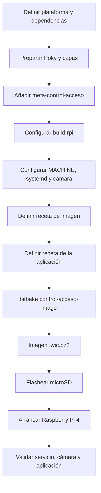
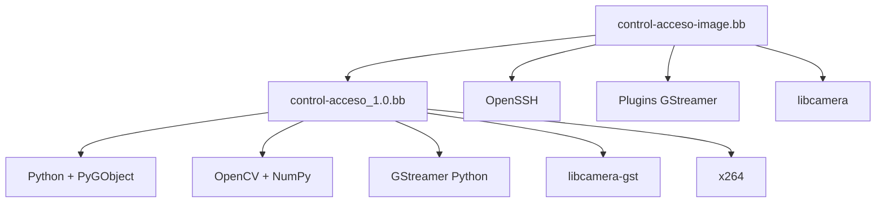

# Fundamentos y flujo de trabajo: Yocto Project y GStreamer

## 1. Propósito

Este documento cubre de forma explícita los puntos metodológicos del proyecto relacionados con:

- estudio y documentación del flujo de trabajo con Yocto Project;
- investigación del marco de trabajo GStreamer y sus características;
- prototipado de tuberías con `gst-launch-1.0`;
- implementación posterior en Python;
- identificación de dependencias del sistema operativo;
- consolidación de recetas para generar la imagen Linux del sistema.

El contenido se mantiene alineado con el instructivo del proyecto y con la implementación disponible en este repositorio.

---

## 2. Flujo de trabajo con Yocto Project

El proyecto utiliza una distribución de referencia Poky y capas adicionales para construir una imagen Linux específica para Raspberry Pi 4.

### 2.1 Capas empleadas

```text
poky
├── meta
├── meta-poky
└── bitbake

meta-openembedded
├── meta-oe
├── meta-python
├── meta-networking
└── meta-multimedia

meta-raspberrypi
└── soporte BSP para Raspberry Pi 4

meta-control-acceso
└── capa propia del proyecto
```

Las revisiones exactas utilizadas están registradas en:

```text
yocto-config/versiones.txt
```

### 2.2 Flujo aplicado en el proyecto



### 2.3 Configuración de plataforma

La configuración del proyecto fija:

```bitbake
MACHINE = "raspberrypi4-64"
INIT_MANAGER = "systemd"
```

Para la cámara OV5647:

```bitbake
VIDEO_CAMERA = "0"
RPI_KERNEL_DEVICETREE_OVERLAYS:append = " overlays/ov5647.dtbo"
RPI_EXTRA_CONFIG:append = "\ncamera_auto_detect=0\ndtoverlay=ov5647"
```

La configuración reproducible utilizada por el proyecto se conserva en:

```text
yocto-config/project-local.conf
```

### 2.4 Capa propia del proyecto

La capa `meta-control-acceso` contiene dos elementos centrales:

```text
meta-control-acceso/
├── recipes-core/images/
│   └── control-acceso-image.bb
└── recipes-apps/control-acceso/
    ├── control-acceso_1.0.bb
    └── files/
        ├── prueba_integrada_h1.py
        └── control-acceso.service
```

La receta de imagen selecciona los paquetes del sistema. La receta de aplicación instala el programa, su servicio systemd y la configuración de ejecución.

### 2.5 Construcción

El entorno de construcción usado es:

```bash
cd ~/proyecto-yocto-rpi/poky
source buildtools/environment-setup-x86_64-pokysdk-linux
source oe-init-build-env ../build-rpi
bitbake control-acceso-image
```

El resultado se despliega en:

```text
tmp/deploy/images/raspberrypi4-64/
```

El procedimiento completo de instalación está documentado en [03_yocto_build_install.md](03_yocto_build_install.md).

---

## 3. GStreamer: características relevantes para el proyecto

El instructivo presenta GStreamer como un marco de trabajo para construir aplicaciones multimedia mediante tuberías compuestas por elementos reutilizables. En el proyecto se utilizan especialmente las siguientes características.

### 3.1 Arquitectura de grafo

Cada elemento realiza una función concreta y se conecta con otros elementos para formar un grafo dirigido.

Ejemplos del proyecto:

- fuente de cámara;
- conversión de formato;
- codificación H.264;
- empaquetado RTP;
- escritura de evidencia;
- entrega de frames a OpenCV.

### 3.2 Negociación de formatos

GStreamer negocia los formatos entre elementos conectados. El proyecto usa filtros explícitos cuando necesita fijar una interfaz concreta, por ejemplo:

```text
video/x-raw,width=1280,height=720,framerate=30/1
```

y conversiones hacia formatos utilizados por OpenCV o por el codificador.

### 3.3 Ecosistema de plugins

La imagen integra únicamente los grupos necesarios para la aplicación:

```text
gstreamer1.0
gstreamer1.0-plugins-base
gstreamer1.0-plugins-good
gstreamer1.0-plugins-bad
gstreamer1.0-python
gstreamer1.0-plugins-ugly-x264
libcamera-gst
```

### 3.4 Aceleración por hardware

El instructivo resalta la posibilidad de utilizar interfaces como V4L2 para codificación por hardware.

En este proyecto se investigó `v4l2h264enc`, pero la ruta de hardware no quedó operativa en la configuración actual. La versión funcional utiliza:

```text
x264enc
```

Por lo tanto, **la versión actual codifica H.264 por software**. Este punto se mantiene como limitación técnica y no se presenta como aceleración por hardware.

### 3.5 Herramientas de prototipado y diagnóstico

Antes de la integración en Python se utilizaron herramientas de consola como:

```text
gst-launch-1.0
gst-inspect-1.0
```

Esto permite aislar problemas de cámara, caps y plugins antes de introducir la lógica de aplicación.

---

## 4. Prototipos con gst-launch-1.0

### 4.1 Cámara OV5647 + H.264 por software

Pipeline validado en Raspberry Pi:

```bash
gst-launch-1.0 -v \
libcamerasrc ! \
video/x-raw,width=1280,height=720,framerate=30/1 ! \
videoconvert ! \
video/x-raw,format=I420 ! \
x264enc tune=zerolatency bitrate=2000 speed-preset=veryfast key-int-max=30 ! \
h264parse ! \
fakesink sync=false
```

Objetivo de esta prueba:

- confirmar que `libcamerasrc` abre la OV5647;
- comprobar negociación a 1280x720;
- verificar disponibilidad de `x264enc`;
- probar la cadena H.264 sin depender del resto de la aplicación.

### 4.2 Emisor sintético usado en Docker

El emisor de pruebas utiliza conceptualmente:

```bash
gst-launch-1.0 -v \
videotestsrc is-live=true pattern=ball ! \
video/x-raw,format=I420,width=1280,height=720,framerate=30/1 ! \
x264enc tune=zerolatency bitrate=2000 speed-preset=veryfast key-int-max=30 ! \
h264parse ! \
rtph264pay pt=96 config-interval=1 ! \
udpsink host=<destino> port=5000 sync=false
```

Este prototipo verifica el contrato RTP/H.264 sin utilizar la cámara real.

---

## 5. Paso de prototipo a Python

El flujo de desarrollo seguido fue:


El archivo principal es:

```text
prueba_integrada_h1.py
```

La versión utilizada por Yocto debe mantenerse idéntica en:

```text
meta-control-acceso/recipes-apps/control-acceso/files/prueba_integrada_h1.py
```

---

## 6. Dependencias de software del sistema operativo

| Necesidad | Componente del proyecto | Estado |
|---|---|---|
| Pila de cámara | `libcamera` | Integrado |
| Fuente GStreamer para cámara | `libcamera-gst` / `libcamerasrc` | Integrado |
| GStreamer base | `gstreamer1.0` | Integrado |
| Plugins comunes | base / good / bad | Integrados |
| Enlaces Python | `gstreamer1.0-python`, PyGObject | Integrados |
| Procesamiento QR | `python3-opencv` | Integrado |
| Operaciones numéricas | `python3-numpy` | Integrado |
| Codificación H.264 actual | `gstreamer1.0-plugins-ugly-x264` | Integrado, software |
| Codificación H.264 hardware | V4L2 / `v4l2h264enc` | Investigado; no validado |
| Administración del servicio | systemd | Integrado |
| Acceso GPIO | Por definir en arquitectura final | Pendiente |
| SSH de desarrollo | OpenSSH | Integrado |

### Observación sobre GPIO

El instructivo exige identificar el acceso a entradas y salidas de propósito general. En la versión actual todavía no existe una dependencia GPIO final declarada en la receta porque el circuito de apertura sigue pendiente. La dependencia deberá añadirse cuando se cierre la implementación física y la biblioteca/interfaz elegida.

---

## 7. Consolidación en recetas Yocto

### 7.1 Receta de imagen

`control-acceso-image.bb` instala el conjunto necesario para el sistema y evita depender de instalaciones manuales posteriores.

### 7.2 Receta de aplicación

`control-acceso_1.0.bb`:

- instala el script como `/usr/bin/control-acceso`;
- instala `control-acceso.service`;
- declara dependencias de ejecución;
- crea `/etc/default/control-acceso`;
- crea el directorio persistente `/var/lib/control-acceso`;
- habilita el servicio mediante systemd.

### 7.3 Relación dependencia → receta



---

## 8. Resultado

Los puntos metodológicos asociados con Yocto y GStreamer se materializan en el repositorio mediante:

- capas con revisiones fijadas;
- una capa propia;
- recetas de imagen y aplicación;
- prototipos de pipeline por consola;
- aplicación integrada en Python;
- imagen para Raspberry Pi 4;
- instalación en microSD;
- validación sobre cámara real.

Los elementos todavía abiertos —GPIO y encoder H.264 por hardware— se mantienen explícitamente identificados como pendientes.
