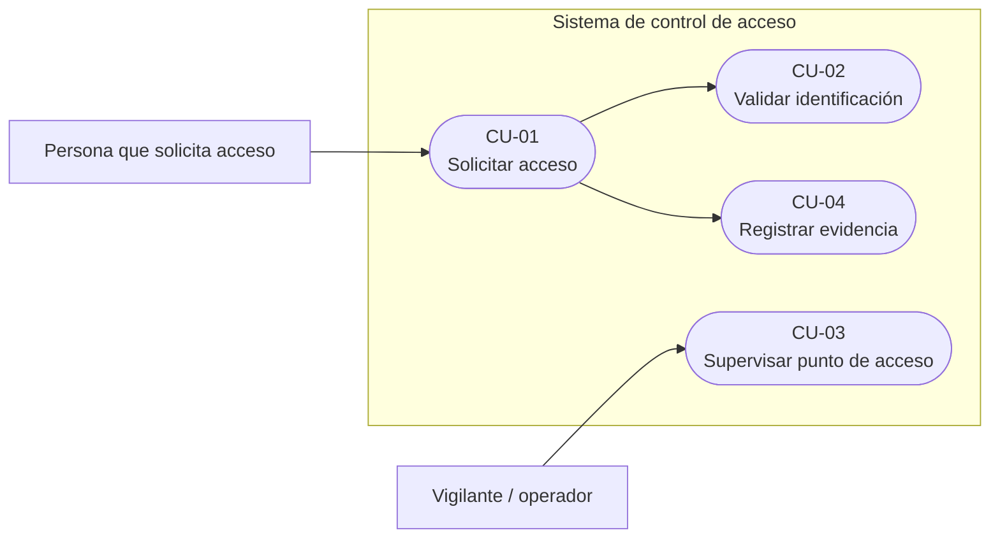
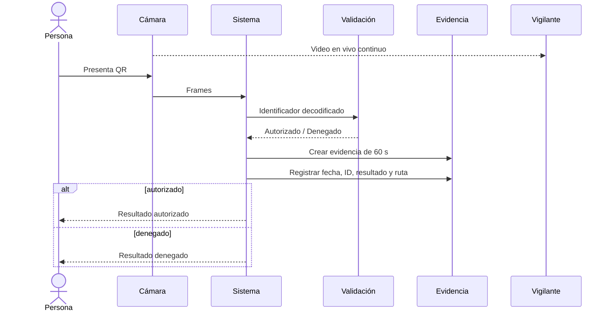

# Casos de uso del sistema

## 1. Propósito

Este documento formaliza los casos de uso definidos para el sistema de control de acceso. La identificación se realiza exclusivamente mediante un **código QR presentado frente a la misma cámara utilizada para supervisión**; no se utiliza un lector externo.

---

## 2. Actores y partes interesadas

| Actor / interesado | Descripción | Interacción principal |
|---|---|---|
| Persona que solicita acceso | Persona que se presenta en el punto de entrada | Presenta un código QR y recibe el resultado de su solicitud |
| Vigilante / operador | Persona ubicada en el puesto de vigilancia | Observa el video transmitido desde el punto de acceso |
| Equipo de desarrollo / mantenimiento | Responsable de configurar, instalar y verificar el sistema | Construye la imagen, despliega la aplicación y realiza pruebas/mantenimiento |

---

## 3. Resumen de casos de uso

| ID | Caso de uso | Actor principal | Descripción |
|---|---|---|---|
| CU-01 | Solicitar acceso | Persona que solicita acceso | La persona se presenta, muestra el QR y el sistema gestiona la solicitud |
| CU-02 | Validar identificación | Persona que solicita acceso | El sistema detecta y decodifica el QR, obtiene el identificador y clasifica la solicitud |
| CU-03 | Supervisar punto de acceso | Vigilante / operador | El vigilante observa el video en vivo procedente del punto de acceso |
| CU-04 | Registrar evidencia | Sistema / caso incluido | El sistema genera y conserva evidencia de video asociada con la solicitud |

---

## 4. Diagrama de casos de uso

El siguiente diagrama representa funcionalmente las relaciones definidas para el proyecto.



---

## 5. Flujo principal de identificación

El flujo definido para CU-01/CU-02 es:

1. La persona se presenta en el punto de acceso.
2. La persona muestra un código QR frente a la cámara.
3. El sistema detecta el código QR en el flujo de video.
4. El sistema decodifica el QR y obtiene el identificador.
5. El sistema valida el identificador frente a las credenciales autorizadas.
6. El sistema clasifica la solicitud como autorizada o denegada.
7. Si la solicitud es autorizada, el sistema activa la salida eléctrica de apertura; si es denegada, mantiene la salida inactiva.
8. El sistema conserva evidencia del evento y mantiene la supervisión por video.

---

# 6. Especificación individual

## CU-01 — Solicitar acceso

**Actor principal:** Persona que solicita acceso.

**Objetivo:** iniciar y completar una solicitud de acceso mediante un código QR.

**Precondiciones:**

- sistema en operación;
- cámara disponible;
- aplicación de control de acceso en ejecución.

**Disparador:** la persona presenta un QR frente a la cámara.

**Flujo principal:**

1. La cámara captura el QR.
2. El sistema obtiene el identificador.
3. Se ejecuta CU-02.
4. El sistema registra el evento.
5. Se genera evidencia mediante CU-04.
6. El sistema continúa supervisando el punto de acceso.

**Flujos alternos:**

- si el identificador no está autorizado, la solicitud se clasifica como denegada;
- si vence el tiempo máximo de decisión, la política definida clasifica la solicitud como denegada;
- si no se consigue decodificar el QR, no existe todavía un identificador sobre el cual ejecutar la clasificación.

**Postcondiciones:**

- solicitud clasificada cuando existe un identificador decodificado;
- evento registrado;
- evidencia asociada al evento.

**Requisitos asociados:** RF-02, RF-03, RF-04, RF-05, RF-06.

---

## CU-02 — Validar identificación

**Actor principal:** Persona que solicita acceso.

**Objetivo:** determinar si el identificador obtenido mediante QR está autorizado.

**Precondición:** existe un identificador decodificado.

**Flujo principal:**

1. El sistema recibe el identificador.
2. El sistema lo compara contra las credenciales autorizadas.
3. El resultado se clasifica como autorizado o denegado.
4. El resultado se entrega a la lógica de salida y registro.

**Comportamiento actual de prueba:**

```text
MC001 -> AUTORIZADO
otro identificador decodificado -> DENEGADO
```

**Flujo alterno por timeout:** si la decisión excede el tiempo máximo configurado, el resultado es denegado por timeout.

**Requisitos asociados:** RF-02, RF-03, RF-04, RF-05.

---

## CU-03 — Supervisar punto de acceso

**Actor principal:** Vigilante / operador.

**Objetivo:** observar en vivo el video del punto de acceso.

**Precondiciones:**

- cámara disponible;
- red entre Raspberry Pi y estación del vigilante;
- receptor Docker en ejecución.

**Flujo principal:**

1. La Raspberry captura video.
2. El pipeline codifica H.264.
3. El flujo se empaqueta como RTP.
4. Se transmite mediante UDP al puerto 5000.
5. La estación del vigilante recibe y decodifica el flujo.
6. El navegador presenta el video mediante la interfaz web.

**Requisitos asociados:** RF-01, RF-08.

---

## CU-04 — Registrar evidencia

**Actor principal:** Sistema / caso incluido.

**Objetivo:** conservar evidencia de video asociada con una solicitud de acceso.

**Precondición:** se genera un evento de acceso.

**Flujo principal implementado:**

1. Se genera un nombre de archivo único con fecha y hora.
2. Se crea una rama de grabación asociada al evento.
3. La grabación se mantiene durante 60 s.
4. El MP4 se guarda en almacenamiento persistente.
5. La bitácora registra la ruta relativa de la evidencia.

**Ubicación:**

```text
/var/lib/control-acceso/evidencias/
```

**Política de retención configurada:**

- video: 7 días;
- bitácora: 30 días.

**Requisitos asociados:** RF-06, RF-07, RQ-01.

---

## 7. Secuencia operacional



## 8. Estado de implementación

| Caso de uso | Estado |
|---|---|
| CU-01 Solicitar acceso | Implementado; rearme QR en validación final |
| CU-02 Validar identificación | Validado en Raspberry con autorizados y denegados |
| CU-03 Supervisar punto de acceso | Validado Raspberry → Docker → navegador |
| CU-04 Registrar evidencia | Validado con evidencia de 60 s y grabaciones concurrentes |

La salida eléctrica prevista en CU-01/CU-02 todavía requiere cerrar el circuito GPIO.
