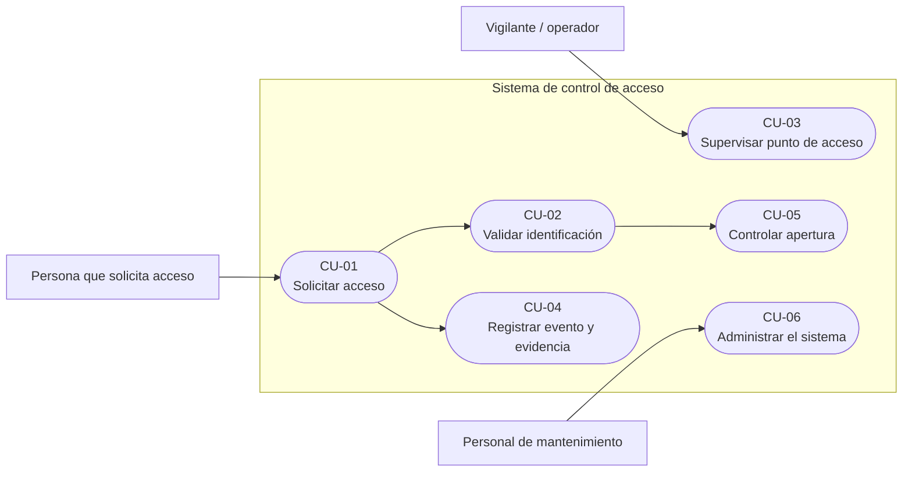
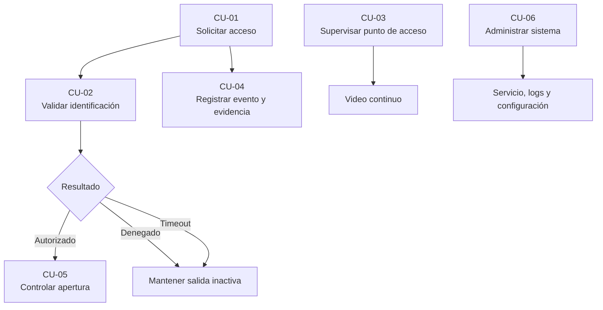
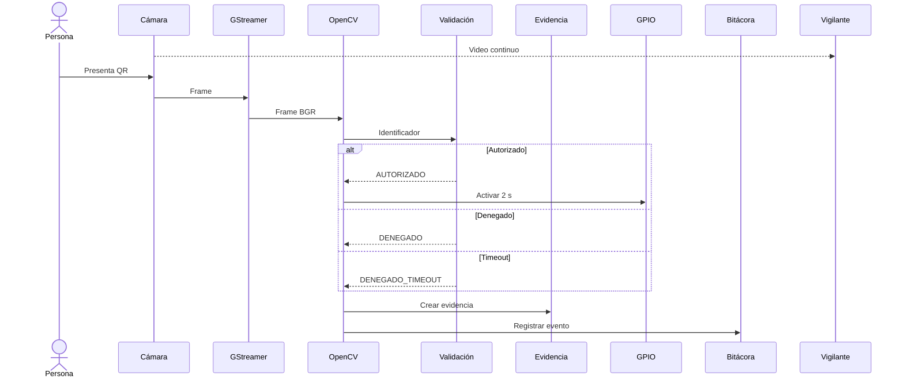

# Casos de uso del sistema

## 1. Propósito

Este documento describe los casos de uso principales del sistema de control de acceso.

La identificación se realiza mediante un **código QR presentado frente a la misma cámara utilizada para supervisión**. El sistema procesa el identificador, determina si el acceso está autorizado, registra el evento, genera evidencia y mantiene la transmisión de video hacia la estación del vigilante.

---

## 2. Actores

| Actor | Descripción |
|---|---|
| Persona que solicita acceso | Presenta un código QR frente a la cámara para solicitar ingreso |
| Vigilante / operador | Supervisa el punto de acceso mediante el video recibido en la estación de vigilancia |
| Personal de mantenimiento | Configura, verifica y administra el sistema embebido |

---

## 3. Casos de uso principales

| ID | Caso de uso | Actor principal |
|---|---|---|
| CU-01 | Solicitar acceso | Persona que solicita acceso |
| CU-02 | Validar identificación | Persona que solicita acceso |
| CU-03 | Supervisar punto de acceso | Vigilante / operador |
| CU-04 | Registrar evento y evidencia | Sistema |
| CU-05 | Controlar apertura | Sistema |
| CU-06 | Administrar el sistema | Personal de mantenimiento |

---

## 4. Diagrama general



---

# 5. CU-01 — Solicitar acceso

**Actor principal:** Persona que solicita acceso.

**Objetivo:** solicitar ingreso mediante un código QR.

### Precondiciones

- el sistema está en ejecución;
- la cámara se encuentra disponible;
- el pipeline de video se encuentra activo.

### Disparador

La persona presenta un código QR frente a la cámara.

### Flujo principal

1. La cámara captura el código QR.
2. El sistema detecta y decodifica el identificador.
3. Se ejecuta la validación de identificación.
4. El sistema determina el resultado de la solicitud.
5. Se registra el evento.
6. Se genera una evidencia de video.
7. Si el resultado es autorizado, se activa la lógica de apertura.
8. El sistema continúa supervisando el punto de acceso.

### Flujos alternos

- Si el QR no puede decodificarse, no se genera una decisión de acceso.
- Si el identificador no está autorizado, el resultado es `DENEGADO`.
- Si la validación excede el tiempo máximo permitido, el resultado es `DENEGADO_TIMEOUT`.

### Postcondiciones

Cuando existe un identificador válido:

- la solicitud queda clasificada;
- el evento queda registrado;
- se crea una evidencia asociada.

---

# 6. CU-02 — Validar identificación

**Actor principal:** Persona que solicita acceso.

**Objetivo:** determinar si el identificador obtenido mediante QR está autorizado.

### Precondición

Existe un identificador QR correctamente decodificado.

### Flujo principal

1. El sistema recibe el identificador.
2. Se consulta el conjunto de identificadores autorizados.
3. Se determina el resultado.
4. El resultado se entrega a la lógica de registro y control de apertura.

Los identificadores configurados como autorizados son:

```text
MC001
MC002
```

El comportamiento es:

```text
MC001 → AUTORIZADO
MC002 → AUTORIZADO
otro identificador → DENEGADO
```

### Timeout

La decisión dispone de un tiempo máximo de:

```text
10 s
```

Si ese intervalo se supera:

```text
DENEGADO_TIMEOUT
```

La política es **fail-secure**: un timeout nunca concede acceso.

---

# 7. CU-03 — Supervisar punto de acceso

**Actor principal:** Vigilante / operador.

**Objetivo:** observar el video proveniente del punto de acceso.

### Precondiciones

- Raspberry Pi en operación;
- cámara disponible;
- conectividad de red;
- estación de vigilancia ejecutándose en Docker.

### Flujo principal

1. La Raspberry Pi captura el video.
2. GStreamer codifica el flujo en H.264.
3. El flujo se encapsula mediante RTP.
4. Se transmite mediante UDP.
5. La estación de vigilancia recibe y decodifica el video.
6. El navegador presenta el flujo al operador.

El contrato utilizado es:

```text
Codec:       H.264
Transporte:  RTP/UDP
Puerto:      5000
Payload:     96
Clock rate:  90000 Hz
```

La interfaz se consulta en:

```text
http://localhost:8081
```

---

# 8. CU-04 — Registrar evento y evidencia

**Actor principal:** Sistema.

**Objetivo:** conservar información asociada con cada solicitud de acceso.

### Precondición

Se ha detectado y procesado un identificador QR.

### Flujo principal

1. Se genera una marca temporal.
2. Se crea un archivo de evidencia único.
3. Se inicia una rama de grabación desde el flujo H.264.
4. Se registra el resultado del acceso.
5. La grabación se mantiene durante 60 segundos.
6. El archivo MP4 se finaliza mediante EOS.
7. El archivo permanece almacenado en el sistema.

Ubicación de evidencias:

```text
/var/lib/control-acceso/evidencias/
```

Bitácora:

```text
/var/lib/control-acceso/bitacora_accesos.log
```

Formato de nombre:

```text
evidencia_YYYY-MM-DD_HH-MM-SS_microsegundos.mp4
```

### Retención

```text
Evidencias: 7 días
Bitácora:   30 días
```

---

# 9. CU-05 — Controlar apertura

**Actor principal:** Sistema.

**Objetivo:** activar temporalmente la salida de apertura cuando una solicitud es autorizada.

### Precondición

La validación produjo:

```text
AUTORIZADO
```

### Flujo principal

1. La aplicación activa la salida asociada con BCM17.
2. La salida permanece activa durante 2 segundos.
3. Un temporizador devuelve la salida al estado inactivo.

Secuencia:

```text
LOW
→ HIGH
→ 2 s
→ LOW
```

### Condiciones de seguridad

La salida permanece inactiva ante:

- acceso denegado;
- timeout;
- error fatal;
- pérdida de frames;
- cierre de la aplicación.

La política aplicada es:

```text
sin autorización confirmada
→ no abrir
```

---

# 10. CU-06 — Administrar el sistema

**Actor principal:** Personal de mantenimiento.

**Objetivo:** verificar y administrar la operación del sistema embebido.

### Funciones principales

El personal puede:

- consultar el estado del servicio;
- revisar logs;
- reiniciar el servicio;
- consultar evidencias;
- revisar la bitácora;
- verificar plugins y dispositivos;
- modificar parámetros de ejecución.

Comandos principales:

```bash
systemctl status control-acceso
systemctl restart control-acceso
journalctl -fu control-acceso
```

Configuración:

```text
/etc/default/control-acceso
```

Datos persistentes:

```text
/var/lib/control-acceso
```

---

# 11. Relación entre casos de uso

El flujo funcional principal puede resumirse como:



La supervisión de video es continua y no depende de que exista una solicitud de acceso.

---

# 12. Secuencia de una solicitud



---

# 13. Casos alternos

## QR no decodificado

Si la cámara detecta una escena pero OpenCV no obtiene un identificador válido:

```text
no existe solicitud clasificable
```

No se concede acceso.

---

## Identificador no autorizado

```text
QR válido
→ identificador no autorizado
→ DENEGADO
→ salida LOW
→ registro
→ evidencia
```

---

## Timeout de validación

```text
identificador
→ validación > 10 s
→ DENEGADO_TIMEOUT
→ salida LOW
```

---

## Pérdida de cámara

Si el sistema permanece:

```text
3 s
```

sin frames:

```text
watchdog
→ salida segura
→ terminación con error
→ recuperación mediante systemd
```

---

# 14. Resumen

Los casos de uso describen seis funciones principales del sistema:

```text
solicitar acceso
validar identificación
supervisar el punto de acceso
registrar evidencia
controlar la apertura
administrar el sistema
```

La arquitectura mantiene separadas la supervisión, la decisión de acceso y la administración, mientras que cada solicitud válida queda asociada con un resultado y una evidencia persistente.
