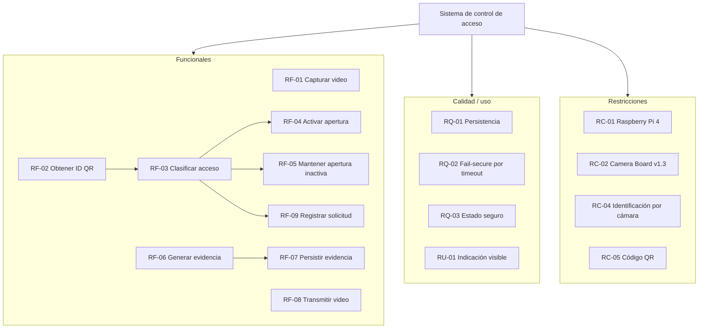

# Requerimientos del sistema

## 1. Criterio de redacción

Los requerimientos de este proyecto se mantienen con la forma **“el sistema deberá…”** y se revisan según los criterios trabajados en el curso:

- necesario;
- apropiado;
- inequívoco;
- completo;
- singular;
- factible;
- verificable;
- correcto;
- conforme.

El conjunto debe mantenerse consistente, comprensible, factible y validable.

> Los textos de los requerimientos que siguen conservan la especificación definida durante la etapa de diseño. Los resultados de implementación y pruebas se documentan aparte para no modificar silenciosamente la línea base.

---

# 2. Requerimientos funcionales

| ID | Requerimiento | Verificación | Origen | Estado de implementación |
|---|---|---|---|---|
| RF-01 | Durante el modo de operación normal, el sistema deberá capturar el flujo de video proveniente de la cámara ubicada en el punto de acceso. | Demostración | CU-01 / CU-03 | Validado en Raspberry |
| RF-02 | Ante una solicitud de acceso, el sistema deberá obtener mediante la cámara el identificador contenido en el código QR presentado por el usuario. | Prueba | CU-01 / CU-02 | Validado en Raspberry |
| RF-03 | Ante la obtención de un identificador, el sistema deberá clasificar la solicitud de acceso como autorizada o denegada. | Prueba | CU-02 | Validado en Raspberry |
| RF-04 | Cuando una solicitud de acceso sea clasificada como autorizada, el sistema deberá activar la salida eléctrica asociada con la apertura del acceso. | Prueba | CU-02 | **Pendiente GPIO/circuito** |
| RF-05 | Cuando una solicitud de acceso sea clasificada como denegada, el sistema deberá mantener la salida eléctrica de apertura en estado inactivo. | Prueba | CU-02 | **Pendiente GPIO/circuito** |
| RF-06 | Ante una solicitud de acceso, el sistema deberá generar evidencia de video asociada con el evento ocurrido en el punto de entrada. | Prueba | CU-01 / CU-04 | Validado en Raspberry |
| RF-07 | El sistema deberá conservar en almacenamiento persistente la evidencia de video generada para cada solicitud de acceso. | Prueba + inspección | CU-04 | Validado |
| RF-08 | Durante el modo de operación normal, el sistema deberá transmitir en vivo hacia el puesto de vigilancia el flujo de video capturado en el punto de acceso. | Demostración | CU-03 | Validado Raspberry → Docker |
| RF-09 | El sistema deberá registrar cada solicitud de acceso con una marca de tiempo y el resultado de autorización correspondiente. | Prueba / inspección | — | Validado; además registra ruta de evidencia |

---

# 3. Requerimientos de desempeño

Estos requerimientos fueron definidos como necesarios, pero la especificación original indicó que sus valores cuantitativos debían justificarse mediante pruebas y no fijarse arbitrariamente.

| ID | Requerimiento definido | Estado original | Estado actual |
|---|---|---|---|
| RD-01 | Durante la captura de video, el sistema deberá mantener una resolución mínima de 1280 × 720 píxeles. | Pendiente | El pipeline está configurado y ha negociado 1280×720; conservar evidencia final |
| RD-02 | Durante la captura y transmisión de video, el sistema deberá mantener una tasa mínima de 30 imágenes por segundo. | Pendiente | **No cerrado:** falta medir FPS reales en Raspberry |
| RD-03 | Durante la transmisión en vivo, el sistema deberá mantener una latencia máxima de **[POR DEFINIR]** entre el punto de acceso y el puesto de vigilancia. | Pendiente | **No cerrado:** falta fijar umbral y medir E2E final |
| RD-04 | Ante una solicitud autorizada, el sistema deberá activar la salida eléctrica en un tiempo máximo de 2 segundos después de completar la validación. | Pendiente | **No cerrado:** requiere GPIO |
| RD-05 | Para cada solicitud de acceso, el sistema deberá conservar evidencia de video durante un intervalo mínimo de **[POR DEFINIR]**. | Pendiente | Implementación actual: 60 s por evento; falta formalizar el valor como línea base si el equipo/profesor lo aprueba |

## 3.1 Valores de implementación que no sustituyen automáticamente la especificación

En la versión actual:

```text
Resolución solicitada/configurada: 1280x720
Framerate solicitado:            30/1
Duración de evidencia:           60 s
Timeout de decisión:             10 s
```

El framerate solicitado en caps **no constituye una medición de FPS reales**. La validación final debe contar cuadros.

---

# 4. Requerimientos de interfaz

| ID | Requerimiento | Verificación | Estado |
|---|---|---|---|
| RI-01 | La interfaz de cámara del sistema deberá recibir el flujo de video proveniente de la cámara instalada en el punto de acceso. | Demostración | Validado con OV5647 + libcamera |
| RI-02 | La interfaz de red del sistema deberá entregar al puesto de vigilancia el flujo de video destinado a la transmisión en vivo. | Demostración | Validado mediante H.264 RTP/UDP |
| RI-03 | La interfaz de salida del sistema deberá proporcionar al mecanismo de apertura un estado eléctrico correspondiente al resultado de autorización del acceso. | Prueba | **Pendiente GPIO/circuito** |

No se define una interfaz para lector externo porque el QR se obtiene mediante la misma cámara del sistema.

---

# 5. Restricciones de plataforma y diseño

| ID | Restricción | Origen | Estado |
|---|---|---|---|
| RC-01 | El sistema deberá ejecutarse sobre una Raspberry Pi 4. | Instructivo | Cumplido |
| RC-02 | El sistema deberá ser compatible con la Raspberry Pi Camera Board v1.3 de 5 MP (AD35352) disponible para el proyecto. | Hardware disponible | Cumplido con sensor OV5647 |
| RC-03 | El sistema deberá disponer de almacenamiento persistente para conservar la evidencia generada. | Retención de evidencia | Cumplido en microSD |
| RC-04 | La identificación de acceso deberá realizarse utilizando únicamente información obtenida mediante la cámara del sistema. | Criterio confirmado por el profesor | Cumplido |
| RC-05 | El mecanismo de identificación seleccionado para el proyecto será un código QR presentado frente a la cámara. | Decisión del equipo | Cumplido |

---

# 6. Requerimientos de proceso

| ID | Requerimiento de proceso | Evidencia en el repositorio |
|---|---|---|
| RP-01 | El proceso de desarrollo deberá prototipar los flujos multimedia mediante gst-launch-1.0 antes de su implementación en la aplicación. | [10_fundamentos_yocto_gstreamer.md](10_fundamentos_yocto_gstreamer.md) |
| RP-02 | La implementación de los flujos multimedia deberá realizarse mediante GStreamer y Python. | `prueba_integrada_h1.py` |
| RP-03 | El proceso de construcción del sistema operativo deberá utilizar Yocto Project a partir de una imagen mínima o base. | `meta-control-acceso/`, [03_yocto_build_install.md](03_yocto_build_install.md) |
| RP-04 | La configuración de la imagen deberá incluir el soporte requerido para ejecutar el sistema sobre una Raspberry Pi 4. | `yocto-config/`, `meta-raspberrypi` |
| RP-05 | La imagen Linux generada deberá instalarse en una tarjeta microSD para su ejecución en la Raspberry Pi 4. | [03_yocto_build_install.md](03_yocto_build_install.md) |
| RP-06 | El sistema integrado deberá verificarse sobre una Raspberry Pi 4 con una cámara conectada. | [06_validacion.md](06_validacion.md) |

---

# 7. Requerimientos de calidad o no funcionales

| ID | Requerimiento | Verificación / estado |
|---|---|---|
| RQ-01 | La evidencia de video almacenada deberá permanecer disponible después de reiniciar la aplicación del sistema. | Persistencia implementada; repetir verificación final tras reboot de imagen definitiva |
| RQ-02 | Si el sistema no puede determinar el resultado de una solicitud de acceso dentro del tiempo máximo establecido, deberá clasificar la solicitud como denegada. | Política fail-secure implementada y previamente probada |
| RQ-03 | Durante el arranque del sistema y ante una falla de la aplicación, la salida eléctrica asociada con la apertura deberá permanecer en estado inactivo. | **Pendiente de validar con GPIO real** |

No se añaden requisitos arbitrarios de disponibilidad, mantenibilidad, portabilidad o seguridad sin una necesidad y métrica previamente justificadas.

---

# 8. Requerimiento de usabilidad / calidad en uso

| ID | Requerimiento | Estado |
|---|---|---|
| RU-01 | Después de procesar una solicitud de acceso, el sistema deberá proporcionar una indicación visible que permita distinguir si la solicitud fue autorizada o denegada. | Propuesto; implementación física por definir junto con GPIO |

La especificación original no fija obligatoriamente si la indicación será mediante LED u otro mecanismo.

---

# 9. Diagrama de requerimientos



---

# 10. Trazabilidad caso de uso → requerimientos → funciones

| Caso de uso | Requerimientos asociados | Funciones asociadas |
|---|---|---|
| CU-01 Solicitar acceso | RF-02, RF-03, RF-04, RF-05, RF-06 | F-02, F-03, F-04, F-05, F-06 |
| CU-02 Validar identificación | RF-02, RF-03, RF-04, RF-05 | F-02, F-03, F-04, F-05 |
| CU-03 Supervisar punto de acceso | RF-01, RF-08 | F-01, F-08 |
| CU-04 Registrar evidencia | RF-06, RF-07, RQ-01 | F-06, F-07 |

## 10.1 Funciones del sistema definidas

| ID | Función | Descripción resumida |
|---|---|---|
| F-01 | Capturar video | Obtener el flujo de imágenes |
| F-02 | Detectar código QR | Determinar presencia de QR |
| F-03 | Decodificar código QR | Extraer identificador |
| F-04 | Validar identificador | Producir resultado de autorización |
| F-05 | Controlar salida de acceso | Activar o mantener inactiva la salida |
| F-06 | Generar evidencia | Crear segmento asociado al evento |
| F-07 | Almacenar evidencia | Conservar evidencia persistentemente |
| F-08 | Transmitir video | Enviar flujo al puesto de vigilancia |
| F-09 | Indicar resultado | Proporcionar indicación visible |

---

# 11. Requerimientos aún abiertos

Antes de declarar cerrada la especificación deben resolverse explícitamente:

1. FPS reales y decisión sobre RD-02.
2. Umbral de latencia y resultado de RD-03.
3. Circuito GPIO y validación de RD-04, RF-04, RF-05, RI-03 y RQ-03.
4. Formalización de 60 s como valor definitivo de RD-05.
5. Implementación concreta de RU-01.
