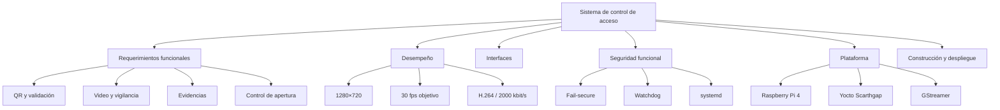

# Requerimientos del sistema

## 1. Propósito

Este documento define los requerimientos del sistema de control de acceso desarrollado para Raspberry Pi 4.

Los requerimientos describen **qué debe hacer el sistema** y las condiciones que debe cumplir. Los resultados de las pruebas se documentan por separado en:

```text
06_validacion.md
```

La redacción utiliza la forma:

```text
El sistema deberá...
```

para mantener los requerimientos claros, verificables y trazables.

---

# 2. Requerimientos funcionales

## RF-01 — Captura de video

El sistema deberá capturar continuamente el flujo de video proveniente de la cámara instalada en el punto de acceso.

**Verificación:** demostración sobre Raspberry Pi.

---

## RF-02 — Detección de código QR

El sistema deberá detectar códigos QR presentes en el flujo de video capturado por la cámara.

**Verificación:** prueba funcional con códigos QR.

---

## RF-03 — Decodificación de identificación

El sistema deberá obtener el identificador contenido en un código QR correctamente detectado.

**Verificación:** prueba funcional.

---

## RF-04 — Validación de acceso

El sistema deberá clasificar un identificador decodificado como autorizado o denegado.

Los identificadores configurados como autorizados son:

```text
MC001
MC002
```

**Verificación:** prueba con identificadores autorizados y no autorizados.

---

## RF-05 — Apertura autorizada

Cuando una solicitud sea clasificada como autorizada, el sistema deberá activar la salida lógica de apertura durante:

```text
2 s
```

**Verificación:** inspección de software y prueba de la interfaz GPIO cuando corresponda al montaje físico.

---

## RF-06 — Estado seguro ante denegación

Cuando una solicitud sea clasificada como denegada, el sistema deberá mantener la salida de apertura en estado inactivo.

**Verificación:** prueba funcional.

---

## RF-07 — Estado seguro ante timeout

Si la decisión de acceso no finaliza dentro de:

```text
10 s
```

el sistema deberá clasificar la solicitud como denegada y mantener la salida de apertura inactiva.

**Verificación:** prueba de timeout fail-secure.

---

## RF-08 — Registro del evento

El sistema deberá registrar cada solicitud de acceso procesada junto con:

- fecha y hora;
- identificador;
- resultado de autorización;
- referencia a la evidencia generada.

**Verificación:** inspección de la bitácora.

---

## RF-09 — Generación de evidencia

El sistema deberá generar una evidencia de video asociada con cada solicitud de acceso procesada.

**Verificación:** inspección de archivos generados.

---

## RF-10 — Duración de evidencia

Cada evidencia deberá mantenerse durante:

```text
60 s
```

antes de finalizar la grabación.

**Verificación:** prueba de duración y cierre de archivo.

---

## RF-11 — Almacenamiento persistente

El sistema deberá almacenar las evidencias en:

```text
/var/lib/control-acceso/evidencias/
```

y la bitácora en:

```text
/var/lib/control-acceso/bitacora_accesos.log
```

**Verificación:** inspección del sistema de archivos.

---

## RF-12 — Transmisión de video

El sistema deberá transmitir continuamente el video del punto de acceso hacia la estación de vigilancia.

La transmisión deberá utilizar:

```text
H.264
RTP
UDP
```

**Verificación:** demostración Raspberry Pi → Docker.

---

## RF-13 — Visualización remota

La estación de vigilancia deberá presentar el flujo recibido mediante una interfaz web accesible desde la computadora del operador.

La interfaz utilizada es:

```text
http://localhost:8081
```

**Verificación:** demostración desde navegador.

---

## RF-14 — Recuperación ante pérdida de cámara

Si el sistema permanece durante:

```text
3 s
```

sin recibir frames después de iniciar correctamente el pipeline, deberá:

1. llevar la salida de apertura al estado inactivo;
2. finalizar la aplicación como error;
3. permitir que systemd ejecute la política de recuperación configurada.

**Verificación:** prueba de watchdog y recuperación.

---

## RF-15 — Reinicio del servicio

El servicio deberá configurarse para reiniciar la aplicación cuando esta termine por fallo.

La política será:

```text
Restart=on-failure
RestartSec=5
```

**Verificación:** prueba de reinicio mediante systemd.

---

# 3. Requerimientos de desempeño

## RD-01 — Resolución de captura

El sistema deberá operar con una resolución de:

```text
1280 × 720 píxeles
```

en el flujo principal de captura.

**Verificación:** inspección de caps negociados.

---

## RD-02 — Framerate

El sistema deberá operar con un framerate objetivo de:

```text
30 fps
```

en el punto de captura.

**Verificación:** medición real de frames sobre Raspberry Pi.

---

## RD-03 — Codificación H.264

El sistema deberá producir un flujo H.264 adecuado para transmisión RTP y almacenamiento de evidencias.

La implementación funcional deberá utilizar:

```text
x264enc
```

con una tasa configurada de:

```text
2000 kbit/s
```

**Verificación:** inspección del pipeline y recepción del flujo.

---

## RD-04 — Intervalo de keyframes

La codificación deberá utilizar:

```text
key-int-max=30
scenecut=0
```

de manera que, con una operación cercana a 30 fps, el intervalo entre keyframes sea aproximadamente:

```text
1 s
```

**Verificación:** medición de keyframes.

---

## RD-05 — Capacidad de almacenamiento

El medio de almacenamiento deberá proporcionar una tasa de escritura superior a la requerida por el flujo de evidencia H.264 generado por el sistema.

**Verificación:** prueba de escritura y comparación con el bitrate configurado.

---

# 4. Requerimientos de interfaz

## RI-01 — Interfaz de cámara

El sistema deberá utilizar la Raspberry Pi Camera Board con sensor OV5647 como fuente de video en la plataforma objetivo.

La captura se realizará mediante:

```text
libcamera
+
libcamerasrc
```

---

## RI-02 — Interfaz QR

La identificación de acceso deberá obtenerse mediante la cámara del sistema.

No se requiere un lector externo de códigos para la operación definida.

---

## RI-03 — Interfaz de red

El nodo embebido deberá enviar el flujo de vigilancia mediante RTP/H.264 sobre UDP.

La configuración utilizada deberá admitir:

```text
DEST_HOST
DEST_PORT
```

como parámetros de ejecución.

---

## RI-04 — Puerto de streaming

La estación de vigilancia deberá recibir el flujo en:

```text
UDP 5000
```

salvo que la configuración de despliegue establezca otro valor.

---

## RI-05 — Interfaz web

La estación del vigilante deberá publicar su interfaz HTTP en:

```text
TCP 8081
```

---

## RI-06 — Interfaz de apertura

La aplicación deberá utilizar:

```text
BCM17
```

como salida lógica asociada con la apertura.

El estado:

```text
LOW
```

representará apertura inactiva.

El estado:

```text
HIGH
```

representará una orden temporal de apertura.

---

# 5. Requerimientos de persistencia

## RP-01 — Retención de evidencia

El sistema deberá conservar las evidencias durante:

```text
7 días
```

y eliminar automáticamente las que alcancen o superen ese tiempo de retención.

---

## RP-02 — Retención de bitácora

El sistema deberá conservar los eventos de bitácora durante:

```text
30 días
```

y eliminar automáticamente los registros que alcancen o superen ese tiempo de retención.

---

## RP-03 — Conservación ante reinicio

Los archivos de evidencia y bitácora deberán almacenarse fuera de directorios temporales para permanecer disponibles después de reiniciar la aplicación.

---

# 6. Requerimientos de seguridad funcional

## RS-01 — Política fail-secure

El sistema deberá mantener la salida de apertura inactiva siempre que no exista una autorización confirmada.

Esto incluye:

```text
identificador denegado
timeout
error fatal
pérdida de frames
cierre de la aplicación
```

---

## RS-02 — Inicialización segura

Al inicializar la interfaz GPIO, la aplicación deberá configurar la salida de apertura en estado:

```text
LOW
```

---

## RS-03 — Cierre seguro

Antes de terminar por error o durante un cierre coordinado, la aplicación deberá ejecutar la desactivación de la salida de apertura.

---

## RS-04 — Error de almacenamiento

Si GStreamer detecta un error durante la escritura de una evidencia, la condición deberá propagarse mediante el mecanismo de manejo de errores del pipeline.

---

# 7. Restricciones de plataforma

## RC-01 — Plataforma embebida

La plataforma objetivo será:

```text
Raspberry Pi 4
```

---

## RC-02 — Sistema operativo

El sistema operativo deberá construirse mediante:

```text
Yocto Project
```

utilizando la serie:

```text
Scarthgap
```

---

## RC-03 — Administración de servicios

La imagen deberá utilizar:

```text
systemd
```

como administrador de servicios.

---

## RC-04 — Framework multimedia

La captura, procesamiento multimedia, codificación, transmisión y grabación deberán implementarse mediante:

```text
GStreamer
```

---

## RC-05 — Procesamiento QR

La detección y decodificación de códigos QR deberá realizarse mediante:

```text
OpenCV
```

---

## RC-06 — Lenguaje de aplicación

La aplicación principal deberá implementarse en:

```text
Python 3
```

---

## RC-07 — Estación de vigilancia

El receptor y la interfaz de vigilancia deberán poder ejecutarse dentro de:

```text
Docker
```

sobre la computadora de supervisión.

---

# 8. Requerimientos de construcción y despliegue

## RB-01 — Capa propia

La configuración específica del proyecto deberá mantenerse dentro de una capa Yocto propia:

```text
meta-control-acceso
```

---

## RB-02 — Receta de aplicación

La aplicación deberá incorporarse a la imagen mediante:

```text
control-acceso_1.0.bb
```

---

## RB-03 — Receta de imagen

La imagen final deberá construirse mediante:

```text
control-acceso-image.bb
```

---

## RB-04 — Arranque automático

La aplicación deberá quedar habilitada durante la construcción para ejecutarse automáticamente al iniciar la Raspberry Pi.

---

## RB-05 — Configuración externa

Los parámetros de ejecución principales deberán separarse del código mediante:

```text
/etc/default/control-acceso
```

---

# 9. Requerimientos de mantenibilidad y trazabilidad

## RM-01 — Versiones reproducibles

Las revisiones principales de las capas Yocto utilizadas deberán quedar registradas en:

```text
yocto-config/versiones.txt
```

---

## RM-02 — Configuración reproducible

La configuración específica del build deberá quedar documentada en:

```text
yocto-config/project-local.conf
```

---

## RM-03 — Consistencia de la aplicación

La copia principal de la aplicación y la copia utilizada por la receta Yocto deberán mantenerse equivalentes.

---

## RM-04 — Evidencia de validación

Las pruebas automatizadas deberán generar resultados que puedan almacenarse bajo:

```text
resultados/
```

---

# 10. Relación con los casos de uso

| Caso de uso | Requerimientos principales |
|---|---|
| CU-01 Solicitar acceso | RF-02, RF-03, RF-04, RF-08, RF-09 |
| CU-02 Validar identificación | RF-04, RF-06, RF-07, RS-01 |
| CU-03 Supervisar punto de acceso | RF-12, RF-13, RI-03, RI-04, RI-05 |
| CU-04 Registrar evento y evidencia | RF-08, RF-09, RF-10, RF-11, RP-01, RP-02 |
| CU-05 Controlar apertura | RF-05, RF-06, RI-06, RS-01, RS-02, RS-03 |
| CU-06 Administrar el sistema | RF-15, RB-05, RM-01, RM-02, RM-04 |

---

# 11. Diagrama de requerimientos



---

# 12. Resumen de parámetros de diseño

| Parámetro | Valor |
|---|---|
| Plataforma | Raspberry Pi 4 |
| Cámara | OV5647 |
| Resolución | 1280 × 720 |
| Framerate objetivo | 30 fps |
| Codec | H.264 |
| Encoder funcional | `x264enc` |
| Bitrate configurado | 2000 kbit/s |
| GOP | 30 frames |
| Transporte | RTP/UDP |
| Puerto RTP | 5000/UDP |
| Interfaz web | 8081/TCP |
| Identificadores autorizados | `MC001`, `MC002` |
| Timeout de decisión | 10 s |
| Duración de apertura | 2 s |
| Watchdog de frames | 3 s |
| Duración de evidencia | 60 s |
| Retención de video | 7 días |
| Retención de bitácora | 30 días |
| GPIO de apertura | BCM17 |

---

## 13. Criterio de validación

El cumplimiento de estos requerimientos debe determinarse mediante pruebas, inspección o demostración según corresponda.

Un requerimiento de diseño puede estar implementado en el código sin que eso implique automáticamente que exista validación física de todos sus componentes.

En particular, la implementación de la lógica GPIO se documenta como parte del diseño del sistema, mientras que los resultados experimentales de cada prueba se mantienen en:

```text
06_validacion.md
```

De esta forma se conserva la separación entre:

```text
especificación
implementación
validación
```
