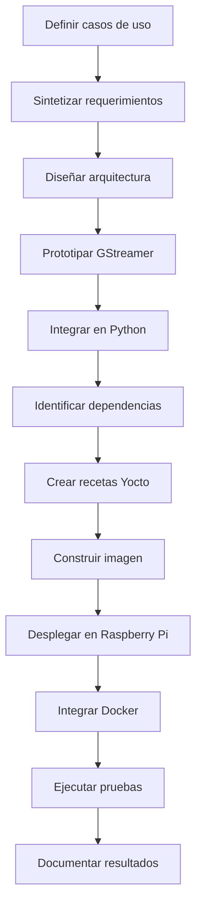
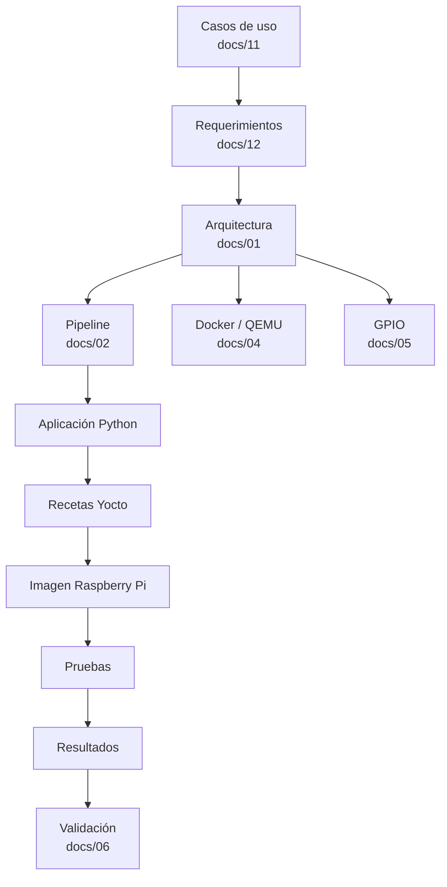
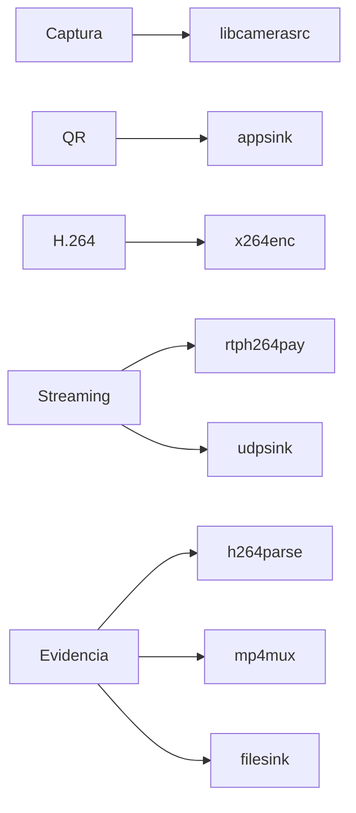
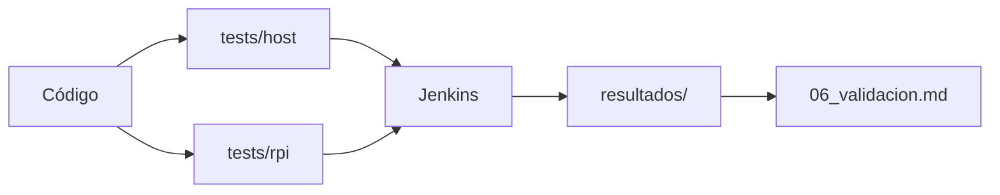
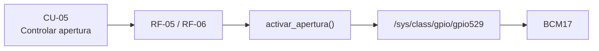
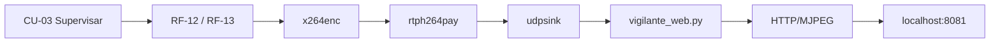
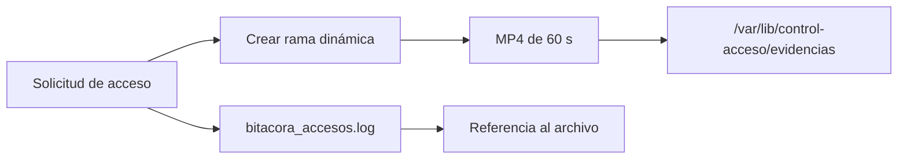

# Trazabilidad y metodología del proyecto

## 1. Propósito

Este documento relaciona la metodología seguida durante el desarrollo con los artefactos técnicos generados en el repositorio.

La trazabilidad permite conectar:

```text
casos de uso
→ requerimientos
→ arquitectura
→ implementación
→ dependencias
→ imagen Yocto
→ pruebas
→ evidencias
```

El objetivo es demostrar que las decisiones del sistema pueden seguirse desde la necesidad funcional hasta su implementación y validación.

---

# 2. Flujo metodológico

El desarrollo siguió una estrategia incremental.



Esta secuencia permitió validar subsistemas antes de combinarlos en la plataforma final.

---

# 3. Relación con la metodología del proyecto

| Etapa metodológica | Evidencia principal |
|---|---|
| Estudio del flujo de trabajo con Yocto Project | `10_fundamentos_yocto_gstreamer.md` |
| Estudio de GStreamer y sus características | `10_fundamentos_yocto_gstreamer.md`, `02_pipeline_gstreamer.md` |
| Definición de casos de uso | `11_casos_de_uso.md` |
| Síntesis de requerimientos | `12_requerimientos_del_sistema.md` |
| Diseño de arquitectura | `01_arquitectura.md` |
| Prototipado multimedia | `10_fundamentos_yocto_gstreamer.md` |
| Implementación en Python | `prueba_integrada_h1.py` |
| Identificación de dependencias | `control-acceso_1.0.bb`, `control-acceso-image.bb` |
| Construcción de imagen Linux | `03_yocto_build_install.md` |
| Integración de Docker y QEMU | `04_docker_qemu.md` |
| Integración de GPIO | `05_circuito_gpio.md` |
| Validación del sistema | `06_validacion.md` |
| Procedimiento de demostración | `07_demostracion.md` |
| Registro del proceso técnico | `08_bitacora_trabajo.md` |
| Declaración de uso de IA | `09_uso_ia.md` |

---

# 4. Trazabilidad global



---

# 5. Casos de uso → requerimientos

| Caso de uso | Requerimientos relacionados |
|---|---|
| CU-01 Solicitar acceso | RF-02, RF-03, RF-04, RF-08, RF-09 |
| CU-02 Validar identificación | RF-04, RF-06, RF-07, RS-01 |
| CU-03 Supervisar punto de acceso | RF-12, RF-13, RI-03, RI-04, RI-05 |
| CU-04 Registrar evento y evidencia | RF-08, RF-09, RF-10, RF-11, RP-01, RP-02 |
| CU-05 Controlar apertura | RF-05, RF-06, RI-06, RS-01, RS-02, RS-03 |
| CU-06 Administrar el sistema | RF-15, RB-05, RM-01, RM-02, RM-04 |

---

# 6. Requerimientos → implementación

| Requerimiento / función | Implementación principal |
|---|---|
| Captura de video | `libcamerasrc` |
| Detección QR | `cv2.QRCodeDetector()` |
| Validación | lógica de identificadores autorizados |
| Timeout fail-secure | `future.result(timeout=...)` |
| Apertura | BCM17 mediante sysfs |
| Registro | `bitacora_accesos.log` |
| Evidencia | rama dinámica H.264 + `mp4mux` |
| Streaming | `rtph264pay` + `udpsink` |
| Vigilancia | `docker/vigilante_web.py` |
| Recuperación | watchdog + systemd |
| Retención | funciones de limpieza de videos y bitácora |

---

# 7. Requerimientos → componentes GStreamer



La relación permite identificar directamente qué elemento implementa cada función multimedia.

---

# 8. Requerimientos → dependencias Yocto

| Necesidad | Dependencia |
|---|---|
| Cámara | `libcamera`, `libcamera-gst` |
| GStreamer | `gstreamer1.0` |
| Plugins base | `gstreamer1.0-plugins-base` |
| Plugins RTP/UDP | `gstreamer1.0-plugins-good` |
| H.264 parser | `gstreamer1.0-plugins-bad` |
| Encoder x264 | `gstreamer1.0-plugins-ugly-x264` |
| Python | `python3` |
| Bindings de GStreamer | `python3-pygobject`, `gstreamer1.0-python` |
| QR | `python3-opencv` |
| Procesamiento numérico | `python3-numpy` |
| Servicio | systemd |
| Acceso remoto | OpenSSH |

Estas dependencias se incorporan mediante:

```text
meta-control-acceso/
```

---

# 9. Implementación → archivos del repositorio

| Función | Archivo principal |
|---|---|
| Aplicación | `prueba_integrada_h1.py` |
| Copia para Yocto | `meta-control-acceso/recipes-apps/control-acceso/files/prueba_integrada_h1.py` |
| Servicio | `control-acceso.service` |
| Receta de aplicación | `control-acceso_1.0.bb` |
| Receta de imagen | `control-acceso-image.bb` |
| Configuración del build | `yocto-config/project-local.conf` |
| Versiones | `yocto-config/versiones.txt` |
| Vigilante web | `docker/vigilante_web.py` |
| Emisor de prueba | `docker/emisor.sh` |
| Receptor de prueba | `docker/vigilante.sh` |
| Docker Compose | `compose.yaml`, `compose.web.yaml` |
| CI | `Jenkinsfile` |
| Pruebas | `tests/` |
| Resultados | `resultados/` |

---

# 10. Implementación → validación

La validación se distribuye entre pruebas de host y pruebas sobre Raspberry Pi.



Las pruebas de host verifican principalmente propiedades estructurales y lógicas.

Las pruebas Raspberry verifican comportamiento dependiente de:

- cámara;
- GStreamer real;
- systemd;
- almacenamiento;
- red;
- plataforma Yocto.

---

# 11. Matriz de validación resumida

| Área | Evidencia |
|---|---|
| Captura y caps | Bloque A |
| Topología y colas | Bloque B |
| Encoder hardware | Bloque C |
| Latencia y GOP | Bloque D |
| Errores y recuperación | Bloque E |
| Almacenamiento | Bloque F |
| Reproducibilidad | Bloque G |
| Concurrencia y fail-secure | Bloque H |

El resultado detallado de cada bloque se encuentra en:

```text
06_validacion.md
```

---

# 12. Trazabilidad de resultados relevantes

| Resultado | Evidencia |
|---|---|
| Captura 1280×720 | pruebas A |
| Operación cercana a 30 fps | A3 |
| Arquitectura de hilos | H1 |
| Timeout fail-secure | H2 |
| Latencia hasta `udpsink` | D1 |
| Intervalo de keyframes | D3 |
| Presupuesto de latencia | D4 |
| Manejo del bus | E1 |
| MP4 reproducible | E4 |
| Error por disco lleno | E5 |
| Reinicio systemd | E6 |
| Registro GStreamer reproducible | G3 |
| Versiones del entorno | G5 |
| Retención 7/30 días | H7 |

---

# 13. Tratamiento de resultados negativos

La trazabilidad también conserva resultados que no alcanzaron el criterio de aceptación.

El caso principal es la ruta de encoder H.264 mediante:

```text
v4l2h264enc
```

Aunque el plugin y el dispositivo:

```text
bcm2835-codec-encode
```

fueron detectados, el procesamiento de frames produjo errores.

Por esa razón:

```text
v4l2h264enc
→ resultado experimental no validado

x264enc
→ ruta funcional utilizada
```

El resultado se conserva en la documentación como una limitación técnica y no se reemplaza por una afirmación de aceleración por hardware.

---

# 14. Trazabilidad del control GPIO

La lógica de apertura puede seguirse desde el requerimiento hasta la implementación:



La documentación distingue entre:

```text
lógica implementada
```

y:

```text
validación física del circuito
```

La existencia del código no se utiliza por sí sola como evidencia de validación física.

---

# 15. Trazabilidad del streaming



La misma interfaz RTP permite utilizar como emisor:

- Raspberry Pi;
- contenedor de prueba;
- modo QEMU con fuente sintética.

---

# 16. Trazabilidad de evidencias



La retención se aplica posteriormente mediante:

```text
video: 7 días
bitácora: 30 días
```

---

# 17. Trazabilidad de reproducibilidad

La reproducibilidad del entorno se sostiene mediante:

```text
yocto-config/versiones.txt
+
yocto-config/project-local.conf
+
meta-control-acceso/
+
Jenkinsfile
+
tests/
```

Estos elementos permiten reconstruir:

- las versiones de las capas;
- la configuración de la plataforma;
- las dependencias;
- la aplicación;
- el servicio;
- las pruebas.

---

# 18. Organización documental

La documentación final se distribuye de la siguiente manera:

| Documento | Contenido |
|---|---|
| `README.md` | Presentación general del proyecto |
| `01_arquitectura.md` | Arquitectura del sistema |
| `02_pipeline_gstreamer.md` | Pipeline multimedia |
| `03_yocto_build_install.md` | Construcción e instalación |
| `04_docker_qemu.md` | Docker y QEMU |
| `05_circuito_gpio.md` | GPIO e interfaz eléctrica |
| `06_validacion.md` | Pruebas y resultados |
| `07_demostracion.md` | Operación y demostración |
| `08_bitacora_trabajo.md` | Evolución técnica |
| `09_uso_ia_resumido.md` | Uso de inteligencia artificial |
| `10_fundamentos_yocto_gstreamer.md` | Fundamentos técnicos |
| `11_casos_de_uso.md` | Casos de uso |
| `12_requerimientos_del_sistema.md` | Requerimientos |
| `13_trazabilidad_metodologia.md` | Trazabilidad global |

---

# 19. Flujo de revisión recomendado

Para revisar el proyecto de forma lógica:

```text
README
↓
casos de uso
↓
requerimientos
↓
arquitectura
↓
pipeline
↓
Yocto
↓
Docker / GPIO
↓
validación
↓
demostración
```

Este orden permite partir de la necesidad del sistema y llegar progresivamente a la evidencia técnica.

---

## 20. Resumen

La trazabilidad del proyecto conecta cada nivel del desarrollo:

```text
necesidad
→ caso de uso
→ requerimiento
→ componente
→ código
→ receta
→ imagen
→ prueba
→ evidencia
```

Esta estructura permite identificar de dónde proviene cada función, cómo fue implementada y qué evidencia respalda su comportamiento, manteniendo además separados los resultados experimentales de las capacidades únicamente definidas en diseño.
