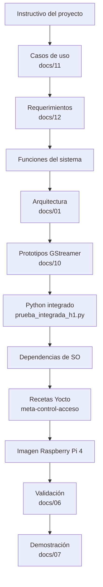
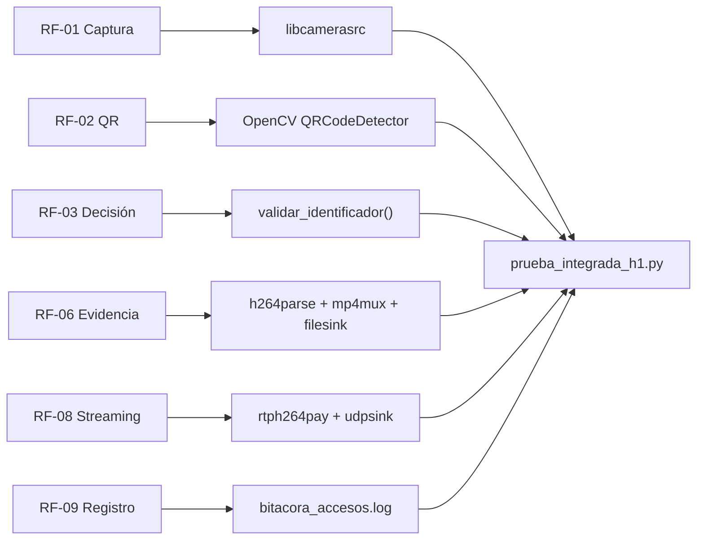

# Trazabilidad con la metodología del instructivo

## 1. Objetivo

El instructivo define una secuencia de trabajo que debe quedar evidenciada en el desarrollo. Esta matriz permite localizar cada punto directamente en el repositorio y distinguir lo ya realizado de lo pendiente.

---

## 2. Matriz de cumplimiento

| # | Solicitud metodológica | Evidencia principal | Estado |
|---:|---|---|---|
| 1 | Estudiar y documentar el flujo de trabajo con Yocto Project. | [10_fundamentos_yocto_gstreamer.md](10_fundamentos_yocto_gstreamer.md), [03_yocto_build_install.md](03_yocto_build_install.md) | Documentado |
| 2 | Investigar el flujo de trabajo con GStreamer y sus características. | [10_fundamentos_yocto_gstreamer.md](10_fundamentos_yocto_gstreamer.md), [02_pipeline_gstreamer.md](02_pipeline_gstreamer.md) | Documentado |
| 3 | Desarrollar y documentar los casos de uso de la aplicación propuesta mediante scripts de Python ejecutados en el host. | [11_casos_de_uso.md](11_casos_de_uso.md), `prueba_integrada_h1.py` | Documentado e implementado |
| 4 | Sintetizar requerimientos de diseño según la normativa vista en el curso. | [12_requerimientos_del_sistema.md](12_requerimientos_del_sistema.md) | Documentado; requisitos de desempeño aún tienen cierres pendientes |
| 5 | Diseñar flujos multimedia utilizando tuberías prototipadas mediante `gst-launch-1.0`. | [10_fundamentos_yocto_gstreamer.md](10_fundamentos_yocto_gstreamer.md), [02_pipeline_gstreamer.md](02_pipeline_gstreamer.md) | Realizado |
| 6 | Implementar los flujos con Python para ejecución en una computadora personal. | `prueba_integrada_h1.py`, documentación del pipeline | Realizado |
| 7 | Identificar dependencias de SO: cámara, plugins GStreamer, codificador hardware y GPIO. | Sección 6 de [10_fundamentos_yocto_gstreamer.md](10_fundamentos_yocto_gstreamer.md) | Identificado; hardware encoder y GPIO permanecen abiertos |
| 8 | Consolidar las recetas requeridas para incluir dependencias en Yocto. | `meta-control-acceso/`, [03_yocto_build_install.md](03_yocto_build_install.md) | Realizado para dependencias actuales; GPIO pendiente |
| 9 | Sintetizar imagen Linux para Raspberry Pi 4 usando Yocto y BSP. | `control-acceso-image.bb`, `meta-raspberrypi`, build RPi | Realizado |
| 10 | Instalar la imagen en microSD y ponerla en operación sobre Raspberry Pi 4 con cámara. | [03_yocto_build_install.md](03_yocto_build_install.md), [06_validacion.md](06_validacion.md) | Realizado |
| 11 | Preparar un tutorial paso a paso de generación e instalación. | [03_yocto_build_install.md](03_yocto_build_install.md) | Documentado |
| 12 | Preparar demostración presencial con los casos de uso. | [07_demostracion.md](07_demostracion.md) | Guion preparado; demo final pendiente |
| 13 | Documentar el proceso mediante bitácora individual. | [08_bitacora_trabajo.md](08_bitacora_trabajo.md) | Base preparada; cada integrante debe completar su bitácora individual |

---

## 3. Flujo de trazabilidad global

---

## 4. Trazabilidad técnica de la aplicación

---

## 5. Relación de dependencias con Yocto

| Función / interfaz | Paquete o mecanismo | Ubicación |
|---|---|---|
| Cámara | `libcamera`, `libcamera-gst` | receta de imagen / RDEPENDS |
| GStreamer | core + plugins base/good/bad | receta de imagen |
| Python GStreamer | `gstreamer1.0-python`, PyGObject | receta |
| QR | `python3-opencv` | receta |
| H.264 actual | `gstreamer1.0-plugins-ugly-x264` | receta |
| Servicio | systemd | receta + `control-acceso.service` |
| Persistencia | `/var/lib/control-acceso` | receta / StateDirectory |
| GPIO | Por definir | **Pendiente** |
| Encoder hardware | V4L2 | **Investigado, no validado** |

---

## 6. Elementos que no deben marcarse como cerrados todavía

Aunque la metodología esté documentada, continúan abiertos:

- salida GPIO y circuito físico;
- acceso a GPIO a nivel de dependencia Yocto;
- encoder H.264 por hardware;
- FPS reales finales;
- latencia máxima final;
- prueba final de throttling;
- rearme QR definitivo sin duplicados;
- build final después de congelar el código;
- revalidación QEMU con la versión entregada;
- bitácora individual completa de cada integrante.

---

## 7. Lectura recomendada para revisión

Para revisar el cumplimiento en el mismo orden que el instructivo:

1. este documento;
2. [10_fundamentos_yocto_gstreamer.md](10_fundamentos_yocto_gstreamer.md);
3. [11_casos_de_uso.md](11_casos_de_uso.md);
4. [12_requerimientos_del_sistema.md](12_requerimientos_del_sistema.md);
5. [02_pipeline_gstreamer.md](02_pipeline_gstreamer.md);
6. [03_yocto_build_install.md](03_yocto_build_install.md);
7. [06_validacion.md](06_validacion.md);
8. [07_demostracion.md](07_demostracion.md);
9. [08_bitacora_trabajo.md](08_bitacora_trabajo.md).
